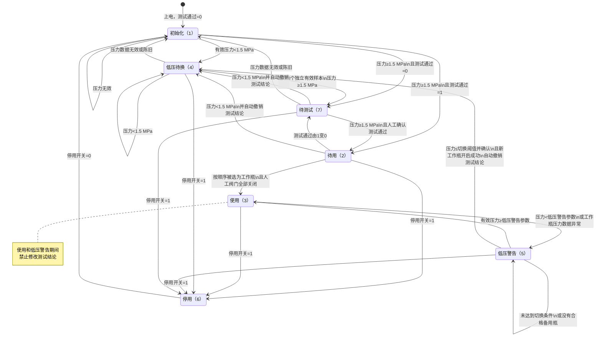

<div align="center" style="font-size: 2em; font-weight: bold;">六瓶三阀气源控制程序</div>

| 文档项目 | 发布信息 |
|---|---|
| 版本 | V1.08 |
| 适用产品 | 六瓶三阀气源控制主机 |
| CAN地址表版本 | `0x0206` |
| Modbus寄存器表版本 | `0x0202` |
| EEPROM运行参数记录版本 | `0x0003`，完整保存13项 |
| CAN/Modbus外部参数接口版本 | `0x0002`，继续开放原有10项 |

# 版本记录

| 软件版本 | 版本日期 | 状态 | 版本说明 |
|---|---|---|---|
| V1.08 | 2026-08-28 | 当前版本 | 删除串口屏、CAN和外部Modbus的人工整机自动/停止切换，系统上电固定自动运行，严重故障仍锁定全阀关闭；通讯切换及Modbus整组参数提交要求六瓶全部停用且十九路阀门关闭；31～48号阀位改为双色图标；增加Screen6日志条件查询；增加VAL_CAL总测试阀内部联动，总阀复用VALP1+，先吸合总阀并满足500 ms共享电源间隔后才打开分路，最后一路测试阀关闭后总阀自动关闭；CAN地址表为0x0206，Modbus寄存器表为0x0202 |
| V1.07 | 2026-08-28 | 历史版本 | 测试阀按钮7～12和停用开关13～18增加MCU实际状态双向同步；CAN、串口屏、自动超时、安全关断和状态机引起的变化均进入优先回写队列，并增加周期校正；按钮显示以业务层最终执行结果为准，互锁拒绝时自动恢复真实状态 |
| V1.06 | 2026-08-27 | 历史版本 | CAN公开的10项运行参数改为单地址校验、EEPROM保存、读回和运行应用，功能码6成功应答代表最终完成，不再使用参数提交键；增加基础码加详细码的写错误反馈和4个连续诊断地址；增加六瓶排气阀、测试阀、停用和测试结论共24个CAN控制地址，所有操作经气源业务层及安全互锁执行，供气阀保持自动状态机独占；CAN地址表升级为0x0205 |
| V1.05 | 2026-08-27 | 历史版本 | 1～6号人工排气按钮改为MCU状态同步开关外观；实际排气命令开启时显示“排气中”，定时结束、互锁拒绝或安全关断后恢复“人工排气”；排气中重复点击不重新计时，按钮值0不作为提前关阀命令；增加变化优先回写和58槽周期校正；串口屏正式工程同步升级为V1.05并只保留当前版本工程 |
| V1.04 | 2026-08-27 | 历史版本 | 事件日志改为每页15条、常规日志改为每页10条；增加“最新页、上一页、下一页”和页码提示；刷新时建立约2KB的单类型RAM索引，满足第1页后立即显示并在后台继续统计；翻页只读取和发送目标页，关闭屏内长列表滑动及滚动条；日志快照变化时保留当前页并提示刷新；串口屏正式工程同步升级为V1.04 |
| V1.03 | 2026-08-27 | 历史版本 | 气瓶状态追加数值7“待测试”，保留原1～6编码兼容；气瓶进入低压待换时自动撤销测试通过结论并回写51～56号开关；低压瓶压力恢复后需连续取得3个独立合格样本才进入待测试，只有工作人员再次确认测试通过后才能进入待用；测试通过按钮以MCU标志为准，支持变化优先回写和周期校正；12 V强吸合出厂默认时间由100 ms调整为200 ms |
| V1.02 | 2026-08-25至26日 | 历史版本 | 参数页精简为11项，移除重新载入按钮和标题下的冗余说明；每个字段修改后进入独立确认画面并运行中原子应用；实时页使用MCU双向同步的整机模式开关，标题改为独立文本控件；主菜单删除说明小字并增加三个功能图标，系统标题改为115号独立文本控件；事件和常规日志页删除标题说明小字，标题分别改为116、117号独立文本控件；运行参数设置标题改为118号独立文本控件，待用最低压力提示明确为不低于切瓶压力加0.1 MPa；手动排气范围为3.000～65.535秒；事件与常规日志支持全量流式加载和SDRAM滑动浏览；修正6号瓶测试阀 `VAL18/P401` 的GPIO配置，并增加全部阀门引脚的启动安全配置检查；允许有人工开阀权限的同瓶排气阀与测试阀同时开启，并增加500 ms强吸合间隔保护 |
| V1.01 | 2026-08-24及以前 | 历史版本 | 六瓶三阀、FreeRTOS、参数设置、日志查询及CAN/RS485双外部通讯基线 |

# 系统方案

系统管理六瓶相同气体，每瓶包含进气阀、排气阀和测试阀，保持“一用五备”和顺序自动换瓶。
六只气瓶压力传感器和一路总压力传感器通过 SCI1/RS485 Modbus RTU 轮询；本地操作和显示使用 SCI9 大彩
DC10600PM101 串口屏；外部设备可通过 CAN0 或 SCI0/RS485 Modbus RTU 读取状态、日志并调整运行参数。
设备无有效通讯模式记录时默认启用CAN。串口屏不提供外部通讯方式切换控件；程序接口只允许在六瓶全部
停用且十八路分瓶阀和一路总测试阀全部关闭的维护状态下切换通讯方式。

程序上电首先关闭全部十八路分瓶电磁阀、一路 `VAL_CAL` 总测试阀和六路 `VAL_Px`。开阀时先输出 12 V 吸合，默认 200 ms 后
关闭 `VAL_Px`，由约 5 V 电源保持；关阀时对应 `VALx` 和该组不再需要的 `VAL_Px` 都置为 0。
200 ms是无有效EEPROM参数记录或执行“恢复默认”时采用的当前版本默认值；升级固件时已有的合法EEPROM参数
仍按原值保留。如现有设备此前保存的是100 ms，需要在参数页改为200 ms，或执行恢复默认并确认后生效。

# 硬件组成与接口

本节规定主板、接口、传感器、串口屏和EEPROM的硬件配置。

**主板与主控**

| 项目 | 配置或说明 |
|---|---|
| 主板类型 | 自定义气源控制主板，FSP 工程选择 `board.custom` |
| 主控芯片 | Renesas RA4M1，具体型号 `R7FA4M1AB3CFP`，Arm Cortex-M4 内核 |
| 软件运行方式 | FreeRTOS 10.4.3-LTS，静态内存任务，控制任务固定5 ms周期 |
| 系统时钟 | 使用48 MHz HOCO，PLL不启用；PCLKB为24 MHz，CAN0时钟源选择PCLKB |
| 电磁阀输出 | 六瓶气源共十八路 `VAL1`～`VAL18`，每瓶分别控制进气阀、排气阀和测试阀 |
| 总测试阀 | `VAL_CAL/P302`控制负端`VAL-CAL-`，正端复用1号阀组`VALP1+`；由六路测试阀内部或逻辑自动控制 |
| 电磁阀驱动方式 | 开阀时先使用 12 V 强吸合，默认持续 200 ms 后切换为约 5 V 保持；输出 0 V 时关闭 |
| 电磁阀吸合控制 | `VAL_P1`～`VAL_P6` 分别对应1～6号瓶的 12 V 强吸合控制 |
| 6号瓶测试阀 | `VAL18` 对应 MCU `P401`，必须配置为 GPIO 输出、初始低电平 |

十八路分瓶电磁阀与气瓶的具体对应关系见“[三路电磁阀映射与互锁](#三路电磁阀映射与互锁)”一节。
硬件层初始化会再次把全部 `VALx`、`VAL_Px` 和 `VAL_CAL` 配置为安全关闭的 GPIO 输出模式；若任一管脚配置失败，平台初始化失败且不会进入正常阀门控制。

**串口、RS485与CAN接口**

| 接口 | 用途 | 参数 | MCU引脚及板级信号 | 启用条件 |
|---|---|---|---|---|
| SCI1/RS485 | 轮询六路气瓶压力传感器和一路总压力传感器 | Modbus RTU，9600、8N1 | P501=`PRE_TXD`，P502=`PRE_RXD`，P503=`PRE_EN` | 固定启用 |
| SCI9/UART | 与大彩串口屏通信 | 115200、8N1 | P109=TXD9，P110=RXD9 | 固定启用 |
| SCI0/RS485 | 外部 Modbus 从站，与上位机或外部控制器通信 | Modbus RTU，115200、8N1，从站地址1 | P100=`SCI0_RXD`，P101=`SCI0_TXD`，P104=`SCI0_485RES`，P105=`SCI0_EN` | 外部通讯模式1启用 |
| CAN0 | 与上位机或外部控制器通信 | 250 kbit/s，经典CAN，29位扩展数据帧，本机类型`Type_FLOW=0x0F`、地址1 | P102=`CAN0_RX`，P103=`CAN0_TX` | 外部通讯模式0启用，出厂默认模式 |

内部传感器 RS485 的 `PRE_EN` 为高电平时发送、低电平时接收。`PRE_RES` 位于 P500，是内部
RS485 总线的 120 Ω 匹配电阻使能信号，程序上电后输出高电平使能。外部 SCI0 的 `SCI0_EN`
为高电平时发送、低电平时接收；`SCI0_485RES` 位于 P104，同样输出高电平使能匹配电阻。

**串口屏**

| 项目 | 配置或说明 |
|---|---|
| 型号 | 大彩 `DC10600PM101` |
| 通信接口 | SCI9/UART，115200、8N1 |
| MCU 通信引脚 | P109 为主板发送端 TXD9，P110 为主板接收端 RXD9 |
| 主要用途 | 人工排气、测试阀开关、气瓶停用、测试合格确认、压力与状态显示、参数设置以及系统时间读取 |
| 时间来源 | 读取串口屏时间控件，控件 ID 为50 |

串口屏各控件编号及用途见“[串口屏配置](#串口屏配置)”一节。

**压力传感器**

| 项目 | 配置或说明 |
|---|---|
| 数量 | 六路气瓶压力传感器和一路总压力传感器，共七路 |
| 总线 | 共用 SCI1/RS485 Modbus RTU 总线 |
| 从机地址 | 1～6依次对应1～6号气瓶，地址7对应总压力传感器 |
| 读取命令 | 功能码 `0x04`，起始寄存器地址0，读取两个寄存器 |
| 压力数据 | 32位 IEEE 754 浮点数，字节顺序为 Float ABCD，单位 MPa |

**EEPROM**

| 项目 | 配置或说明 |
|---|---|
| 器件 | AT24C256，容量256 Kbit，即32768字节 |
| 通信方式 | GPIO模拟IIC，时序约100 kHz |
| 引脚 | P608=`AT24C_SCL`，P609=`AT24C_SDA`，P115=`AT24C_WP` |
| 器件地址 | A0～A2接地时使用七位地址 `0x50` |
| 写保护 | `AT24C_WP` 高电平禁止写入，低电平允许写入 |
| 用途 | 保存运行参数、半小时常规记录和气瓶状态变化事件；参数、日志索引和记录均带CRC16 |
| 通讯模式记录 | `0x0030～0x0037`保存当前外部通讯方式；可兼容迁移旧地址`0x0020～0x0027`，记录无效时默认CAN |

# 工程目录与文件作用

```text
GAS_CONTROL_RTOS/
├─ src/
│  └─ hal_entry.c                 FreeRTOS应用入口，不设置同名头文件
├─ MyUnitFile/
│  ├─ A_Gas_Control.c/.h          七状态、自动换瓶、HMI按钮和人工阀门业务
│  ├─ A_Gas_Rtos.c/.h             静态创建控制任务、空闲钩子并启动调度器
│  ├─ A_Gas_Config.c/.h           默认参数、校验及 AT24C256 参数持久化
│  ├─ A_Gas_Log.c/.h              常规/事件日志、循环覆盖、双索引掉电恢复和CRC校验
│  ├─ F_Gas_Runtime.c/.h          时基和平台初始化功能封装
│  ├─ F_Valve_Control.c/.h        进气/人工阀互锁和阀门命令功能层
│  ├─ H_Gas_Platform.c/.h         SCI1、十八路分瓶阀、VAL_CAL总测试阀及吸合/保持硬件层
│  ├─ H_Gas_Board.c/.h            FSP启动和内外两路RS485匹配电阻设置
│  └─ gas_common.h                公共宏、七状态、七路压力、系统时间结构体和报警位
├─ modbus_poll/
│  ├─ A_Modbus_Poll.c/.h          六瓶压力和一路总压力传感器轮询应用层
│  ├─ F_Modbus_Poll.c/.h          内部Modbus主站状态机
│  └─ H_Modbus_Poll.c/.h          内部Modbus硬件接口转接
├─ modbus/
│  ├─ A_Modbus.c/.h               外部Modbus状态、命令、运行参数和日志读取业务
│  ├─ F_Modbus.c/.h               外部Modbus从站03/04/06/10功能层
│  └─ H_Modbus.c/.h               SCI0、RS485方向及匹配电阻硬件层
├─ CAN/
│  ├─ A_Can.c/.h                  CAN状态、命令、运行参数和日志地址映射
│  ├─ F_Can_Protocol.c/.h         29位扩展ID、自定义CRC和非阻塞响应队列
│  └─ H_Can.c/.h                  CAN0邮箱、中断接收队列和FSP硬件层
├─ HMI/
│  ├─ A_Hmi.c/.h                  控件ID、按钮与文本事件、RTC读取、文本刷新和气瓶状态高亮
│  ├─ A_Hmi_Config.c/.h           密码参数页、单字段候选确认、隐藏参数补齐与分时刷新
│  ├─ A_Hmi_Log.c/.h              事件与常规日志RAM索引、分页查询、进度和双行格式化
│  ├─ F_Hmi.c/.h                  大彩B1 10/11/23/52/53及82/F7帧组装与解析
│  └─ H_Hmi.c/.h                  SCI9 dis_uart异步收发和回调
└─ AT24C256/
   ├─ A_Storage.c/.h              EEPROM业务接口
   ├─ F_At24c256.c/.h             AT24C256读写功能层
   └─ H_Soft_Iic.c/.h             GPIO软件IIC硬件层

工程配套资料：
tests/pc/                                PC主机单元测试与协议回归测试
tests/modbus-slave/                      Modbus从站联调脚本
hmi-screen/GasControl_HMI_V1.08/         七页VisualTFT正式画面，包含日志条件页、分类分页结果页和独立参数确认画面
tools/can-user/                          CAN用户配置文件
docs/                                    运行流程说明与用户操作手册
```

调用层级保持为：应用层 `A_` 只能调用功能层 `F_` 或其他应用层，功能层 `F_` 只能调用硬件层
`H_`。`hal_entry.c` 是唯一不设置同名头文件的自编 C 文件；FSP 固定回调名称是命名规则例外。

# FreeRTOS运行结构

系统使用FreeRTOS 10.4.3-LTS，关闭动态内存分配，任务控制块和栈均由
`A_Gas_Rtos_Context`静态提供。`hal_entry()`只负责调用`A_GasRtos_Start()`；调度器启动后，
`GasControl`任务先执行一次`A_GasControl_Init()`，随后使用`vTaskDelayUntil()`保持5 ms固定周期。

当前版本采用“单一业务所有者任务”：压力Modbus、三阀状态机、EEPROM日志、CAN/外部Modbus和
串口屏上下文都只由`GasControl`任务访问。这样可以在不引入互斥锁的情况下保证业务状态、软件IIC
和各串口发送缓冲不会被多个任务同时修改。串口屏日志查询已在任务内部做成非阻塞分步状态机，
每个周期最多扫描、读取或发送一行数据，不集中占用EEPROM和SCI9。事件与常规查询从快照最新端向旧端建立单类型RAM索引，满足第1页后立即显示，随后后台完成总数统计；翻页只读取并发送目标页，每32条原始日志更新一次索引进度。

| 项目 | 配置 |
|---|---|
| 控制任务名称 | `GasControl` |
| 优先级 | 3 |
| 静态栈深度 | 1024个`StackType_t`，即4096字节 |
| 调度周期 | 5 ms |
| 空闲任务 | 执行`__WFI()`等待中断 |
| 动态堆 | 禁用，`configSUPPORT_DYNAMIC_ALLOCATION=0` |

如后续增加独立通信或存储任务，必须通过FreeRTOS队列传递命令或快照，不能让多个任务直接操作同一个
`A_Gas_Control_Context`、SCI实例或软件IIC实例。

# 七种气瓶状态

| 数值 | 状态 | 进入条件和行为 |
|---:|---|---|
| 1 | 初始化 | 上电、解除停用或压力数据失效后进入；取得有效压力后转入低压待换、待测试或待用 |
| 2 | 待用 | 有效压力不低于 1.5 MPa且测试通过，可按气瓶顺序成为工作瓶 |
| 3 | 使用 | 当前工作瓶，进气阀开启 |
| 4 | 低压待换 | 非工作瓶压力低于待用最低压力，默认1.5 MPa；进入时自动撤销原测试通过结论 |
| 5 | 低压警告 | 仅供当前工作瓶使用；工作瓶压力低于低压警告参数（默认2.0 MPa）时继续供气并在屏幕提示 |
| 6 | 停用 | 维护停用，进气、排气和测试三阀全部关闭且禁止开阀 |
| 7 | 待测试 | 压力已经合格，等待工作人员完成排气、测试并重新确认测试通过；不能参与自动选瓶 |

停用状态执行三阀始终全关，因此不允许排气和测试。允许人工操作排气阀和
测试阀的状态为“初始化”“待测试”“待用”和“低压待换”，使工作人员能在换瓶后完成测试。使用、
低压警告和停用状态都会拒绝人工排气或测试开阀。

# 低压状态判定边界

“低压警告”不是所有气瓶低压时都会进入的通用状态，而是当前工作瓶的专用预警状态。待用瓶、
初始化瓶以及已经退出供气的气瓶不会进入低压警告；这些非工作瓶压力不足时进入低压待换。

| 气瓶角色与压力条件 | 目标状态或动作 |
|---|---|
| 当前工作瓶压力不低于低压警告参数 | 保持使用状态 |
| 当前工作瓶压力低于低压警告参数，但尚未达到切瓶压力 | 进入并持续显示低压警告，进气阀继续开启 |
| 当前工作瓶压力达到或低于切瓶压力，默认 1.2 MPa | 仍以低压警告状态执行低压时间和样本确认 |
| 低压确认完成且新工作瓶成功投入 | 原工作瓶退出供气并进入低压待换、测试通过标志自动清零，新工作瓶进入使用 |
| 待用瓶压力低于待用最低压力，默认1.5 MPa | 由待用直接进入低压待换并撤销测试结论，不经过低压警告 |
| 低压待换瓶连续3个独立压力样本达到待用最低压力 | 进入待测试，等待人工测试确认 |
| 待测试瓶压力合格且工作人员确认测试通过 | 进入待用并允许参与自动选瓶 |
| 当前工作瓶压力数据无效或超过新鲜度时限 | 进入低压警告并设置工作瓶传感器报警，不把未知压力显示成正常使用 |

调试低压警告时，应先确认被调整压力的气瓶就是当前工作瓶，再把该瓶压力稳定设置在默认
默认参数下可使用`1.2 MPa < 压力 < 2.0 MPa`范围，例如1.8 MPa。若直接设置为1.0 MPa，程序会在完成低压确认后
自动换瓶，原工作瓶随即转为低压待换，因此低压警告只会短暂存在。调整待用瓶压力则只能验证
“待用→低压待换”，不能用于验证低压警告。

# 测试合格开关与状态门槛

每瓶设置一个由工作人员控制的 `qualification_passed` 测试合格标志，上电默认值为 `false`：

- 控件51～56依次对应1～6号瓶，开关值1表示测试通过，0表示测试不通过。
- 测试通过是人员确认标志；“待测试”是独立的第七种气瓶业务状态。
- 任意非停用气瓶进入低压待换时，程序自动把测试通过标志清零，并主动把对应51～56号开关恢复为未通过。
- 低压待换气瓶压力恢复到1.5 MPa以上后，需要连续取得3个时间戳不同的有效样本才进入待测试，防止单个跳变误判。
- 只有待测试状态允许把开关设置为通过；压力仍不足、压力无效或处于其他状态时，请求会被拒绝并由MCU回写实际按钮状态。
- 待测试同时满足“压力有效、压力不低于1.5 MPa、测试通过”后进入待用。
- 已经处于待用时把测试结果改为不通过，该瓶在本周期状态判断后进入待测试并退出自动选瓶集合。
- 使用和低压警告期间禁止修改测试结论；原工作瓶完成切换并进入低压待换时自动撤销结论。
- 进入停用时撤销测试通过结论；解除停用后先进入初始化，压力合格后进入待测试并要求重新确认。
- 初始化、待测试、待用和低压待换均可使用排气阀与测试阀，但只要人工阀门仍开启，就不会被自动选为工作瓶。

工作瓶低于运行参数中的低压警告压力（默认2.0 MPa）时只进入低压警告，不立即切换。继续下降到切瓶压力（默认
1.2 MPa），并满足默认 1 秒和 3 个独立样本确认后，按顺序寻找下一只待用瓶，执行“关闭旧瓶、
等待、打开新瓶”。没有合格备用瓶时保留旧瓶供气并产生无备用瓶报警。

# 三路电磁阀映射与互锁

| 气瓶 | 进气阀 | 排气阀 | 测试阀 | 12V吸合控制 |
|---:|---|---|---|---|
| 1 | `VAL1` | `VAL2` | `VAL3` | `VAL_P1` |
| 2 | `VAL4` | `VAL5` | `VAL6` | `VAL_P2` |
| 3 | `VAL7` | `VAL8` | `VAL9` | `VAL_P3` |
| 4 | `VAL10` | `VAL11` | `VAL12` | `VAL_P4` |
| 5 | `VAL13` | `VAL14` | `VAL15` | `VAL_P5` |
| 6 | `VAL16` | `VAL17` | `VAL18` | `VAL_P6` |

# 各状态下的阀门控制情况

下表描述气瓶处于各业务状态时的阀门稳态和人工操作权限。进气阀只由自动换瓶程序控制，任何状态下
都不可通过串口屏手动开闭；“可手动开闭”表示允许串口屏发出操作命令，但仍受供气互锁、人工排气
参数（默认5秒）和测试阀最长开启参数（默认60秒）等安全规则限制。

| 气瓶状态 | 进气阀 | 排气阀 | 测试阀 |
|---|---|---|---|
| 初始化 | 始终紧闭，不可手动开闭 | 可手动开启；按人工排气时间自动关闭 | 可手动开闭；达到测试阀最长开启时间后自动关闭 |
| 待测试 | 始终紧闭，不可手动开闭 | 可手动开启；按人工排气时间自动关闭 | 可手动开闭；达到测试阀最长开启时间后自动关闭 |
| 待用 | 始终紧闭，不可手动开闭；被选为工作瓶时由程序打开并转入使用 | 可手动开启；按人工排气时间自动关闭 | 可手动开闭；达到测试阀最长开启时间后自动关闭 |
| 使用 | 始终打开，不可手动开闭 | 始终紧闭，不可开启 | 始终紧闭，不可开启 |
| 低压待换 | 始终紧闭，不可手动开闭 | 可手动开启；按人工排气时间自动关闭 | 可手动开闭；达到测试阀最长开启时间后自动关闭 |
| 低压警告 | 始终打开，不可手动开闭；达到自动换瓶条件后由程序关闭 | 始终紧闭，不可开启 | 始终紧闭，不可开启 |
| 停用 | 始终紧闭，不可手动开闭 | 始终紧闭，不可开启 | 始终紧闭，不可开启 |

表中的“始终打开”或“始终紧闭”指该状态稳定运行期间的目标状态。自动换瓶过程中存在机械等待和
状态交接：旧工作瓶会先关闭进气阀，等待新瓶进气阀打开并确认后，才由使用或低压警告转为低压待换；
新瓶则会在由待用转为使用的交接过程中由程序打开进气阀。这些动作不属于人工开闭。

互锁规则：

- 初始化、待测试、待用和低压待换状态下，排气阀与测试阀具有相同的人工开启权限，允许同瓶同时开启。
- 排气阀和测试阀分别保持自己的自动关闭计时，任何一只到期关闭都不改变另一只阀门的状态或截止时间。
- 六路分支测试阀没有独立的总阀操作入口；任一路测试开启请求都会先联动`VAL_CAL`总测试阀。
- 总测试阀线圈接在`VALP1+`和`VAL-CAL-`之间。程序先等待1号阀组强吸合电源可用，打开总阀后再等待500 ms，才真正打开请求的分路测试阀；分路最长开启计时从实际打开时开始。
- 多路分支测试阀可同时开启。关闭其中一路不影响总阀，只有最后一路实际或等待中的测试请求结束后才关闭总测试阀。
- 总阀开启失败时不打开分路；分路开启失败且没有其他测试请求时回退关闭总阀。上电、严重故障和全关操作同时关闭总阀。
- 进气阀与排气阀、测试阀保持严格互斥；任一人工阀门开启时，该瓶不能进入使用状态或被自动选为工作瓶。
- 整机停止、气瓶停用、使用和低压警告状态均拒绝人工开阀，并确保排气阀和测试阀关闭。
- 同瓶两次 `VAL_Px` 12 V强吸合脉冲至少间隔500 ms，避免快速连续操作反复冲击已经吸合的线圈。
- 全系统最多一路进气阀开启。
- 同一气瓶进气阀开启时，排气阀和测试阀必须关闭。
- 停用状态三阀必须全部关闭。
- 排气阀由串口屏触发，按当前`manual_exhaust_time_ms`自动关闭；默认5000 ms，可在密码参数页设置3000～65535 ms，即3.000～65.535秒。
- 测试阀由串口屏开关控制，达到`test_valve_max_time_ms`时强制关闭；默认60000 ms，可在密码参数页设置5000～60000 ms。

阀门硬件总开关定义在 `gas_common.h`：

```c
#define GAS_BOARD_VALVE_OUTPUTS_ENABLED (1U)
```

正式发布配置为1，允许业务层执行开阀和关阀。设为0时进入硬件输出禁用模式：程序仍执行所有
关阀操作，但拒绝开阀命令并将 `platform_ready` 置为false。该选项仅用于脱离阀门负载的维护测试。

# 串口屏配置

FSP实例为 `dis_uart`，SCI9，115200、8N1；P109为TXD9，P110为RXD9。画面0为主菜单，
画面1为六瓶实时监控，画面2为事件日志，画面3为常规日志，画面4为密码保护的运行参数设置页，
画面5为参数逐项独立确认画面，画面6为日志条件查询页。实时监控画面ID定义在 `HMI/A_Hmi.h` 的
`A_HMI_MONITOR_PAGE_ID`，日志画面和控件ID定义在 `HMI/A_Hmi_Log.h`。

串口屏控件使用以下连续编号：

| 控件 ID | 数量 | 用途 | 配置要求 |
|---|---:|---|---|
| 1～6 | 6 | 1～6号瓶排气按钮，按下后按当前人工排气时间自动关闭 | 瞬时按钮，只上传按下值1 |
| 7～12 | 6 | 1～6号瓶测试阀开关，1开、0关 | 开关按钮，自动上传状态 |
| 13～18 | 6 | 1～6号瓶停用开关，1停用、0重新初始化 | 开关按钮，自动上传状态 |
| 19～24 | 6 | 六路正常压力文本，格式如 `1.500`；无效或陈旧显示 `--` | 青色ASCII文本控件 |
| 25～30 | 6 | 六路状态，显示“初始化、待用、使用、低压待换、低压警告、停用、待测试” | GBK中文文本控件 |
| 31～36 | 6 | 六路进气阀状态，显示“开启”或“关闭” | 双帧图标：0原色关闭、1绿色开启 |
| 37～42 | 6 | 六路排气阀状态，显示“开启”或“关闭” | 双帧图标：0原色关闭、1绿色开启 |
| 43～48 | 6 | 六路测试阀状态，显示“开启”或“关闭” | 双帧图标：0原色关闭、1绿色开启 |
| 49 | 1 | 地址7正常总压力；无效或陈旧显示 `--` | 青色ASCII文本控件 |
| 50 | 1 | 系统日期时间来源，供MCU读取并作为日志时间 | RTC控件，显示格式 `20XX-MM-DD HH:MM:SS` |
| 51～56 | 6 | 1～6号瓶测试合格开关，1通过、0不通过 | 开关按钮，初始状态为0；MCU变化时优先回写并在普通刷新轮次中周期校正 |
| 57～60 | 4 | 主菜单及监控页画面导航 | VisualTFT内部画面切换，不作为业务按钮上传 |
| 61 | 1 | 按当前筛选快照刷新事件日志并返回第1页 | 画面2瞬时按钮，只在按下值为1时重建索引 |
| 62 | 1 | 事件日志四列分页控件 | 一屏及最大均为15行，每行96字节，关闭滑动和滚动条 |
| 63 | 1 | 事件日志查询状态文本 | 显示索引进度、匹配总数、日志更新、时间无效或读取错误 |
| 64 | 1 | 事件日志页返回查询条件 | VisualTFT内部切换到画面6 |
| 65 | 1 | 按当前时间条件刷新常规日志并返回第1页 | 画面3瞬时按钮，只在按下值为1时重建索引 |
| 66 | 1 | 常规日志时间与内容分页控件 | 一屏及最大均为20行，每行128字节，两行对应一条日志 |
| 67 | 1 | 常规日志查询状态文本 | 显示索引进度、匹配总数、日志更新、时间无效或读取错误 |
| 68 | 1 | 常规日志页返回查询条件 | VisualTFT内部切换到画面6 |
| 69～70 | 2 | 事件日志与常规日志页签切换 | 上传查询类型并由Lua切换结果页，沿用当前筛选条件重新查询 |
| 71 | 0 | 保留ID | 当前不创建控件，时间已合并到ID66，避免双表滑动错位 |
| 72～77 | 6 | 1～6号气瓶卡片状态高亮 | 三帧图标控件：0普通、1绿色使用、2红色低压警告 |
| 78 | 1 | 主菜单进入参数设置页 | VisualTFT内部切换到画面4，启用登录密码`243579`并上传按下事件 |
| 80～90 | 11 | 11项可见运行参数编辑值 | 画面4文本输入控件，启用系统数字键盘并上传ASCII文本 |
| 93 | 1 | 参数输入、逐项确认和保存结果 | 画面4 GBK中文文本控件 |
| 97 | 1 | 恢复默认 | 建立整组默认候选值并自动进入独立确认画面，确认前不生效 |
| 98 | 1 | 返回主菜单 | 结束当前参数编辑会话并切换到画面0 |
| 101～106 | 6 | 六路超量程实际压力，与19～24逐路重叠 | 红色ASCII文本控件，初始内容为空格 |
| 107 | 1 | 超量程总压力，与49重叠 | 红色ASCII文本控件，初始内容为空格 |
| 108 | 1 | 确认并应用 | 画面5瞬时按钮；只有存在已校验候选值时才写EEPROM并立即应用 |
| 109 | 1 | 返回修改 | 画面5瞬时按钮；恢复原显示值，不改变EEPROM和运行参数 |
| 110～113 | 4 | 参数名、当前值、候选值和校验说明 | 画面5 GBK/ASCII动态文本控件 |
| 114 | 1 | 实时监控页系统标题 | GBK文本控件，显示“六瓶三阀气源控制系统” |
| 115 | 1 | 主菜单系统标题 | Screen0透明背景GBK文本控件，默认显示“六瓶三阀气源控制系统”，可直接在VisualTFT中修改 |
| 116 | 1 | 事件日志页标题 | Screen2透明背景GBK文本控件，默认显示“事件日志”，可直接在VisualTFT中修改 |
| 117 | 1 | 常规日志页标题 | Screen3透明背景GBK文本控件，默认显示“常规日志”，可直接在VisualTFT中修改 |
| 118 | 1 | 运行参数设置页标题 | Screen4透明背景GBK文本控件，默认显示“运行参数设置”，可直接在VisualTFT中修改 |
| 119～121 | 3 | 事件日志最新页、上一页、下一页 | 画面2瞬时按钮；上一页减小页码，下一页增大页码 |
| 122 | 1 | 事件日志页码信息 | 显示当前页、总页数、总条数或后台统计状态 |
| 123～125 | 3 | 常规日志最新页、上一页、下一页 | 画面3瞬时按钮；上一页减小页码，下一页增大页码 |
| 126 | 1 | 常规日志页码信息 | 显示当前页、总页数、总条数或后台统计状态 |
| 127～130 | 4 | 开始日期、开始时间、结束日期、结束时间 | 画面6数字文本输入；日期固定8位`YYYYMMDD`，时间固定6位`HHMMSS` |
| 131 | 1 | 全部时间开关 | 1忽略起止时间，0启用闭区间时间筛选 |
| 132～133 | 2 | 事件气瓶选择按钮及当前条件文本 | 按钮循环选择全部、1～6号；只影响事件日志 |
| 134～135 | 2 | 事件目标状态选择按钮及当前条件文本 | 按钮循环选择全部及七种气瓶状态；只匹配状态变化后的新状态 |
| 136～137 | 2 | 查询事件、查询常规 | 建立筛选快照并分别切换到画面2或画面3 |
| 138 | 1 | 重置查询条件 | 恢复全部时间、全部气瓶和全部状态 |
| 139 | 1 | 条件页状态提示 | 显示条件有效、输入格式错误或已经重置；时间先后错误在结果页提示 |
| 140 | 1 | 返回主菜单 | VisualTFT内部切换到画面0 |
| 141 | 1 | 日志条件查询页标题 | Screen6透明背景GBK文本控件，默认显示“日志条件查询” |

程序解析大彩按钮上传帧：

```text
EE B1 11 页面ID(2B) 控件ID(2B) 控件类型 按钮类型 状态值 FF FC FF FF
```

参数页文本控件使用控件类型`0x11`上传，文本为ASCII并以`00`结束：

```text
EE B1 11 页面ID(2B) 控件ID(2B) 11 ASCII参数文本 00 FF FC FF FF
```

程序使用大彩文本更新帧刷新显示：

```text
EE B1 10 页面ID(2B) 控件ID(2B) GBK或ASCII文本数据 FF FC FF FF
```

实时监控页的气瓶卡片高亮由控件72～77显示，MCU使用大彩图标指定帧指令：

```text
EE B1 23 页面ID(2B) 控件ID(2B) 帧索引(1B) FF FC FF FF
```

| 气瓶状态 | 图标帧 | 显示效果 |
|---|---:|---|
| 使用 | 1 | 整张卡片显示绿色边框、绿色状态区域和轻微绿色底色 |
| 低压警告 | 2 | 整张卡片显示红色边框、红色状态区域和红色底色 |
| 初始化、待测试、待用、低压待换、停用 | 0 | 透明普通帧，保持原卡片颜色 |

六个高亮图标控件位于动态文字和触摸按钮下层，不遮挡压力、状态、阀位文本，也不改变按钮触摸区域。
控件使用透明显示且关闭自动播放，所有帧切换仅由MCU的 `B1 23` 指令控制；禁止使用“与背景融合”，
避免六个控件共用图标资源时重复显示第一路气瓶的静态背景。
高亮ICON使用大彩屏实际解析的32位 `ARGB` 字节顺序，使用帧为绿色，低压警告帧为红色。
固件把压力双色层、高亮、十八路双色阀位和四组六路按钮一起分时刷新，普通项目最迟在一轮68槽刷新周期内更新；
按20 ms槽间隔计算，完整一轮约1.36秒。阀门命令和四组按钮状态发生变化时会进入优先队列，不必等待完整轮次。每路压力先清空非目标颜色层，再于下一槽写入目标颜色层；
正常值使用控件19～24和49的青色层，超出压力合法上限时保留实际值并使用控件101～107的红色层，
从而避免两个透明文本控件同时显示造成重影或混色。低压警告只会出现在当前工作瓶，因此红色高亮与
该瓶继续供气的状态含义一致。

控件25～30必须在VisualTFT中配置为支持中文且编码为GBK的文本控件，并确保工程字库包含“待测试”等上述
全部汉字以及异常状态备用文字“未知”。31～48号阀位使用`Valve_State.icon`双帧ARGB资源，不再接收GBK文字帧；
帧0使用原浅色“关闭”，帧1使用绿色“开启”。MCU对其余中文使用固定GBK字节发送；压力控件19～24、49和101～107仍发送ASCII数字。若中文文本控件选择UTF-8、UNICODE或纯ASCII字库，
屏幕会因编码不匹配显示乱码。

控件50使用串口屏内部 RTC。RTC控件负责显示和允许工作人员编辑屏内时间，但大彩读取 RTC 是全局
指令，不携带页面ID或控件ID。MCU每1000 ms发送一次：

```text
EE 82 FF FC FF FF
```

串口屏返回以下报文，各时间字段均为一字节压缩BCD：

```text
EE F7 年 月 星期 日 时 分 秒 FF FC FF FF
```

程序把两位年份转换为2000～2099完整年份，并校验BCD数位、闰年、月份天数以及时分秒范围。通过
校验后保存到 `Gas_System.date_time`；星期日为0，星期一至星期六为1～6。连续5000 ms没有收到
有效RTC响应时只把 `valid` 置为false，保留最后一次时间内容供故障诊断，日志不得使用无效时间。

# 串口屏运行参数设置

进入主菜单“参数设置”时，VisualTFT弹出密码验证，固定密码为`243579`。验证通过后MCU把当前实际
生效参数中的11项可见值分时写入画面4。每次只为刚修改的字段建立一份候选参数，候选值保存在
`A_Hmi_Config_Context.edit_config`中；在人员于画面5确认且EEPROM保存成功之前，不会改变压力判断、
状态机或阀门计时。

| 控件ID | 参数 | 页面单位 | 默认值 | 允许范围或关系 |
|---:|---|---|---:|---|
| 80 | 切瓶压力 | MPa | 1.200 | 大于0；回差释放压力自动取本值加0.100 MPa |
| 81 | 待用最低压力 | MPa | 1.500 | 不低于自动生成的回差释放压力，且不高于低压警告压力 |
| 82 | 低压警告压力 | MPa | 2.000 | 固定安全范围1.500～5.000，且不高于压力合法上限 |
| 83 | 压力合法上限 | MPa | 25.000 | 不低于低压警告压力，最大65.535 |
| 84 | 12V强吸合时间 | ms | 200 | 1～65535 |
| 85 | 低压确认时间 | ms | 1000 | 0～65535 |
| 86 | 低压确认样本数 | 次 | 3 | 1～255 |
| 87 | 关闭阀等待 | ms | 500 | 0～65535 |
| 88 | 打开阀等待 | ms | 500 | 0～65535 |
| 89 | 手动排气时间 | s | 5.000 | 固定范围3.000～65.535，内部保存为3000～65535 ms |
| 90 | 测试阀最长开启 | s | 60 | 固定安全范围5～60，内部保存为5000～60000 ms |

画面不再提供“回差释放压力”和“压力数据新鲜度”输入框。每次进入、恢复默认或提交保存时，
程序都把回差释放压力设置为“切瓶压力+0.100 MPa”，并把压力数据新鲜度固定为2500 ms；随后仍按
完整13项参数关系进行校验和EEPROM保存。若待用最低压力低于自动生成的回差释放压力，保存会被拒绝。

低压警告压力、手动排气时间和测试阀最长开启时间只允许通过该密码页修改，没有CAN地址，也没有
外部Modbus寄存器。CAN或外部Modbus执行“恢复默认”时也会保留这三项当前值。输入格式或单项安全
范围错误时MCU拒绝该文本并把控件恢复为当前生效值；每次字段输入后立即补齐隐藏参数并校验完整13项关系。

控件80～90任一文本修改完成后，`main.lua`自动切换到独立画面5。该画面显示参数名、当前值、规范化后的
候选值和校验说明。控件108“确认并应用”把候选值写入AT24C256并完成读回校验，成功后一次性替换
当前运行参数；控件109“返回修改”恢复当前值，不修改EEPROM。控件97“恢复默认”也自动打开同一个
独立确认画面，但候选对象是全部运行参数。画面4不再设置保存、确认和取消按钮。

MPa输入接受整数或最多三位小数，例如`20`、`20.0`和`20.00`都会规范化为`20.000`；程序也会忽略
串口屏文本首尾可能携带的空格、制表符和回车换行。格式错误、数值越界或参数关系错误时不会生成
保存请求，子画面显示原因，返回后输入框恢复当前值。整个本地参数流程在自动运行中直接完成。

运行中应用新参数时，尚处于`GAS_SWITCH_LOW_CONFIRM`或`GAS_SWITCH_NO_BACKUP`的低压确认会清零并按
新阈值重新开始；已经进入关旧阀、死区等待、开新阀或新阀验证的机械切瓶步骤不会被中途打断。
已经开启的人工排气阀和测试阀保留启动时确定的截止时间，新时长从下一次开启动作开始使用。
V1.08不再提供控件94和99，也不允许串口屏、CAN或外部Modbus人工停止或恢复整机。系统上电后固定进入自动控制；阀门冲突、平台异常或切瓶开阀失败仍会进入内部故障锁定并关闭十八路分瓶阀和总测试阀，排障后通过重新上电恢复。CAN公开参数采用运行中单地址原子保存；外部RS485/Modbus整组提交要求六瓶全部停用且十九路阀门全部关闭。参数输入控件80～90采用水平及垂直居中显示。

# 气瓶状态机转换图



# 串口屏硬件注意事项

DC10600PM101 支持 RS232/TTL，产品资料说明出厂默认通常为 RS232，短接 J5 才是 TTL。RA4M1 的
P109/P110 是 3.3 V UART，硬件必须确认串口屏已切换到 TTL 电平，或增加 RS232 电平转换芯片，
禁止把RS232电平直接接入MCU。FSP将 `DISP_POWER` 和 `DISP_EN` 初始配置为低；程序初始化时先将
`DISP_POWER` 拉高并等待100 ms，再将 `DISP_EN` 拉高并等待500 ms，最后打开SCI9开始通信。

# 内部压力 Modbus

| 项目 | 配置 |
|---|---|
| 传感器地址 | 1～6对应六瓶压力，7对应总压力 |
| 功能码 | `0x04` 读取输入寄存器 |
| 起始地址 | `0x0000` |
| 寄存器数量 | 2 |
| 压力格式 | IEEE-754 float32，AB CD，高字寄存器在前，单位 MPa |
| 串口 | SCI1，9600、8N1 |
| 方向控制 | `PRE_EN`，高发送、低接收 |
| 匹配电阻 | `PRE_RES`，高电平使能 |

内部 Modbus 由 `modbus_poll` 目录负责，是 SCI1 上的主站；外部 Modbus 由 `modbus` 目录负责，
是 SCI0 上的从站。两者位于独立物理总线，互不占用从站地址；外部 CAN 由 `CAN` 目录负责。
地址7总压力使用与六瓶传感器完全相同的功能码、寄存器和float AB CD格式；用于控件49/107显示、日志
和通信诊断，不参与待用判断、低压警告、自动换瓶或阀门联锁。

# 外部通讯选择

系统支持CAN和SCI0/RS485两种外部通讯方式，但任一时刻只运行其中一种。通讯模式数值如下：

| 模式值 | 接口 | 上电行为 |
|---:|---|---|
| 0 | CAN0，250 kbit/s，29位扩展数据帧 | EEPROM无有效模式记录时的默认值 |
| 1 | SCI0/RS485 Modbus RTU | EEPROM已经保存模式1时启用 |

串口屏不提供通讯方式选择控件。通讯方式由程序调用
`A_GasControl_SetExternalCommMode(&context, mode)`切换；调用前必须确认六瓶全部处于“停用”状态，且十八路分瓶阀和总测试阀命令全部关闭。
目标接口初始化成功且模式记录写入、读回校验成功后立即生效；初始化失败或
EEPROM保存失败时，程序会重新启用原通讯接口，模式不会改变。成功模式保存在AT24C256
`0x0030～0x0037`，下次上电直接恢复。旧版`0x0020～0x0027`记录会在首次启动时先迁移到新地址。

# 外部 RS485 Modbus 通信与参数调整

外部接口为 SCI0/RS485 Modbus RTU 从站，FSP 实例名为 `rs485_out`。通信参数为115200、8N1，
本机从站地址为1；`SCI0_EN` 高电平发送、低电平接收，`SCI0_485RES` 高电平使能120 Ω匹配电阻。
从站支持 `0x03` 读取保持寄存器、`0x04` 读取输入寄存器、`0x06` 写单个保持寄存器和 `0x10`
写多个保持寄存器。

文档中的地址均为 Modbus PDU 零起始地址。例如 `0x0106` 等于十进制262：上位机采用零起始地址时
填写262；采用一基地址时填写263；采用 `40001` 引用编号时对应40263。不同上位机的地址显示方式
由所用上位机的地址显示规则决定。配置上位机时必须确认其是否自动增加1或40001。功能码03只能读取，
修改参数必须使用06或10。

外部输入寄存器使用功能码04读取：

| PDU地址 | 数量 | 内容和数据格式 |
|---|---:|---|
| `0x0000～0x000B` | 12 | 1～6号瓶压力，每瓶占两个寄存器；第n瓶起始地址为 `(n-1)×2`，float32 ABCD，单位MPa |
| `0x000C～0x0011` | 6 | 1～6号瓶状态；数值1～7对应初始化、待用、使用、低压待换、低压警告、停用、待测试 |
| `0x0012～0x0017` | 6 | 1～6号瓶压力质量：0无效、1有效、2陈旧、3超量程 |
| `0x0018` | 1 | 系统模式：1正常自动；0表示程序因严重故障进入内部锁定，不是人工停止状态 |
| `0x0019` | 1 | 当前工作瓶号1～6，无工作瓶时为0 |
| `0x001A` | 1 | 自动切瓶子状态，数值对应 `gas_switch_state_t` |
| `0x001B` | 1 | 排气阀位图，bit0～bit5对应1～6号瓶，1表示开启 |
| `0x001C` | 1 | 32位报警值的高16位 |
| `0x001D` | 1 | 32位报警值的低16位 |
| `0x001E` | 1 | 硬件平台就绪标志：0未就绪、1就绪 |
| `0x001F` | 1 | 对外寄存器映射版本 `0x0202` |
| `0x0020～0x0021` | 2 | 总压力传感器压力，float32 ABCD，单位MPa |
| `0x0022` | 1 | 总压力数据质量：0无效、1有效、2陈旧、3超量程 |
| `0x0023` | 1 | 六瓶测试合格位图，bit0～bit5对应1～6号瓶，1表示人员确认测试通过 |
| `0x0024` | 1 | 进气阀位图，bit0～bit5对应1～6号瓶，1表示开启 |
| `0x0025` | 1 | 测试阀位图，bit0～bit5对应1～6号瓶，1表示开启 |

外部保持寄存器使用功能码03读取，使用06或10写入：

| PDU地址 | 读写 | 内容 |
|---|---|---|
| `0x0100` | 兼容保留 | V1.08废弃的整机人工启停寄存器；读取0，写0无动作，写入任何非零值返回命令无效 |
| `0x0101` | 只读兼容 | 旧命令结果：正常为0；向`0x0100`写入非零值后为3，不会改变系统运行状态 |
| `0x0102` | 写入触发 | 参数提交键，写入 `0xA55A` 后校验、保存并应用参数 |
| `0x0103` | 只读结果 | 参数结果：0空闲、1处理中、2成功、3范围错误、4关系错误、5存储失败、6系统忙、7键值错误 |
| `0x0104` | 只读 | 参数结构版本 `0x0002` |
| `0x0105` | 写入触发 | 恢复默认参数键，写入 `0x5AA5` 后生成默认参数请求 |

10项运行参数连续位于 `0x0106～0x010F`：

| PDU地址 | 参数 | 编码公式 | 默认写入值 | 作用 |
|---|---|---|---:|---|
| `0x0106` | 切瓶压力 | `寄存器值=MPa×1000` | 1200 | 工作瓶低压达到该值后进入切瓶确认 |
| `0x0107` | 回差释放压力 | `寄存器值=MPa×1000` | 1300 | 压力恢复到该值时退出低压确认 |
| `0x0108` | 12 V强吸合时间 | 直接使用ms | 200 | 下一次开阀时使用 |
| `0x0109` | 待用最低压力 | `寄存器值=MPa×1000` | 1500 | 低压待换恢复到待测试及待测试进入待用的压力门槛 |
| `0x010A` | 压力合法上限 | `寄存器值=MPa×1000` | 25000 | 判断压力数据是否超量程 |
| `0x010B` | 低压确认时间 | 直接使用ms | 1000 | 工作瓶低压必须连续满足的时间 |
| `0x010C` | 低压确认样本数 | 直接使用无符号整数 | 3 | 切瓶前需要累计的独立有效样本数 |
| `0x010D` | 关旧阀等待时间 | 直接使用ms | 500 | 自动切瓶关闭旧阀后的机械等待时间 |
| `0x010E` | 开新阀等待时间 | 直接使用ms | 500 | 自动切瓶打开新阀后的机械等待时间 |
| `0x010F` | 压力新鲜度时限 | 直接使用ms | 2500 | 超过该时间未更新的压力判定为陈旧 |

日志读取使用 `0x0110～0x0125` 保持寄存器：

| PDU地址 | 读写 | 内容 |
|---|---|---|
| `0x0110` | 写入触发 | 日志命令：0无操作、1读取 `0x0111` 指定的记录；处理后自动清零 |
| `0x0111` | 读写 | 日志逻辑序号，0表示最旧记录，`有效数量-1` 表示最新记录 |
| `0x0112` | 只读结果 | 0空闲、1处理中、2成功、3命令无效、4序号无效、5读取或CRC失败、6请求忙 |
| `0x0113` | 只读 | 有效日志数量，范围0～1017 |
| `0x0114` | 只读 | 日志最大有效容量，固定为1017 |
| `0x0115` | 只读 | 单条日志字节数，固定为32 |
| `0x0116～0x0125` | 只读 | 32字节日志数据窗口，共16个寄存器 |

日志数据窗口保持原始字节顺序。对于数据窗口第 `k` 个寄存器，`k` 的范围为0～15：

```text
寄存器地址 = 0x0116 + k
寄存器高字节 = record[2 × k]
寄存器低字节 = record[2 × k + 1]
寄存器值 = record[2 × k] × 256 + record[2 × k + 1]
```

上位机读取一条日志的操作顺序：

1. 使用功能码03读取 `0x0113`，取得有效日志数量。
2. 将0～`有效数量-1`的逻辑序号写入 `0x0111`。
3. 使用功能码06向 `0x0110` 写1；也可以使用功能码10从 `0x0110` 连续写两个寄存器，依次写入命令1和逻辑序号。
4. 使用功能码03轮询 `0x0112`，结果为2表示读取成功。
5. 使用功能码03从 `0x0116` 连续读取16个寄存器，组合为32字节原始日志。
6. 按“EEPROM日志管理”中的常规记录或事件记录格式解析，并校验最后两个字节的CRC16。

读取失败、逻辑序号无效或命令无效时，MCU会把16个日志数据寄存器清零，防止上位机把上一次成功
读取的数据误认为本次结果。日志逻辑序号随循环覆盖而变化，批量导出时应同时检查记录中的32位
流水号，以识别读取期间发生的新记录或覆盖。

压力参数的反算公式为 `MPa=寄存器值÷1000`。外部四个压力参数与当前HMI低压警告压力共同满足：
切瓶压力＜回差释放压力≤待用最低压力≤低压警告压力≤压力合法上限。压力编码范围为
0.001～65.535 MPa；低压样本数范围为1～255；压力新鲜度时限范围为700～65535 ms；强吸合时间
范围为1～65535 ms；低压确认、关阀等待和开阀等待时间范围为0～65535 ms。低压警告压力、人工排气
时间和测试阀最长开启时间不在外部Modbus参数表中，只有密码串口屏参数页可以修改。

外部Modbus整组参数提交只能在六瓶全部为“停用”且十九路阀门命令全部关闭时进行。上位机先通过各瓶停用控制把现场转入维护状态，
再写 `0x0106～0x010F`，随后向 `0x0102` 写 `0xA55A`，最后轮询 `0x0103`。结果为2时，新参数已写入AT24C256并立即成为运行参数；
结果为6表示尚有气瓶未停用或存在开阀命令，该候选值已丢弃，需重新写入并提交。不再使用`0x0100`启停整机。

# 外部 CAN 通信与参数调整

CAN0固定使用250 kbit/s、经典CAN、8字节数据帧和29位扩展标识符，时钟源为24 MHz PCLKB。
FSP配置为4个邮箱：邮箱0、2和3发送，邮箱1接收；全局ID模式及各邮箱ID模式均为`Extended ID`。CAN只使用
P102=`CAN0_RX`和P103=`CAN0_TX`，收发器及终端电阻由板级硬件处理，程序没有额外CAN使能管脚。

气源控制器本机节点类型为`Type_FLOW=0x0F`，本机从机地址为1，对应协议配置
`self_type = Type_FLOW`和`self_address = 1`。周期发送对象配置为`Type_Header=0x00`、对象地址1，
对应`self_cycleout_point_type = Type_Header`和`self_cycleout_point_address = 1`。本协议不启用功能码5
周期主动上报，该配置用于固定节点角色和协议兼容字段。29位标识符分配如下：

| 位范围 | 宽度 | 含义 |
|---|---:|---|
| bit28～bit24 | 5 | 功能码 |
| bit23～bit19 | 5 | 目标节点类型 |
| bit18～bit12 | 7 | 目标节点地址 |
| bit11～bit7 | 5 | 源节点类型 |
| bit6～bit0 | 7 | 源节点地址 |

扩展标识符按以下公式生成：

```text
CAN_ID = (功能码 << 24)
       | (目标类型 << 19)
       | (目标地址 << 12)
       | (源类型 << 7)
       | 源地址
```

当上位机为`Type_Header=0x00`、地址1时，典型定向读请求和响应标识符如下：

| 方向 | 功能 | 扩展标识符 | 目标节点 | 源节点 |
|---|---|---|---|---|
| 上位机→气源控制器 | 功能码2读请求 | `0x02781001` | `Type_FLOW`，地址1 | `Type_Header`，地址1 |
| 气源控制器→上位机 | 功能码7读响应 | `0x07001781` | `Type_Header`，地址1 | `Type_FLOW`，地址1 |

功能码1为定向写、2为定向读、4为广播读、6为写响应、7为读响应。协议不支持功能码3广播写、
功能码5周期数据和功能码8心跳。定向请求的目标
必须为类型`0x0F`、地址1。广播读允许目标类型31或地址127，但多节点同时响应时上位机必须处理总线仲裁。

固定8字节数据区格式如下：

| 字节 | 含义 |
|---:|---|
| 0 | 16位数据地址低字节 |
| 1 | 16位数据地址高字节 |
| 2 | 自定义CRC校验字节 |
| 3 | 连续数据数量，范围1～64；写请求固定为1 |
| 4～7 | 32位数据，小端顺序，即最低有效字节在data[4] |

CRC算法依次取data[0]、data[1]、data[3]～data[7]和
`CAN_ID >> 24`的功能码字节，使用初值`0xFFFF`、多项式`0xA001`计算Modbus CRC16，最后使用
`(CRC16 >> 4) & 0xFF`作为data[2]。float32直接传输IEEE-754原始位模式。例如3.25 MPa的原始值
为`0x40500000`，在线数据data[4]～data[7]依次为`00 00 50 40`。

CAN地址严格按照访问权限和数据类型分为四个区域：

| 地址范围 | 访问权限 | 数据类型 | 用途 |
|---|---|---|---|
| `0x0000～0x00FF` | 只读 | float32 | 实时压力等浮点测量值 |
| `0x0100～0x01FF` | 只读 | uint32 | 状态、位图、结果、版本及日志只读窗口 |
| `0x0200～0x02FF` | 读写 | float32 | 可调整的浮点运行参数 |
| `0x0300～0x03FF` | 读写 | uint32 | 可调整的整数参数、命令和操作入口 |

未分配地址保留并返回不存在；只读区域收到写请求时返回结果码1。CAN只读浮点地址：

| 地址 | 内容 |
|---|---|
| `0x0000～0x0005` | float32，1～6号瓶压力，单位MPa |
| `0x0006` | float32，总压力，单位MPa |

CAN只读整数地址：

| 地址 | 数据类型 | 内容 |
|---|---|---|
| `0x0100～0x0105` | uint32 | 1～6号瓶状态，数值1～7 |
| `0x0106～0x010B` | uint32 | 六路压力质量：0无效、1有效、2陈旧、3超量程 |
| `0x010C` | uint32 | 总压力质量 |
| `0x010D` | uint32 | 系统模式：1正常自动；0为严重故障触发的内部全阀关闭锁定 |
| `0x010E` | uint32 | 当前工作瓶号1～6，无工作瓶时为0 |
| `0x010F` | uint32 | 自动切瓶子状态 |
| `0x0110` | uint32 | 排气阀位图 |
| `0x0111` | uint32 | 32位报警位 |
| `0x0112` | uint32 | 平台就绪标志 |
| `0x0113` | uint32 | CAN地址表版本`0x0206` |
| `0x0114` | uint32 | 测试合格位图 |
| `0x0115` | uint32 | 进气阀位图 |
| `0x0116` | uint32 | 测试阀位图 |
| `0x0117` | uint32 | 当前外部通讯模式；CAN运行时为0 |
| `0x0118` | uint32 | 最近一次控制命令结果：0空闲、1处理中、2成功、3命令无效、4拒绝 |
| `0x0119` | uint32 | 参数处理结果，数值含义与Modbus参数结果一致 |
| `0x011A` | uint32 | 参数结构版本2 |
| `0x011B` | uint32 | 日志读取结果，数值含义与Modbus日志结果一致 |
| `0x011C` | uint32 | 当前有效日志数量 |
| `0x011D` | uint32 | 日志容量1017 |
| `0x011E` | uint32 | 单条日志长度32字节 |
| `0x011F～0x0126` | uint32 | 32字节日志只读窗口，每个地址承载连续4个原始字节 |
| `0x0127` | uint32 | 最近一次格式正确的CAN写请求地址 |
| `0x0128` | uint32 | 最近一次CAN写完整结果，低8位基础码、bit8～bit15详细码 |
| `0x0129` | uint32 | 最近一次CAN写请求携带的32位原始值 |
| `0x012A` | uint32 | 格式正确的CAN写请求累计序号 |

只读整数地址从`0x0100`连续排列到`0x012A`，区间内没有空地址。`0x0127～0x012A`用于在功能码6
响应丢失或上位机重新连接后回查最近一次写操作；累计序号每收到一条通过目标、长度和CRC检查的定向写请求加1。

# CAN读取值详细解析

CAN读响应中的32位数据均放在data[4]～data[7]，顺序为低字节在前。uint32数值`0x00000005`在线
字节为`05 00 00 00`。float32传输的是IEEE-754原始位模式，不能把压力值直接转换成普通整数发送。

**气瓶压力和数据质量**

| 气瓶 | 压力地址 | 质量地址 |
|---:|---|---|
| 1 | `0x0000` | `0x0106` |
| 2 | `0x0001` | `0x0107` |
| 3 | `0x0002` | `0x0108` |
| 4 | `0x0003` | `0x0109` |
| 5 | `0x0004` | `0x010A` |
| 6 | `0x0005` | `0x010B` |
| 总压力 | `0x0006` | `0x010C` |

压力地址和质量地址必须配合使用。压力存储区可能保留最后一次收到的数值，因此质量不为1时，上位机
不得把压力值作为有效实时数据使用。

| 质量值 | 名称 | 含义 | 上位机处理 |
|---:|---|---|---|
| 0 | 无效 | 上电后尚未取得合法数据，或通信连续失败 | 显示“无效”或`--`，不参与控制判断 |
| 1 | 有效 | 协议、数值范围和更新时间均通过检查 | 可以显示并用于监控 |
| 2 | 陈旧 | 曾经取得有效数据，但更新时间超过`0x0305`规定的新鲜度 | 显示“陈旧”，不得作为实时压力使用 |
| 3 | 超量程 | 压力高于`0x0203`压力上限，但仍处于0～99.999 MPa诊断显示范围 | 显示实际值并标红，不得用于控制判断；检查传感器和量程设置 |

**六瓶状态值**

地址`0x0100～0x0105`依次对应1～6号瓶，即第n瓶状态地址为`0x0100+(n-1)`。

| 状态值 | 状态 | 含义 |
|---:|---|---|
| 1 | 初始化 | 等待有效压力和人员测试合格确认；不能自动投入供气 |
| 2 | 待用 | 压力满足待用门槛且测试通过，可以按顺序成为工作瓶 |
| 3 | 使用 | 该瓶是工作瓶，进气阀逻辑命令为开启 |
| 4 | 低压待换 | 非工作瓶压力不足，等待换瓶和重新测试 |
| 5 | 低压警告 | 工作瓶低于低压警告参数或工作瓶压力数据异常，继续供气并等待切换条件 |
| 6 | 停用 | 人员停用该瓶，三个阀门均关闭且禁止开启 |
| 7 | 待测试 | 压力已恢复合格但尚未重新测试通过，不参与自动选瓶 |

正常运行只返回1～7。上位机收到0或大于7的值时应显示“未知状态”，不得自行推断阀门动作。

**系统模式、工作瓶和自动切瓶状态**

| 地址 | 数值 | 含义 |
|---|---:|---|
| `0x010D` | 0 | 内部严重故障锁定，自动供气停止并关闭全部阀门；无对外人工切换入口 |
| `0x010D` | 1 | 自动模式，系统执行压力监测、初始选瓶和顺序换瓶 |
| `0x010E` | 0 | 没有工作瓶 |
| `0x010E` | 1～6 | 对应编号的气瓶是当前工作瓶 |

`0x010F`用于显示自动切瓶状态机所处步骤：

| 数值 | 切瓶状态 | 含义 |
|---:|---|---|
| 0 | 空闲 | 没有执行切瓶流程，正常监测工作瓶压力 |
| 1 | 低压确认 | 工作瓶达到切瓶压力，正在累计持续时间和有效低压样本 |
| 2 | 查找备用瓶 | 按1～6号循环顺序寻找状态为待用、压力有效且测试通过的气瓶 |
| 3 | 关闭旧瓶 | 向原工作瓶进气阀发出关闭命令 |
| 4 | 断气等待 | 等待`0x0303`规定的关旧阀稳定时间；此时允许短暂断气 |
| 5 | 打开新瓶 | 向新工作瓶进气阀发出开启命令 |
| 6 | 新瓶确认 | 等待`0x0304`规定的新阀开启稳定时间 |
| 7 | 无备用瓶 | 没有找到合格备用瓶，保留旧瓶供气并置无备用瓶报警 |

**阀门位图和测试合格位图**

地址`0x0110`、`0x0114`、`0x0115`和`0x0116`共用相同的六位编码。bit0～bit5分别对应1～6号瓶，
某一位为1表示对应条件成立，为0表示不成立；bit6～bit31固定为0。

| 位 | 掩码 | 对应气瓶 |
|---:|---:|---:|
| bit0 | `0x00000001` | 1号瓶 |
| bit1 | `0x00000002` | 2号瓶 |
| bit2 | `0x00000004` | 3号瓶 |
| bit3 | `0x00000008` | 4号瓶 |
| bit4 | `0x00000010` | 5号瓶 |
| bit5 | `0x00000020` | 6号瓶 |

| 地址 | 位图名称 | 位为1时表示 |
|---|---|---|
| `0x0110` | 排气阀位图 | 对应气瓶的排气阀逻辑开启命令有效 |
| `0x0114` | 测试合格位图 | 工作人员已经把对应气瓶标记为测试通过 |
| `0x0115` | 进气阀位图 | 对应气瓶的进气阀逻辑开启命令有效 |
| `0x0116` | 测试阀位图 | 对应气瓶的测试阀逻辑开启命令有效 |

位图解析必须使用按位与，不能把整个数值只当成一个气瓶编号。例如：

| 位图值 | 二进制低六位 | 含义 |
|---:|---:|---|
| `0x00` | `000000` | 六瓶对应条件全部为0；用于阀位图时表示全部关闭 |
| `0x01` | `000001` | 只有1号瓶为1 |
| `0x04` | `000100` | 只有3号瓶为1 |
| `0x05` | `000101` | 1号瓶和3号瓶同时为1 |
| `0x2A` | `101010` | 2号瓶、4号瓶和6号瓶同时为1 |
| `0x3F` | `111111` | 1～6号瓶全部为1 |

上位机判断3号瓶时使用`(value & 0x00000004) != 0`。四个位图表示软件逻辑命令或人员确认状态，
不是电磁阀机械位置反馈；主板没有阀位反馈输入，因此位为1不能证明阀芯已经实际动作，也不区分
12 V强吸合阶段和5 V保持阶段。

按照进气/人工阀互锁规则，正常情况下进气阀位图最多只能有一个位为1。同一气瓶的进气阀位为1时，该瓶
排气阀和测试阀对应位必须为0；排气阀位与测试阀位允许同时为1。发现不符合进气互锁关系时，上位机应同时检查`0x0111`报警位。

**系统报警位`0x0111`**

报警值是可同时存在多个报警的32位位图。上位机必须逐位判断，不能使用`alarm == 某个固定值`判断
单项报警。例如`0x00000005`表示bit0和bit2同时为1，即“无备用瓶”和“传感器通信异常”同时存在。

| 位 | 掩码 | 报警含义 |
|---:|---:|---|
| bit0 | `0x00000001` | 没有状态、压力和测试条件均合格的备用瓶 |
| bit1 | `0x00000002` | 当前工作瓶压力无效、陈旧或超量程 |
| bit2 | `0x00000004` | 至少一路压力传感器发生通信异常 |
| bit3 | `0x00000008` | 阀门命令违反进气、排气和测试互锁规则 |
| bit4 | `0x00000010` | 检测到两路或更多进气阀命令同时开启 |
| bit5 | `0x00000020` | 人工排气或测试阀请求被状态/互锁拒绝，或到时自动关阀执行失败 |
| bit6 | `0x00000040` | 外部CAN初始化、总线状态、发送或接收队列异常 |
| bit7 | `0x00000080` | 硬件平台或阀门安全输出条件未就绪 |
| bit8 | `0x00000100` | AT24C256初始化、参数保存、日志读写或校验异常 |
| bit9 | `0x00000200` | 外部SCI0/RS485 Modbus初始化或通信异常 |
| bit10 | `0x00000400` | SCI9串口屏初始化或通信异常 |
| bit11～bit31 | — | 未定义，正式协议中应为0 |

多个报警的组合值等于各报警掩码按位或后的结果。部分实时报警在故障消失后由程序自动清除，安全
互锁、人工操作和部分初始化故障会保留用于诊断；上位机不得假定读取后报警会自动清零。

**平台、版本和通讯方式**

| 地址 | 数值 | 含义 |
|---|---:|---|
| `0x0112` | 0 | 硬件平台未就绪，程序拒绝开阀命令；应检查初始化、传感器总线和阀门总使能 |
| `0x0112` | 1 | 硬件平台满足开阀前置条件；不代表每只阀门都有机械反馈 |
| `0x0113` | `0x00000206` | CAN地址表版本`0x0206`；上位机应按十六进制版本比较，不按十进制518显示给操作员 |
| `0x0117` | 0 | 外部通讯方式为CAN |
| `0x0117` | 1 | 外部通讯方式为SCI0/RS485 Modbus |

CAN接口只有在通讯方式0时运行，因此通过CAN正常读到`0x0117`时其值应为0。软件发布版本`V1.08`与
`0x0113`的CAN地址表版本属于两个独立版本号，不能混用。

**命令、参数和日志操作结果**

功能码6写响应的data[4]是基础结果码，data[5]是详细原因码，data[6]和data[7]固定为0。完整32位结果为
`基础码 | (详细码 << 8)`。对运行参数和四组单瓶控制，响应在业务执行完成后才产生：基础码0表示
校验、EEPROM保存读回或阀门业务操作已经最终完成，不再表示“仅接收请求”。日志命令仍通过`0x011B`
公布异步EEPROM读取结果。

| data[4]基础码 | 含义 |
|---:|---|
| 0 | 操作已经最终完成并生效 |
| 1 | 地址不存在、只读或已经废弃 |
| 2 | 数据格式或单项数值范围错误 |
| 3 | 参数关系、系统状态、阀门互锁、机械切换、存储故障或设备忙导致未执行 |

| data[5]详细码 | 名称 | 含义 |
|---:|---|---|
| 0 | 无错误 | 与基础码0配合使用，操作成功 |
| 1 | 地址不存在 | 地址表没有定义该地址 |
| 2 | 地址只读 | 地址可读但禁止写入 |
| 3 | 地址已废弃 | 旧版地址保留读兼容，但当前固件不再执行写操作 |
| 4 | 数值过低 | 小于该字段允许下限 |
| 5 | 数值过高 | 大于该字段允许上限 |
| 6 | 数据格式错误 | float32为NaN/无穷大或密钥、命令格式无效 |
| 7 | 参数关系冲突 | 单项本身可编码，但与其他正式参数的大小关系矛盾 |
| 8 | 状态不允许 | 当前系统模式或气瓶状态不允许执行 |
| 9 | 阀门互锁 | 同瓶进气阀已开等安全互锁拒绝人工阀请求 |
| 10 | 正在机械切瓶 | 处于关旧阀、断气等待、开新阀或新瓶确认阶段 |
| 11 | EEPROM失败 | 写入或读回校验失败，正式运行参数保持原值 |
| 12 | 上一请求未完成 | 上一条需要业务处理的CAN写请求仍在处理或等待最终应答 |
| 13 | 硬件未就绪 | 平台或阀门输出硬件不满足执行条件 |

例如响应data[4]～data[7]为`03 07 00 00`，完整结果是`0x00000703`，表示基础码3“执行失败”，
详细码7“参数关系冲突”。上位机应优先解析两个字节，不能只把完整32位数与0～3比较。

`0x0118`控制命令结果：

| 数值 | 含义 |
|---:|---|
| 0 | 空闲，没有控制命令等待处理 |
| 1 | 命令已接收，等待业务层执行 |
| 2 | 启动自动或停止命令执行成功 |
| 3 | 向V1.08已废弃的`0x0306`写入了非零启停命令 |
| 4 | 保留兼容值，V1.08不会因对外启停请求进入该状态 |

`0x0119`参数处理结果：

| 数值 | 含义 |
|---:|---|
| 0 | 空闲，没有参数写请求 |
| 1 | CAN单参数或Modbus整组参数已通过校验，等待保存和应用 |
| 2 | 参数已写入EEPROM、读回校验成功并正式应用 |
| 3 | 至少一个参数超过允许范围 |
| 4 | 参数关系错误，必须满足“切瓶压力＜回差压力≤待用最低压力≤低压警告压力≤压力上限” |
| 5 | EEPROM保存或读回校验失败 |
| 6 | CAN处于机械切瓶阶段，或Modbus提交时未满足六瓶全部停用、十八路分瓶阀和一路总测试阀全部关闭的维护条件 |
| 7 | `0x0308`恢复默认密钥错误 |

`0x011B`日志读取结果：

| 数值 | 含义 |
|---:|---|
| 0 | 空闲，没有日志读取操作 |
| 1 | 日志请求已接收，等待EEPROM读取 |
| 2 | 读取和CRC校验成功，`0x011F～0x0126`数据窗口有效 |
| 3 | `0x0309`写入的日志命令不是1 |
| 4 | `0x030A`指定的逻辑序号超出有效日志范围 |
| 5 | EEPROM读取失败或日志CRC校验失败 |
| 6 | 上一条日志读取请求尚未完成 |

`0x011C`是有效日志数量，范围0～1017；`0x011D`固定为1017，表示最大有效容量；`0x011E`固定
为32，表示每条日志占32字节。逻辑序号0表示最旧日志，`0x011C-1`表示最新日志。

日志读取成功后，地址`0x011F+i`对应`record[4i]～record[4i+3]`。其uint32组合公式为：

```text
value = record[4i]
      | (record[4i+1] << 8)
      | (record[4i+2] << 16)
      | (record[4i+3] << 24)
```

由于CAN响应再次按小端发送，data[4]～data[7]正好还原这四个日志原始字节。上位机连续读取
`0x011F～0x0126`并依次拼接，可得到完整32字节记录。

CAN可读写运行参数：

| 地址 | 数据类型 | 参数及默认值 | 作用 |
|---|---|---|---|
| `0x0200` | float32 | 切瓶压力，1.2 MPa | 工作瓶压力达到或低于该值后启动低压确认 |
| `0x0201` | float32 | 回差释放压力，1.3 MPa | 低压确认期间压力恢复到该值时取消本次确认，防止阈值附近抖动 |
| `0x0202` | float32 | 待用最低压力，1.5 MPa | 低压待换恢复到待测试及待测试进入待用的压力门槛 |
| `0x0203` | float32 | 压力合法上限，25.0 MPa | 超过该值的传感器数据标记为超量程 |
| `0x0300` | uint32 | 12 V强吸合时间，200 ms | 开阀后保持12 V的时长，超时后切换为约5 V保持 |
| `0x0301` | uint32 | 低压确认时间，1000 ms | 工作瓶低压必须连续满足的最短时间 |
| `0x0302` | uint32 | 低压确认样本数，3 | 除时间条件外，还必须累计达到该数量的独立有效低压样本 |
| `0x0303` | uint32 | 关旧阀等待时间，500 ms | 旧工作瓶进气阀关闭后、打开新瓶前的机械稳定时间 |
| `0x0304` | uint32 | 开新阀等待时间，500 ms | 新工作瓶进气阀打开后的稳定确认时间 |
| `0x0305` | uint32 | 压力数据新鲜度，2500 ms | 距最后有效更新时间超过该值时把压力质量标记为陈旧 |

这些地址始终读回已经写入EEPROM并正式用于控制的值。写请求先以当前正式配置为基础只替换目标字段，
再检查单项范围和完整参数关系；通过后写入AT24C256并立即读回逐字节校验，最后一次性更新运行参数。
同一数值重复写入直接返回成功，不重复擦写EEPROM。压力参数按0.001 MPa分辨率规范化，因此写入更多
小数位后读回的是四舍五入到三位小数的正式值。

控制、兼容和日志地址：

| 地址 | 读写 | 内容 |
|---|---|---|
| `0x0306` | 废弃兼容 | V1.08删除整机人工启停；读取返回0，任何写入返回基础码1、详细码3 |
| `0x0307` | 只读兼容 | V1.06废弃的参数提交地址；读取返回0，任何写入返回基础码1、详细码3 |
| `0x0308` | 读写 | 恢复10项CAN公开参数默认值，写`0x00005AA5`；三项HMI安全参数不变，读取返回0 |
| `0x0309` | 读写 | 日志命令，写1读取所选记录；读取返回0 |
| `0x030A` | 读写 | 日志逻辑序号，0表示最旧记录 |
| `0x030B～0x0310` | 读写 | 1～6号排气阀：写1按人工排气时间开启，写0立即关闭；读取实际逻辑命令 |
| `0x0311～0x0316` | 读写 | 1～6号测试阀：写1开启并启动最长开启计时，写0关闭；读取实际逻辑命令 |
| `0x0317～0x031C` | 读写 | 1～6号停用状态：写1停用并关闭该瓶三阀，写0重新启用并进入初始化判断 |
| `0x031D～0x0322` | 读写 | 1～6号测试结论：写1确认通过，写0设为未通过；读.................................................0取当前人员确认标志 |

四组单瓶地址都使用`基址+(气瓶号-1)`。例如6号瓶排气为`0x0310`、6号瓶测试阀为`0x0316`、
6号瓶停用为`0x031C`、6号瓶测试结论为`0x0322`。写值只能为0或1，其他数值返回基础码2、详细码5。

排气阀和测试阀只有在系统未被内部故障锁定，且气瓶为初始化、待测试、待用或低压待换时允许开启；同瓶进气阀开启时
返回阀门互锁错误。排气阀和测试阀彼此不互斥，二者都有开启权限时可以同时为1。关闭排气阀或测试阀
立即执行。测试通过只能在待测试、压力新鲜且不低于待用最低压力时设为1；使用或低压警告状态不允许
撤销已经生效的测试结论。供气阀没有CAN写地址，始终只由自动状态机控制。

# CAN运行参数修改流程

CAN参数采用“单地址原子修改”。不需要停止系统，也不需要再写提交寄存器。每次只修改一个字段，
候选值以当前完整正式参数为基础生成，因此必须始终满足：

```text
切瓶压力 < 回差释放压力 <= 待用最低压力 <= 低压警告压力 <= 压力合法上限
```

如果计划同时改变两个存在先后关系的阈值，应选择不会使中间状态失效的顺序。例如把切瓶压力和回差
压力同时调高，应先调高回差压力，再调高切瓶压力；同时调低时应先调低切瓶压力，再调低回差压力。
任何一步关系不成立都会返回基础码3、详细码7，EEPROM和正式运行参数保持原值。

上位机修改单项参数时按以下顺序操作：

1. 读取`0x0113`，确认CAN地址表版本为`0x0206`。
2. 读取目标地址，取得修改前正式值。
3. 按地址类型发送功能码1定向写。`0x0200～0x0203`使用IEEE-754 float32原始位模式，
   `0x0300～0x0305`使用uint32整数。
4. 等待同地址的功能码6响应。data[4]和data[5]均为0时，表示EEPROM写入、读回及运行应用已经完成。
5. 读取目标地址复核正式值；需要审计时同时读取`0x0127～0x012A`。

自动切瓶处于低压确认、查找备用瓶或无备用瓶阶段时可以修改参数；处于关旧阀、断气等待、开新阀或
新瓶确认的机械阶段时拒绝修改，返回基础码3、详细码10。成功修改只影响后续计时和动作：已经启动的
12 V吸合、人工排气、测试阀超时以及已经进入的机械等待均保留原截止时间，不在中途重新计时。

同一正式值重复写入返回成功，但程序识别为无变化，不执行EEPROM写周期。发生EEPROM错误时返回基础码3、
详细码11，`0x0119`为5，同时设置存储报警bit8；运行参数不会应用未确认的数据。

常用地址及十进制值如下：

| 用途 | 十六进制地址 | 十进制地址 | 写入值或期望值 |
|---|---:|---:|---|
| CAN地址表版本 | `0x0113` | 275 | 期望读取`0x00000206` |
| 系统模式 | `0x010D` | 269 | 1正常自动，0内部严重故障锁定 |
| 兼容命令结果 | `0x0118` | 280 | 正常为0；V1.08不再执行整机启停 |
| 参数处理结果 | `0x0119` | 281 | 2表示保存并应用成功 |
| 压力合法上限 | `0x0203` | 515 | float32，单位MPa |
| 废弃启停地址 | `0x0306` | 774 | 只读为0；写入均返回“地址已废弃” |
| 最近写地址 | `0x0127` | 295 | 返回最近一次写请求的16位数据地址 |
| 最近写结果 | `0x0128` | 296 | 低8位基础码、bit8～bit15详细码 |
| 最近写原始值 | `0x0129` | 297 | 返回最近一次请求的原始uint32或float32位模式 |
| 写请求序号 | `0x012A` | 298 | 每条格式正确的定向写请求加1 |
| 1号瓶排气 | `0x030B` | 779 | 0立即关闭、1按设定时长开启 |
| 1号瓶测试阀 | `0x0311` | 785 | 0关闭、1开启 |
| 1号瓶停用 | `0x0317` | 791 | 0重新启用、1停用 |
| 1号瓶测试结论 | `0x031D` | 797 | 0未通过、1通过 |

`0x0119`保留用于界面状态和断线回查：0空闲、1处理中、2成功、3范围错误、4关系错误、5 EEPROM失败、
6机械切换忙、7恢复默认密钥错误。单次操作的首选判断依据仍是功能码6的基础码和详细码。

例如把压力合法上限修改为29.0 MPa，29.0的float32原始值为`0x41E80000`，完整操作顺序为：

```text
读取0x0113                   应返回0x00000205
读取0x0203                   保存修改前正式值
0x0203写float32 29.0         原始值0x41E80000，在线小端00 00 E8 41
等待功能码6响应             data[4..7]应为00 00 00 00
读取0x0203                   应返回float32 29.0
可选读取0x0127～0x012A      回查地址、完整结果、原始值和序号
```

使用本机节点配置从`Type_Header`地址1向气源控制器手动发送时，扩展帧ID为`0x01781001`。上述示例
写请求的数据区为：

```text
压力上限写29.0：03 02 B5 01 00 00 E8 41
```

其中`B5`是按该帧ID和其余七个数据字节计算的自定义CRC。设备最终成功响应使用功能码6扩展ID，
响应data[0]～data[1]仍为`03 02`，data[4]～data[7]为`00 00 00 00`。

功能码2或4可用data[3]一次请求1～64个连续地址，设备为每个地址分别返回一帧功能码7响应；地址在
每个响应中自动递增。读取不存在的地址返回`0xFFFFFFFF`。功能码1的写响应使用功能码6，并按基础码和
详细码说明最终结果。

CAN读写整数地址从`0x0300`连续排列到`0x0322`，区间内没有空地址；`0x0307`是明确标记为废弃的兼容位。
日志读取
时先写`0x030A`，再向`0x0309`写1，轮询只读地址`0x011B`为2后，从`0x011F`开始连续读取8个地址并按
小端顺序拼接，即得到与EEPROM完全一致的32字节记录；文字转换仍由上位机解析日志字段后完成。

# 参数和 EEPROM

13项运行参数由`Gas_Config`保存，并从AT24C256 `0x0000～0x0023`的36字节V3带CRC记录加载。
EEPROM没有有效记录时使用`gas_common.h`中的编译期默认值并尝试写入EEPROM；CAN或外部Modbus仍只
修改原有10项。串口屏密码页显示11项，提交时自动生成回差释放压力并固定压力数据新鲜度，最终仍保存
完整13项记录，因此EEPROM结构版本继续使用`0x0003`。

旧固件30字节V2记录仍可读取。首次启动时程序保留旧记录的10项值，为新增三项填入2.0 MPa、5秒和
60秒默认值，校验通过后自动写为V3。由于V3记录扩展到`0x0023`，程序会先把旧地址`0x0020`的通讯
模式迁移到`0x0030`，再升级参数记录，避免原CAN/RS485选择被覆盖。

# EEPROM日志管理

日志管理接入主循环，并可通过CAN或外部Modbus按照从最旧到最新的逻辑序号读取。MCU内部由
`A_GasLog_ReadRecord()`完成EEPROM读取和CRC16校验；Modbus使用`0x0110～0x0125`保持寄存器，
CAN使用`0x011B～0x0126`只读整数结果/数据窗口和`0x0309～0x030A`读写整数操作入口。

AT24C256分区如下：

| EEPROM地址 | 长度 | 用途 |
|---|---:|---|
| `0x0000～0x0023` | 36字节 | 完整13项运行参数记录，EEPROM结构版本`0x0003` |
| `0x0024～0x002F` | 12字节 | 参数记录与通讯模式记录之间的保留区 |
| `0x0030～0x0037` | 8字节 | 外部通讯模式记录：`GCOM`标识、版本、模式和CRC16 |
| `0x0038～0x003F` | 8字节 | 参数页剩余保留区，不写日志 |
| `0x0040～0x005F` | 32字节 | 日志管理头A，位于独立64字节页 |
| `0x0060～0x007F` | 32字节 | 管理头A所在页预留 |
| `0x0080～0x009F` | 32字节 | 日志管理头B，位于另一个独立64字节页 |
| `0x00A0～0x00BF` | 32字节 | 管理头B所在页预留 |
| `0x00C0～0x7FFF` | 32576字节 | 1018个固定32字节物理槽位，其中1个作为掉电安全提交备用槽 |

管理头保存更新代数、下一流水号、下一写入槽位、有效数量和最近常规记录时段键，并带CRC16。每次
追加日志时先写记录并读回比较，再交替写管理头A或B。重新上电后选择CRC有效且代数较新的副本；
如果记录写完但更新管理头前掉电，该条未提交记录会被覆盖，已经提交的日志仍然有效。
日志区最多对外保留1017条记录，始终留下一个备用槽。新记录先写入备用槽，管理头成功提交后才推进
逻辑队列并把下一个最旧槽位作为新备用槽，因此覆盖阶段掉电也不会改写管理头仍引用的有效记录。
日志循环不会越过 `0x00C0～0x7FFF`。

常规记录在RTC时间第一次有效时先保存一条当前快照，之后进入新的半小时时段时保存一次。同一时段键
写入管理头，因此设备在同一个半小时内重新启动不会重复写常规记录。每条常规记录的32字节格式为：

| 字节偏移 | 长度 | 内容 |
|---|---:|---|
| 0 | 1 | 记录类型，1表示常规记录 |
| 1 | 1 | 格式版本1 |
| 2～5 | 4 | 无符号32位流水号，高字节在前 |
| 6～11 | 6 | 年偏移、月、日、时、分、秒；年偏移26表示2026年 |
| 12～23 | 12 | 1～6号瓶压力，每路uint16，高字节在前，数值为MPa×1000 |
| 24～25 | 2 | 总压力，uint16，高字节在前，数值为MPa×1000 |
| 26～28 | 3 | 六瓶状态压缩值，每瓶占3 bit，1～7对应七种业务状态 |
| 29 | 1 | 七路压力有效位图，bit0～bit5为六瓶，bit6为总压力 |
| 30～31 | 2 | 前30字节的CRC16，高字节在前 |

事件记录在任意气瓶状态与最近已记录状态不同时产生。为避免软件IIC连续页写阻塞内部传感器和串口
通信，每次主循环最多写一条事件，其32字节格式为：

| 字节偏移 | 长度 | 内容 |
|---|---:|---|
| 0 | 1 | 记录类型，2表示事件记录 |
| 1～11 | 11 | 格式版本、流水号和时间，编码与常规记录相同 |
| 12 | 1 | 发生变化的气瓶号，1～6 |
| 13 | 1 | 原状态，数值1～7 |
| 14 | 1 | 新状态，数值1～7 |
| 15 | 1 | 事件原因，1表示状态变化 |
| 16～17 | 2 | 状态变化时该瓶压力，MPa×1000 |
| 18 | 1 | 该瓶压力质量，0无效、1有效、2陈旧、3超量程 |
| 19 | 1 | 系统模式，0停止、1自动 |
| 20～22 | 3 | 进气阀、排气阀、测试阀位图 |
| 23 | 1 | 六瓶测试合格位图 |
| 24～27 | 4 | 32位系统报警位，高字节在前 |
| 28 | 1 | 当前工作瓶号，无工作瓶时为0 |
| 29 | 1 | 自动切瓶子状态 |
| 30～31 | 2 | 前30字节的CRC16，高字节在前 |

RTC时间无效时不写日志，避免生成无法追溯的错误时间。模块保留最近已记录状态；时间恢复后，如果
当前状态已经不同，则记录“最近已记录状态→当前状态”。RTC失效期间发生并再次恢复的中间状态无法
还原。压力无效时对应定点压力写0，并通过压力质量或有效位图区分真实0压力。

在没有事件的理想情况下，每天产生48条常规记录，1017条约可保存21天。状态变化事件与常规记录
共用循环区，因此事件越多，实际可追溯天数越短。

串口屏从主菜单或实时监控页进入画面6日志条件页。默认选择“全部时间、全部气瓶、全部状态”；关闭“全部时间”后，开始和结束字段分别按`YYYYMMDD`、`HHMMSS`输入，查询边界包含开始时刻和结束时刻。开始时间晚于结束时间时不读取EEPROM，并在对应结果页提示“时间范围错误”。事件查询可继续选择1～6号气瓶和状态变化后的目标状态；“气瓶”和“目标状态”条件对常规日志无效，因为常规记录是一条同时包含六瓶状态的系统快照。

按画面6的“查询事件”后，固件复制当前条件形成不可变查询快照，切换画面2并从最新端向旧端扫描原始日志。只有时间、气瓶和目标状态全部匹配的事件记录才把EEPROM逻辑位置写入RAM索引。索引达到15条后立即把第1页转换为“时间、气瓶、状态变化、压力”四列并发送到控件62，不等待剩余记录统计完成。控件62一屏及最大容量均为15行、单行96字节。画面2的刷新按钮沿用该查询快照重建索引，返回按钮回到画面6。

按“查询常规”后切换画面3并采用相同分页索引，但仅应用时间条件。控件66是覆盖完整表格的两列控件，列宽为22%时间和78%内容；每条常规日志先发送“时间＋压力”行，再发送“空时间＋状态”行。一屏20个物理行对应10条逻辑日志，控件最大容量也是20行，单行128字节。ID71仅保留编号，不创建第二个表格。

两种日志共用一个最多1017项的`uint16_t`索引数组，约占2034字节RAM；同一时间只保存当前查询类型的索引。索引按新到旧排列，第1页固定表示最新记录，页码越大表示记录越早。控件119/123返回最新页，120/124显示上一页并令页码减1，121/125显示下一页并令页码加1。翻页时只读取和发送目标页的15条事件或10条常规记录，不重新扫描此前页面。

控件62和66仍使用屏内SDRAM，但关闭手势滑动和垂直滚动条，只保存当前页。画面数据不占用屏内Flash，AT24C256始终是日志唯一持久化来源。第一页发送后，固件继续在后台建立剩余索引，每扫描32条更新一次“扫描 已处理/总数”进度；完成后控件122或126显示“第x/y页 共n条”。

如果目标下一页尚未索引完成，当前页保持不变，后台扫描到目标页满足条件后再清表显示。加载或空闲查看期间产生新日志时，旧逻辑索引不再用于翻页，当前页保留并提示“日志已更新”；用户点击61或65号刷新按钮后建立新快照。查询时普通监控文本刷新暂缓，压力轮询、阀门状态机、自动换瓶和日志记录仍按5 ms任务周期继续执行。

事件日志只记录六个气瓶的业务状态变化，例如“待用→使用”或“低压警告→低压待换”。单独点击排气阀、
测试阀、刷新按钮或修改参数不会改变气瓶业务状态，因此不会生成事件记录。所有日志都必须带有效时间；
MCU连续5秒没有收到串口屏RTC响应时会暂停新增日志，时间恢复后只补记恢复时检测到的最终状态变化。
刷新日志时如果RTC当前无效，控件63或67显示“时间无效”；旧日志仍可读取，提示文字只说明当前时间无效期间不会新增记录。读取或CRC校验失败时显示“读取错误”，正常完成时显示“事件 n条”或“常规 n条”。

# 发布验证与代码规范

正式发布固件通过PC协议和业务回归测试。测试覆盖：默认CAN模式、29位扩展ID、自定义CRC、float32小端响应、V1.08连续地址表、CAN单参数EEPROM最终应答、参数关系详细错误码、废弃参数提交及整机启停地址、远程排气/测试阀控制及二者并行、测试阀与停用按钮按MCU实际状态同步、六瓶停用且全阀关闭时CAN/RS485切换、模式EEPROM恢复、
外部Modbus功能码06参数写入、日志序号请求、16寄存器数据窗口、无效序号清零、
Modbus六瓶停用且全阀关闭的整组提交门槛、EEPROM参数持久化、日志双管理头恢复、半小时常规记录、状态事件及32字节记录校验、初始化压力判断、
测试合格门槛、控件51～56开关映射、可配置低压警告、顺序自动切换、
可配置排气和测试阀超时、排气/测试阀并行、VAL_CAL总测试阀预开启、VALP1+共享吸合间隔、多分路保持及最后一路关闭联动、排气按钮变化优先回写及重复点击不延时、进气/人工阀互锁、停用/重新初始化、地址7配置、控件49总压力显示、HMI按钮
业务映射、RTC读取命令、BCD时间解析、五秒时间失效判断、B1 23图标指定帧、控件72～77连续映射、
使用绿色高亮与低压警告红色高亮、数据记录控件清表、事件15条与常规10条分页索引、第一页优先显示、上一页/下一页/最新页方向、扫描进度、日志快照变化提示、日志时间闭区间、事件气瓶和目标状态筛选、无效时间范围拒绝扫描、Screen6文本输入与条件按钮、事件四列格式化、常规两列双行对齐顺序、B1 11文本输入、11项页面映射、
隐藏回差和压力新鲜度补齐、手动排气3000～65535 ms边界、三项安全范围拒绝、`20/20.0/20.00`压力格式兼容、逐项自动确认、取消不生效、
运行中13项参数EEPROM持久化、低压确认重启策略、废弃整机启停入口、内部严重故障全阀关闭以及31～48号阀位关闭原色/开启绿色图标同步。

FreeRTOS工程已使用工程配套的Arm GCC 10.3.1完成编译和链接验证，生成文件位于
`Debug/`。V1.08验证结果为：`text=58184`字节、`data=72`字节、
`bss=12256`字节，总计`70512`字节；主机测试同时使用MinGW GCC 15.2.0的`-Wall -Wextra -Werror`编译并全部通过，自编模块没有编译警告。FreeRTOS官方内核源码在工程原有的
严格`-Wconversion`选项下可能报告第三方源码警告，不影响固件链接，未对官方内核文件作本地修改。

所有自编函数注释包含函数名、说明、输入和输出；函数内部关键逻辑使用 `//`；除 `hal_entry.c`
和只保存公共数据的 `gas_common.h` 外，每个自编 `.c` 文件均有同名 `.h` 文件。
