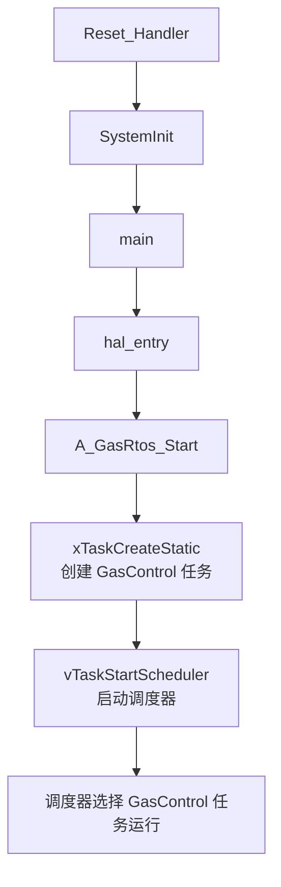
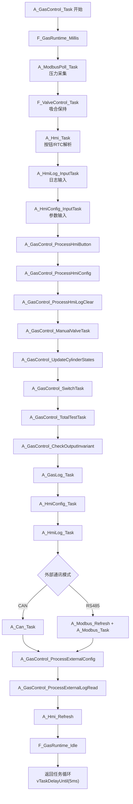

# 六瓶三阀气源控制代码执行流程（函数级）

> 适用版本：V1.11（2026-08-29）
>
> 本文按“先执行哪个函数 → 再调用哪个函数 → 每个函数的作用”梳理调用顺序。
> 更偏业务细节的状态机、串口屏控件、日志格式说明，请配合 `docs/程序运行流程说明.md` 一起阅读。

## 1. 从复位到 FreeRTOS 调度器启动

| 顺序 | 函数 | 所在文件 | 作用 |
|---:|---|---|---|
| 1 | `Reset_Handler` | `ra/fsp/src/bsp/cmsis/Device/RENESAS/Source/startup.c` | MCU 复位后的启动入口，先调用 `SystemInit()`，再调用 `main()`。 |
| 2 | `SystemInit` | `ra/fsp/src/bsp/cmsis/Device/RENESAS/Source/system.c` | BSP 系统初始化，完成时钟等基础设置。 |
| 3 | `main` | `ra_gen/main.c` | FSP 自动生成的主函数，内部只调用 `hal_entry()`。 |
| 4 | `hal_entry` | `src/hal_entry.c` | 定义静态的 `A_Gas_Rtos_Context` 上下文，并调用 `A_GasRtos_Start()`。 |
| 5 | `A_GasRtos_Start` | `MyUnitFile/A_Gas_Rtos.c` | 清零上下文，用 `xTaskCreateStatic()` 静态创建 `GasControl` 任务，再调用 `vTaskStartScheduler()` 启动调度器。 |
| 6 | `vApplicationGetIdleTaskMemory` / `vApplicationGetTimerTaskMemory` / `vApplicationIdleHook` | `MyUnitFile/A_Gas_Rtos.c` | 为 FreeRTOS 提供空闲任务、定时器任务的静态内存；空闲时执行 `__WFI()` 降低功耗。 |

## 2. 控制任务主循环

调度器启动后，首先运行 `GasControl` 任务入口 `F_GasRtos_ControlTask()`，其执行顺序如下：

1. `F_GasRtos_ControlTask`：任务入口，检查 `context` 参数。
2. `A_GasControl_Init`：只在上电后执行一次，完成整套气源业务初始化。
3. `xTaskGetTickCount`：记录第一个唤醒节拍。
4. 进入无限循环：
   - `A_GasControl_Task`：每周期执行一次完整业务。
   - `vTaskDelayUntil`：以固定 5 ms 绝对周期延时，减少累积漂移。

## 3. `A_GasControl_Init` 初始化调用顺序

初始化函数按下列顺序执行，先建立安全软件初态，再依次初始化硬件、传感器、存储、外部通讯和串口屏。

| 顺序 | 调用函数 | 作用 |
|---:|---|---|
| 1 | `memset(context, 0, ...)` | 清空整个应用上下文，避免残留状态。 |
| 2 | `A_GasConfig_LoadDefaults` | 加载编译期默认运行参数。 |
| 3 | 直接设置 `system` 字段 | 设为自动模式、无工作瓶、六瓶进入初始化状态、测试合格标志全清。 |
| 4 | `F_GasRuntime_Init` → `H_GasPlatform_Init` | 初始化硬件平台和毫秒时基。 |
| 5 | `F_GasRuntime_Millis` | 读取当前单调毫秒时间。 |
| 6 | `F_ValveControl_Init` → `F_ValveControl_AllOff` → `H_GasPlatform_AllValvesOff` | 把所有阀门置为关闭，保证上电安全。 |
| 7 | `A_ModbusPoll_Init` | 初始化 SCI1 内部压力传感器 Modbus 主站轮询。 |
| 8 | `A_Storage_Init` | 初始化 AT24C256 EEPROM。 |
| 9 | `A_GasControl_LoadCommMode` | 读取并校验外部通讯模式记录，优先新地址、兼容旧地址。 |
| 10 | `A_GasConfig_Load` | 从 EEPROM 读取并校验运行参数；失败则尝试 `A_GasConfig_Save` 写默认值。 |
| 11 | `A_GasLog_Init` | 恢复或创建循环日志区，并建立六瓶状态快照。 |
| 12 | `A_GasControl_InitExternalComm` | 按通讯模式调用 `A_Can_Init` 或 `A_Modbus_Init`。 |
| 13 | `A_GasControl_SaveCommMode`（条件执行） | EEPROM 无有效模式记录时，补写当前默认模式。 |
| 14 | `A_Hmi_Init` | 初始化 SCI9 大彩串口屏。 |
| 15 | `A_HmiConfig_Init` | 初始化密码参数页模块。 |
| 16 | `A_HmiLog_Init` | 初始化串口屏日志查询模块。 |

## 4. `A_GasControl_Task` 周期执行顺序

每个 5 ms 周期都按以下顺序执行，先采集输入、再执行业务控制、最后做安全检查、记录日志和刷新外部接口。

| 顺序 | 调用函数 | 作用 |
|---:|---|---|
| 1 | `F_GasRuntime_Millis` | 读取当前毫秒时间，供本周期各状态机使用。 |
| 2 | `A_ModbusPoll_Task` | 轮询并解析 1～7 号压力传感器，更新六瓶压力和总压力。 |
| 3 | `F_ValveControl_Task` | 推进 12 V 吸合转 5 V 保持的阀门时序。 |
| 4 | `A_Hmi_Task` | 解析串口屏按钮帧、文本输入和 RTC 响应，并周期请求 RTC。 |
| 5 | `A_HmiLog_InputTask` | 处理日志查询页的日期、时间输入。 |
| 6 | `A_HmiConfig_InputTask` | 处理参数页文本输入。 |
| 7 | `A_GasControl_ProcessHmiButton` | 把串口屏按钮转换为排气、测试、停用、合格确认、日志和参数操作。 |
| 8 | `A_GasControl_ProcessHmiConfig` | 执行串口屏参数保存请求。 |
| 9 | `A_GasControl_ProcessHmiLogClear` | 执行串口屏日志物理清除请求。 |
| 10 | `A_GasControl_ManualValveTask` | 按截止时间自动关闭人工排气阀、测试阀，并保证停用瓶全关。 |
| 11 | `A_GasControl_UpdateCylinderStates` | 根据压力和测试合格标志更新六瓶业务状态。 |
| 12 | `A_GasControl_SwitchTask` | 执行初始选瓶或低压自动换瓶状态机。 |
| 13 | `A_GasControl_TotalTestTask` | 推进总测试阀预开启和分路测试阀延时放行。 |
| 14 | `A_GasControl_CheckOutputInvariant` | 检查阀门安全不变量，冲突时全关并停止。 |
| 15 | `A_GasLog_Task` | 在时间有效时写半小时常规记录和状态变化事件日志。 |
| 16 | `A_HmiConfig_Task` | 分时刷新参数页显示。 |
| 17 | `A_HmiLog_Task` | 非阻塞执行日志索引、读页和逐行发送。 |
| 18 | CAN 分支：`A_Can_UpdateLogInfo` + `A_Can_Task` | 更新 CAN 日志信息并处理读写请求。 |
| 18 | RS485 分支：`A_Modbus_UpdateLogInfo` + `A_Modbus_Refresh` + `A_Modbus_Task` | 刷新 Modbus 寄存器并处理从站请求。 |
| 19 | `A_GasControl_ProcessCanControl` | 执行 CAN 收到的人工控制请求。 |
| 20 | `A_GasControl_ProcessExternalConfig` | 执行外部通讯参数保存/恢复请求。 |
| 21 | `A_GasControl_ProcessExternalLogRead` | 执行外部通讯日志读取请求。 |
| 22 | `A_Hmi_Refresh` | 日志查询空闲时分时刷新实时监控画面。 |
| 23 | `F_GasRuntime_Idle` | 把本周期剩余空闲处理转交硬件平台层。 |

## 5. 关键子函数职责速查

| 函数 | 主要作用 |
|---|---|
| `A_GasControl_UpdateCylinderStates` | 维护七种气瓶状态：初始化、待测试、待用、使用、低压待换、低压警告、停用。 |
| `A_GasControl_SelectInitialBottle` | 无工作瓶时按 1→2→…→6 顺序选择合格待用瓶并开进气阀。 |
| `A_GasControl_SwitchTask` | 低压确认、查找备用瓶、先关旧瓶、死区等待、开新瓶、验证新瓶的非阻塞自动换瓶。 |
| `A_GasControl_ProcessHmiButton` | 串口屏按钮到业务操作的分发中心。 |
| `A_GasControl_ManualValveTask` | 人工排气阀、测试阀到时自动关闭。 |
| `A_GasControl_TotalTestTask` | 总测试阀 `VAL_CAL` 与六路测试阀的联动和 500 ms 延时放行。 |
| `A_GasControl_CheckOutputInvariant` | 最后一道安全关：多路供气、同瓶冲突、停用瓶开阀时全关停机。 |
| `A_GasLog_Task` | 写常规记录和事件记录，维护环形日志。 |

## 6. 主要模块 Init / Task 对照

| 模块 | Init 函数 | 周期 Task 函数 | 作用 |
|---|---|---|---|
| 运行时平台 | `F_GasRuntime_Init` | `F_GasRuntime_Idle` | 硬件平台初始化、毫秒时基、空闲处理。 |
| 阀门控制 | `F_ValveControl_Init` | `F_ValveControl_Task` | 三阀输出、12 V 吸合转 5 V 保持、安全互锁。 |
| 内部传感器 | `A_ModbusPoll_Init` | `A_ModbusPoll_Task` | 轮询 1～7 号压力传感器。 |
| EEPROM | `A_Storage_Init` | — | AT24C256 读写。 |
| 参数 | `A_GasConfig_LoadDefaults` | — | 运行参数默认值、校验、读写。 |
| 日志 | `A_GasLog_Init` | `A_GasLog_Task` | 循环日志、状态事件、物理清除。 |
| 串口屏 | `A_Hmi_Init` | `A_Hmi_Task` / `A_Hmi_Refresh` | 按钮、RTC、监控画面刷新。 |
| 参数页 | `A_HmiConfig_Init` | `A_HmiConfig_Task` | 密码参数编辑和保存。 |
| 日志查询 | `A_HmiLog_Init` | `A_HmiLog_Task` | 串口屏分页日志查询。 |
| 外部 CAN | `A_Can_Init` | `A_Can_Task` | CAN0 外部通讯。 |
| 外部 Modbus | `A_Modbus_Init` | `A_Modbus_Task` | SCI0/RS485 外部 Modbus 从站。 |
