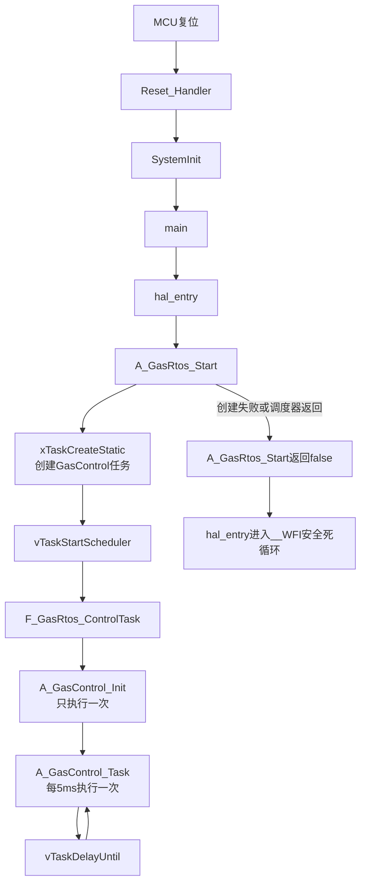

<p align="center" style="font-size: 2em; font-weight: bold; margin: 0.67em 0;">气源控制系统代码执行流程（函数执行轨迹）</p>

> 适用版本：V1.12（2026-09-01）
>
> 本文按照“谁调用当前函数 → 当前函数配置什么 → 当前函数继续调用谁 → 如何处理调用结果 → 当前函数返回到哪里 → 调用者下一步执行什么”的顺序说明程序执行过程。
>
> 气瓶七状态、自动换瓶条件、串口屏控件、日志格式和通信地址等业务定义，请配合 [程序运行流程说明_V1.12.md](程序运行流程说明_V1.12.md) 阅读。

# 阅读标记和展开范围

本文使用以下标记区分不同动作：

- **[调用]**：进入另一个函数执行。
- **[配置]**：直接修改上下文、系统状态、硬件寄存器或外设配置。
- **[判断]**：根据参数、返回值、状态机或时间条件选择分支。
- **[返回]**：当前函数结束，回到调用它的函数。
- **[下一步]**：调用者在当前函数返回后执行的下一个函数或动作。

调用链展开到三层：

1. 系统入口和应用层主函数。
2. A/F/H 模块之间的调用。
3. 影响硬件、状态机、存储、通信和安全结果的重要内部步骤。

`memcpy()`、CRC逐字节计算、字符串逐字符拼接等纯算法细节不逐行展开，只说明最终输入、输出和失败条件。

# 系统总调用链



正常运行时，`A_GasRtos_Start()`、`F_GasRtos_ControlTask()`和 `hal_entry()`都不会返回。只有任务创建失败或调度器异常退出时，程序才进入安全等待分支。

# 从复位到控制任务启动

## `Reset_Handler()` → `SystemInit()` → `main()`

调用者：MCU复位硬件。

执行频率：每次上电或复位一次。

1. **[调用]** `Reset_Handler()`执行启动代码。
2. **[调用]** `SystemInit()`完成BSP时钟和基础系统配置。
3. **[返回]** `SystemInit()`返回启动代码。
4. **[调用]** 启动代码进入FSP生成的 `main()`。
5. **[调用]** `main()`调用用户入口 `hal_entry()`。

## `hal_entry()`

调用者：FSP生成的 `main()`。

所在文件：`src/hal_entry.c`。

1. **[配置]** 在非安全工程中创建静态 `A_Gas_Rtos_Context gas_rtos_context`，用于长期保存任务控制块、任务栈和气源应用实例。
2. **[调用]** `A_GasRtos_Start(&gas_rtos_context)`。
3. **[判断]** `A_GasRtos_Start()`是否返回 `false`：
   - 正常情况：FreeRTOS调度器持续运行，不会返回。
   - 失败情况：进入无限循环并执行 `__WFI()`，保持上电安全状态，不再进入业务控制。

## `A_GasRtos_Start()`

调用者：`hal_entry()`。

所在文件：`MyUnitFile/A_Gas_Rtos.c`。

1. **[判断]** 检查 `context`：
   - `NULL`：返回 `false`给 `hal_entry()`。
   - 有效：继续执行。
2. **[配置]** 清空整个RTOS上下文。
3. **[调用]** `xTaskCreateStatic()`：
   - 任务入口：`F_GasRtos_ControlTask()`。
   - 任务名称：`GasControl`。
   - 参数：当前RTOS上下文。
   - 栈和任务控制块：使用上下文中的静态内存。
4. **[判断]** 任务句柄是否为空：
   - 为空：任务创建失败，返回 `false`给 `hal_entry()`。
   - 非空：设置 `scheduler_started = true`。
5. **[调用]** `vTaskStartScheduler()`启动调度器。
6. 正常情况下函数停留在调度器内，不再返回。
7. 如果调度器异常返回：设置 `scheduler_started = false`，返回 `false`给 `hal_entry()`。

## `F_GasRtos_ControlTask()`

调用者：FreeRTOS调度器。

执行频率：任务创建后进入一次，此后函数内部永久循环。

1. **[配置]** 将 `argument`转换为 `A_Gas_Rtos_Context *context`。
2. **[判断]** `context`是否为空：
   - 为空：调用 `vTaskDelete(NULL)`删除当前任务，然后返回调度器。
   - 有效：继续执行。
3. **[调用]** `A_GasControl_Init(&context->gas_control)`，完成整套气源系统初始化。
4. **[返回]** `A_GasControl_Init()`返回当前任务。
5. **[调用]** `xTaskGetTickCount()`，把当前系统节拍保存到 `last_wake_tick`。
6. **[配置]** 进入永久循环：
   1. **[调用]** `A_GasControl_Task()`执行一个完整5ms业务周期。
   2. **[返回]** 业务周期结束后返回当前任务。
   3. **[调用]** `vTaskDelayUntil()`等待下一个绝对周期，减少执行时间波动造成的累计漂移。
   4. 延时结束后再次调用 `A_GasControl_Task()`。

# `A_GasControl_Init()`完整初始化执行轨迹

调用者：`F_GasRtos_ControlTask()`。

执行频率：系统启动后只执行一次。

所在文件：`MyUnitFile/A_Gas_Control.c`。

完成结果：建立安全软件初态，初始化硬件、传感器、EEPROM、日志、外部通信和串口屏。

## 建立软件安全初态

1. **[判断]** 检查 `context`：为空时直接返回 `F_GasRtos_ControlTask()`。
2. **[配置]** 清空气源控制上下文，所有命令位、计时器、队列和状态从0开始。
3. **[调用]** `A_GasConfig_LoadDefaults()`：
   - 写入默认压力阈值。
   - 写入阀门吸合、关阀等待、开阀等待和人工阀门时长。
   - 测试阀最长开启时间默认设为10分钟。
4. **[返回]** 默认参数加载结束，回到 `A_GasControl_Init()`。
5. **[配置]** 外部通信模式先设为编译期默认模式。
6. **[配置]** 设置系统初态：
   - `mode = GAS_MODE_AUTO`。
   - 当前工作瓶、旧瓶和新瓶索引均设为无效索引。
   - 六瓶状态设为 `GAS_CYL_INIT`。
   - 六瓶测试合格标志全部清除。

## 初始化运行时硬件平台

1. **[调用]** `F_GasRuntime_Init()`。
2. `F_GasRuntime_Init()`内部：
   1. **[判断]** 检查运行时上下文。
   2. **[调用]** `H_GasPlatform_Init()`。
3. `H_GasPlatform_Init()`内部：
   1. **[配置]** 清空硬件上下文。
   2. **[调用]** `H_GasPlatform_ConfigureValvePins()`，把阀门和强吸合引脚配置为GPIO输出安全电平。
   3. **[调用]** `H_GasPlatform_AllValvesOff()`，强制关闭十八路分瓶阀、总测试阀和强吸合输出。
   4. **[调用]** `H_GasPlatform_SensorDirectionReceive()`，将内部RS485切换为接收方向。
   5. **[调用]** `R_SCI_UART_BaudCalculate()`计算SCI1的9600波特率参数。
   6. **[调用]** `R_SCI_UART_Open()`打开压力传感器SCI1。
   7. **[调用]** `R_SCI_UART_BaudSet()`应用波特率。
   8. **[调用]** `R_SCI_UART_CallbackSet()`注册 `rs485_sensor_callback()`并绑定当前硬件上下文。
   9. **[配置]** 启用DWT周期计数器，建立不占用SysTick的单调毫秒时基。
   10. **[返回]** UART、DWT时基、RS485方向、阀门引脚和阀门总使能全部成功时返回 `true`。
4. **[返回]** `F_GasRuntime_Init()`把硬件结果保存到 `runtime_service.ready`，再返回 `A_GasControl_Init()`。
5. **[配置]** 将结果写入 `system.platform_ready`。
6. **[调用]** `F_GasRuntime_Millis()`：
   - 内部调用 `H_GasPlatform_Millis()`读取DWT累计毫秒。
   - 返回后保存到 `now_ms`和 `system.switch_enter_ms`。
7. **[判断]** 平台未就绪时设置 `GAS_ALARM_PLATFORM_NOT_READY`。

## 初始化阀门服务并再次确认全关

1. **[调用]** `F_ValveControl_Init()`。
2. **[调用]** `F_ValveControl_AllOff()`。
3. `F_ValveControl_AllOff()`内部：
   1. **[调用]** `H_GasPlatform_AllValvesOff()`关闭全部硬件输出。
   2. **[配置]** 清除六瓶的 `supply_cmd`、`exhaust_cmd`和 `test_cmd`。
   3. **[配置]** 清除人工排气和测试阀截止时间。
   4. **[配置]** 清除 `total_test_cmd`。
4. **[返回]** 阀门服务初始化结束，回到 `A_GasControl_Init()`。
5. **[下一步]** 初始化内部压力传感器轮询。

## 初始化1～7号压力传感器轮询

1. **[调用]** `A_ModbusPoll_Init()`。
2. `A_ModbusPoll_Init()`内部：
   1. **[判断]** 检查轮询上下文、硬件平台和系统对象。
   2. **[配置]** 清空轮询上下文。
   3. **[配置]** 将轮询索引0～5映射到1～6号气瓶传感器地址，索引6映射到总压力地址7。
   4. **[配置]** 六瓶和总压力质量设为无效，通信失败次数清零。
   5. **[调用]** `F_ModbusPoll_Init()`。
   6. `F_ModbusPoll_Init()`再调用 `H_ModbusPoll_Init()`，把Modbus主站绑定到已打开的SCI1硬件平台。
   7. **[返回]** 将主站绑定结果写入 `sensor_poll.ready`并返回 `A_GasControl_Init()`。
3. **[判断]** 传感器主站初始化失败时：
   - `platform_ready = false`。
   - 设置传感器通信报警和平台未就绪报警。
4. **[下一步]** 初始化EEPROM。

## 初始化EEPROM并恢复持久化数据

1. **[调用]** `A_Storage_Init()`初始化AT24C256存储服务。
2. `A_Storage_Init()`内部通过 `F_At24c256_Init()`和软件IIC检查器件地址、总线和应答。
3. **[判断]** EEPROM初始化结果：
   - 失败：设置 `GAS_ALARM_STORAGE`，跳过通信模式、参数和日志恢复。
   - 成功：继续下面的数据恢复步骤。
4. **[调用]** `A_GasControl_LoadCommMode()`：
   - 优先读取新的通信模式地址。
   - 记录无效时兼容读取旧地址。
   - 校验标识、模式值和CRC。
   - 返回结果保存到 `comm_record_valid`。
5. **[调用]** `A_GasConfig_Load()`读取运行参数：
   - 校验记录标识、版本、CRC、单项范围和参数关系。
   - 支持旧版本参数迁移。
6. **[判断]** 参数读取结果：
   - 成功：用EEPROM参数覆盖编译期默认参数。
   - 失败：调用 `A_GasConfig_Save()`尝试把默认参数写入EEPROM。
   - 默认参数保存仍失败：设置 `GAS_ALARM_STORAGE`。
7. **[调用]** `A_GasLog_Init()`：
   - 读取两份冗余日志管理头。
   - 校验版本、代数、索引和CRC。
   - 选择较新的有效管理头；均无效时创建空日志区。
   - 建立六瓶状态快照，用于后续识别状态变化事件。
8. **[判断]** 日志初始化失败时设置 `GAS_ALARM_STORAGE`。
9. **[返回]** 存储恢复步骤结束，回到 `A_GasControl_Init()`。
10. **[下一步]** 初始化当前外部通信接口。

## 初始化CAN或外部Modbus

1. **[调用]** `A_GasControl_InitExternalComm(context, external_comm_mode)`。
2. **[判断]** 当前模式：
   - CAN：调用 `A_Can_Init()`，然后调用 `A_Can_UpdateLogInfo()`写入日志数量和容量。
   - RS485：调用 `A_Modbus_Init()`，然后调用 `A_Modbus_UpdateLogInfo()`写入日志数量和容量。
3. **[判断]** 接口初始化失败：设置对应的CAN或外部Modbus报警并返回 `false`。
4. **[返回]** 初始化成功时清除对应通信报警并返回 `A_GasControl_Init()`。
5. **[判断]** 同时满足以下条件时调用 `A_GasControl_SaveCommMode()`：
   - 外部接口初始化成功。
   - EEPROM存储服务已经就绪。
   - EEPROM中没有有效通信模式记录。
6. **[判断]** 通信模式补写失败时设置存储报警。

## 初始化串口屏及其业务模块

1. **[调用]** `A_Hmi_Init()`：
   - 清空HMI应用上下文。
   - 调用 `F_Hmi_Init()`。
   - `F_Hmi_Init()`调用 `H_Hmi_Init()`打开SCI9并注册回调。
   - 结果写入 `hmi.ready`。
2. **[判断]** HMI初始化失败时设置 `GAS_ALARM_HMI_COMM`。
3. **[调用]** `A_HmiConfig_Init()`：
   - 绑定HMI上下文。
   - 初始化参数编辑、确认和日志清除页面状态。
4. **[判断]** 参数页模块初始化失败时设置HMI通信报警。
5. **[调用]** `A_HmiLog_Init()`：
   - 绑定HMI、日志服务和系统状态。
   - 默认查询类型设为事件日志。
   - 建立默认时间、气瓶和状态筛选条件。
6. **[判断]** 日志查询模块初始化失败时设置HMI通信报警。
7. **[返回]** `A_GasControl_Init()`结束，返回 `F_GasRtos_ControlTask()`。
8. **[下一步]** `F_GasRtos_ControlTask()`调用 `xTaskGetTickCount()`，随后进入5ms周期循环。

# `A_GasControl_Task()`每5ms执行轨迹

调用者：`F_GasRtos_ControlTask()`。

执行频率：每5ms一次。

执行原则：先采集输入，再处理人员和外部请求，然后推进控制状态机，最后执行安全检查、日志和界面刷新。

## 一个完整周期的固定顺序

| 顺序 | 当前函数中的动作 | 返回后下一步 |
|---:|---|---|
| 1 | `F_GasRuntime_Millis()`读取本周期 `now_ms` | 压力传感器轮询 |
| 2 | `A_ModbusPoll_Task()`推进1～7号传感器事务并更新压力 | 阀门吸合保持任务 |
| 3 | `F_ValveControl_Task()`推进12V吸合转5V保持 | HMI协议解析 |
| 4 | `A_Hmi_Task()`解析按钮、文本、RTC并周期请求RTC | 日志条件文本处理 |
| 5 | `A_HmiLog_InputTask()`处理日期和时间输入 | 参数文本处理 |
| 6 | `A_HmiConfig_InputTask()`处理参数页文本输入 | HMI按钮分发 |
| 7 | `A_GasControl_ProcessHmiButton()`执行一条按钮事件 | HMI参数保存请求 |
| 8 | `A_GasControl_ProcessHmiConfig()`校验、保存并应用参数 | 日志清除请求 |
| 9 | `A_GasControl_ProcessHmiLogClear()`推进日志物理清除 | 人工阀门超时处理 |
| 10 | `A_GasControl_ManualValveTask()`关闭到时阀门和停用瓶阀门 | 六瓶状态更新 |
| 11 | `A_GasControl_UpdateCylinderStates()`维护七种气瓶状态 | 自动切瓶状态机 |
| 12 | `A_GasControl_SwitchTask()`推进初始选瓶或自动换瓶 | 总测试阀联动 |
| 13 | `A_GasControl_TotalTestTask()`推进总阀预开和分路延时开启 | 安全不变量检查 |
| 14 | `A_GasControl_CheckOutputInvariant()`检查十九路阀门安全关系 | 日志记录 |
| 15 | 条件调用 `A_GasLog_Task()`写事件或常规日志 | 参数页刷新 |
| 16 | `A_HmiConfig_Task()`分时发送一项参数页内容 | 日志查询任务 |
| 17 | `A_HmiLog_Task()`推进索引、翻页和逐行发送 | 当前外部通信分支 |
| 18A | CAN模式：更新日志信息，调用 `A_Can_Task()`并检查CAN故障 | CAN控制请求 |
| 18B | RS485模式：更新日志信息，刷新寄存器，调用 `A_Modbus_Task()`并检查故障 | CAN控制函数快速返回 |
| 19 | `A_GasControl_ProcessCanControl()`；非CAN模式或无请求时立即返回 | 外部参数请求 |
| 20 | `A_GasControl_ProcessExternalConfig()` | 外部日志读取请求 |
| 21 | `A_GasControl_ProcessExternalLogRead()` | HMI监控刷新判断 |
| 22 | 日志查询不忙时调用 `A_Hmi_Refresh()` | 空闲处理 |
| 23 | `F_GasRuntime_Idle()`转交平台空闲处理 | 返回RTOS任务 |
| 24 | `A_GasControl_Task()`返回 `F_GasRtos_ControlTask()` | `vTaskDelayUntil()`等待下一周期 |

## 日志记录条件

执行完安全不变量检查后：

1. **[判断]** 日志是否正在物理清除：正在清除时跳过正常日志写入。
2. **[判断]** 日志模块是否就绪：未就绪时不调用记录函数。
3. **[调用]** 条件满足时调用 `A_GasLog_Task()`。
4. **[判断]** 返回 `false`时设置 `GAS_ALARM_STORAGE`。
5. **[下一步]** 无论本周期是否写日志，都继续执行 `A_HmiConfig_Task()`。

## 外部通信分支结束后的共同路径

CAN或RS485分支执行完毕后统一进入：

```text
A_GasControl_ProcessCanControl
    ↓
A_GasControl_ProcessExternalConfig
    ↓
A_GasControl_ProcessExternalLogRead
    ↓
判断A_HmiLog_IsBusy
    ├─ 忙：跳过A_Hmi_Refresh
    └─ 空闲：调用A_Hmi_Refresh
    ↓
F_GasRuntime_Idle
    ↓
返回F_GasRtos_ControlTask
```

# 压力传感器轮询执行链

入口：`A_GasControl_Task()`调用 `A_ModbusPoll_Task()`。

1. **[判断]** 检查轮询上下文、系统、参数和 `ready`状态；异常时设置平台未就绪报警并返回主周期。
2. **[调用]** `F_ModbusPoll_Task()`推进当前异步事务：
   - 等待发送完成。
   - 切换RS485接收方向。
   - 等待固定长度响应。
   - 检查地址、功能码、字节数和CRC。
   - 超时或I/O异常时中止事务并保存结果。
3. **[返回]** 回到 `A_ModbusPoll_Task()`。
4. **[调用]** `F_ModbusPoll_TakeResult()`检查是否有完整事务结果。
5. **[判断]** 有成功结果时调用 `A_ModbusPoll_DecodePressure()`：
   - 解析AB CD顺序的IEEE-754浮点压力。
   - 超过配置上限时保存为超量程质量，而不是当作有效控制压力。
6. **[配置]** 根据 `pending_index`更新：
   - 0～5：对应气瓶压力、质量、时间戳和失败计数。
   - 6：更新总压力；总压力只用于显示和诊断，不参与自动切瓶。
7. **[判断]** 事务失败或数据解析失败时调用 `A_ModbusPoll_RecordFailure()`累计通信失败并更新质量与报警。
8. **[配置]** 无论成功失败都轮转到下一个传感器，避免离线设备长期占用总线。
9. **[判断]** 检查六瓶和总压力时间戳，超过新鲜时间后把质量改为 `GAS_PRESSURE_STALE`。
10. **[判断]** 主站空闲、没有待取结果并且轮询时间到达时调用 `F_ModbusPoll_StartRead()`，发起下一地址的功能码04请求。
11. **[返回]** `A_ModbusPoll_Task()`返回 `A_GasControl_Task()`。
12. **[下一步]** 主周期调用 `F_ValveControl_Task()`。

# HMI输入和按钮处理执行链

## `A_Hmi_Task()`解析串口数据

1. **[调用]** `F_Hmi_Task()`从SCI9环形缓冲区取字节并解析按钮、菜单、文本和RTC帧。
2. **[调用]** `F_Hmi_TakeRtcTime()`尝试取出有效RTC时间。
3. **[判断]** 有新RTC时更新 `system.date_time`和来源时间戳，并设 `valid = true`。
4. **[判断]** RTC超过规定时间没有更新时设 `valid = false`，日志暂停写入带时间记录。
5. **[判断]** 到达每秒读取时间且发送队列可用时调用 `F_Hmi_SendReadRtc()`。
6. **[返回]** 回到主周期，下一步执行日志和参数文本输入处理。

## 文本先处理、按钮后处理

主周期严格执行以下顺序：

```text
A_Hmi_Task解析上传帧
    ↓
A_HmiLog_InputTask提交日期/时间文本
    ↓
A_HmiConfig_InputTask提交参数文本
    ↓
A_GasControl_ProcessHmiButton处理查询/确认按钮
```

因此，同一周期内先上传文本再点击按钮时，按钮建立的日志筛选快照或参数候选值会使用最后一次合法输入。

## `A_GasControl_ProcessHmiButton()`

1. **[调用]** `A_Hmi_TakeButtonEvent()`取出一条按钮或下拉菜单事件；没有事件时返回主周期。
2. **[判断]** 根据控件ID依次分发：
   - 排气按钮：调用 `A_GasControl_StartExhaust()`，再调用 `A_Hmi_RequestExhaustSync()`回写MCU实际状态。
   - 测试阀按钮：调用 `A_GasControl_SetTestValve()`，再请求测试按钮同步。
   - 停用按钮：调用 `A_GasControl_SetCylinderDisabled()`，再请求停用状态同步。
   - 测试合格按钮：调用 `A_GasControl_SetQualificationPassed()`，再请求测试结论同步。
   - 日志筛选页控件：调用 `A_HmiLog_HandleFilterButton()`。
   - 事件或常规日志刷新：调用 `A_HmiLog_Request()`。
   - 最新页、上一页、下一页：调用 `A_HmiLog_RequestPage()`。
   - 参数菜单：调用 `A_HmiConfig_Open()`。
   - 日志清除入口：调用 `A_HmiConfig_OpenLogClear()`。
   - 日志清除确认按钮：调用 `A_HmiConfig_HandleLogClearButton()`。
   - 参数确认按钮：调用 `A_HmiConfig_HandleButton()`。
3. **[判断]** 业务请求被状态或互锁拒绝时设置 `GAS_ALARM_MANUAL_VALVE_ABORTED`。
4. **[返回]** 返回 `A_GasControl_Task()`。
5. **[下一步]** 主周期调用 `A_GasControl_ProcessHmiConfig()`处理可能产生的保存请求。

# 参数修改、确认、保存和生效流程

入口：串口屏参数文本和确认按钮。

1. `A_HmiConfig_InputTask()`读取一个参数文本：
   - 解析整数或三位小数。
   - 检查单项范围。
   - 合法值写入 `edit_config`。
   - 非法值保留原配置并安排错误提示刷新。
2. `A_GasControl_ProcessHmiButton()`调用 `A_HmiConfig_HandleButton()`：
   - 第一次确认只建立候选参数和确认画面。
   - 人员再次确认后设置 `save_pending`。
3. **[返回]** 按钮处理结束，主周期立即调用 `A_GasControl_ProcessHmiConfig()`。
4. `A_GasControl_ProcessHmiConfig()`内部：
   1. **[调用]** `A_HmiConfig_TakeSaveRequest()`取出完整候选参数。
   2. **[调用]** `A_GasConfig_Validate()`检查全部范围和阈值关系。
   3. **[判断]** 校验失败：调用 `A_HmiConfig_ReportResult()`显示范围或关系错误，保留当前运行参数并返回主周期。
   4. **[调用]** 校验成功后调用 `A_GasConfig_Save()`写EEPROM并读回校验。
   5. **[判断]** 保存失败：设置存储报警，向HMI报告存储失败，保留旧参数并返回。
   6. **[配置]** 保存成功后一次性用候选值替换 `context->config`。
   7. **[调用]** `A_GasControl_ReclassifyPressureQuality()`按新的压力上限重新判断现有样本质量。
   8. **[判断]** 如果尚处于低压确认或无备用瓶阶段，则复位到 `GAS_SWITCH_IDLE`，使用新阈值重新判断；已经进入机械切瓶阶段时不中断当前动作。
   9. **[调用]** `A_GasControl_UpdateExternalConfig()`同步CAN镜像或Modbus保持寄存器。
   10. **[调用]** `A_HmiConfig_ReportResult()`报告成功并刷新当前参数。
5. **[返回]** 回到主周期。
6. **[下一步]** 调用 `A_GasControl_ProcessHmiLogClear()`。

# 日志记录、查询和物理清除流程

## `A_GasLog_Task()`记录日志

1. **[判断]** 日志上下文未就绪时返回失败。
2. **[判断]** 正在物理清除时不写日志，返回成功让主周期继续。
3. **[判断]** RTC时间无效时暂停写日志，保留状态快照并返回。
4. **[循环]** 比较六瓶当前状态与 `previous_state`：
   - 找到第一条状态变化时编码一条事件日志。
   - 调用 `A_GasLog_Append()`写入EEPROM并更新管理头。
   - 每个5ms周期最多写一条，写完立即返回主周期。
5. **[判断]** 没有状态事件时计算当前半小时常规记录键值。
6. 键值变化时编码六瓶压力、总压力、六瓶状态和有效位图，并追加一条常规日志。
7. **[返回]** 返回主周期；失败时由主周期设置存储报警。

## 日志条件输入和查询请求

1. `A_HmiLog_InputTask()`只处理Screen6的四个文本框：开始日期、开始时间、结束日期和结束时间。
2. 日期按 `YYYYMMDD`解析，时间按 `HHMMSS`解析。
3. **[判断]** 输入合法：
   - 更新 `edit_filter`。
   - 自动启用限定时间筛选。
   - 安排全部时间开关和提示文本回写。
4. **[判断]** 输入非法：
   - 不修改筛选值。
   - 只回写当前输入框的旧值并显示错误提示。
5. 气瓶菜单149号上传0～6，状态菜单150号上传0～7；触发按钮132和134只负责弹出菜单，不修改筛选值。
6. 人员点击查询后，`A_HmiLog_Request()`把 `edit_filter`复制到 `active_filter`，固定本次查询快照，并设置 `request_pending`。
7. **[返回]** 请求函数返回按钮处理函数，再返回主周期。
8. **[下一步]** 本周期后半段调用 `A_HmiLog_Task()`开始非阻塞查询。

## `A_HmiLog_Task()`非阻塞状态机

每次调用最多读取一条EEPROM记录或发送一行，状态按以下顺序推进：

```text
request_pending
    ↓ A_HmiLog_StartRequest
CLEAR 清空记录控件
    ↓
SCAN 反向扫描日志并建立RAM索引
    ↓ 达到请求页或扫描完成
PAGE_CLEAR 清空目标页控件
    ↓
PAGE_READ 读取一条EEPROM日志
    ↓
PAGE_ROWS 格式化并发送一行/两行
    └─ 未到页尾：返回PAGE_READ
    ↓ 页尾
PAGE_INFO 发送页码和总条数
    ↓
STATUS 发送完成、错误或快照变化提示
    ↓
IDLE
```

关键分支：

1. 查询开始时保存日志 `next_sequence`，作为快照版本。
2. 扫描和显示期间产生新日志时：停止使用旧索引，保留已经显示的页面并提示“日志已更新”。
3. 读取EEPROM失败、CRC错误或记录类型不匹配时调用 `A_HmiLog_FailAndClear()`。
4. 常规日志一条记录分压力行和状态行两次发送；事件日志一条记录只发送一行。
5. 查询未结束时 `A_HmiLog_IsBusy()`返回 `true`，主周期暂停普通监控画面刷新，把SCI9带宽留给日志。
6. 状态进入 `IDLE`后返回主周期，下一周期可继续实时画面刷新。

## 日志物理清除

1. 人员进入日志清除画面并二次确认。
2. `A_HmiConfig_TakeLogClearRequest()`返回清除请求。
3. `A_GasControl_ProcessHmiLogClear()`调用 `A_GasLog_RequestClear()`。
4. **[判断]** 请求拒绝：设置存储报警，向HMI报告失败并返回主周期。
5. **[调用]** 请求接受后调用 `A_HmiLog_InvalidateCache()`，立即废弃RAM分页索引。
6. **[调用]** 每个主周期调用一次 `A_GasLog_ClearTask()`：
   - 先提交掉电安全空管理头。
   - 再逐页写入 `0xFF`。
   - 每页执行读回校验。
   - 最后更新结果和进度。
7. **[调用]** `A_GasLog_GetClearResult()`读取当前状态。
8. **[判断]** 结果：
   - `BUSY`：向HMI刷新当前进度。
   - `SUCCESS`：清除存储报警，显示100%和当前日志数量。
   - `FAILED`：设置存储报警并显示失败进度。
9. **[返回]** 返回主周期，下一周期继续清除状态机或后续业务。

# 阀门操作和总测试阀执行链

## 分瓶阀通用调用层级

应用层不直接操作GPIO，调用关系为：

```text
A_GasControl_xxx
    ↓ 业务状态、时间和索引判断
F_ValveControl_SetSupply / SetExhaust / SetTest
    ↓ 状态和阀门互锁判断
H_GasPlatform_WriteSupplyValve / WriteExhaustValve / WriteTestValve
    ↓ GPIO输出和12V强吸合计时
返回F层同步软件命令
    ↓
返回A层更新状态、截止时间、报警和HMI同步请求
```

任何供气阀开启前都检查最多一路供气；同一气瓶供气与排气/测试互斥；停用瓶禁止开阀。

## 人工排气阀

1. HMI或CAN请求进入应用层。
2. **[调用]** `A_GasControl_StartExhaust()`检查索引、停用状态和供气互锁。
3. **[调用]** `F_ValveControl_SetExhaust()`打开排气阀。
4. **[配置]** 成功后设置 `exhaust_deadline_ms`。
5. 每周期 `A_GasControl_ManualValveTask()`检查截止时间。
6. 到时后调用 `F_ValveControl_SetExhaust(..., false)`关闭排气阀并清除截止时间。
7. **[返回]** 回到主周期继续六瓶状态更新。

## 测试阀和总测试阀

1. 测试阀开启请求调用 `A_GasControl_SetTestValve()`。
2. 应用层把对应气瓶加入 `pending_open_mask`。
3. 每周期 `A_GasControl_TotalTestTask()`检查等待位图。
4. **[判断]** 有等待请求且总测试阀未开：调用 `F_ValveControl_SetTotalTest(..., true)`先打开总测试阀。
5. **[配置]** 为每个等待分路设置不早于当前时间加500ms的开启时刻。
6. 时间到达后调用 `F_ValveControl_SetTest(..., true)`打开对应测试阀。
7. **[配置]** 成功后设置测试阀截止时间，最长范围5～60分钟，默认10分钟。
8. `A_GasControl_ManualValveTask()`到时调用 `A_GasControl_SetTestValve(..., false)`关闭分路。
9. 最后一路测试阀关闭且没有等待请求时，`A_GasControl_TotalTestTask()`关闭总测试阀。
10. **[返回]** 回到主周期并进入安全不变量检查。

# 六瓶状态更新和自动换瓶执行链

## `A_GasControl_UpdateCylinderStates()`

对1～6号瓶依次执行：

1. 停用状态优先级最高；存在任何阀门命令时调用 `A_GasControl_CloseCylinderValves()`。
2. 当前工作瓶且供气阀开启：
   - 压力新鲜且不低于警告值：`GAS_CYL_ACTIVE`。
   - 压力低于警告值或压力失效：`GAS_CYL_LOW_WARNING`。
3. 非工作瓶出现供气命令：立即关阀并设置互锁报警。
4. 非工作瓶压力新鲜：
   - 低于待用最低压力：调用 `F_GasControl_EnterLowReplace()`进入低压待换并清除测试结论。
   - 从低压恢复且连续三个独立样本合格：进入待测试。
   - 压力合格且测试通过：进入待用。
   - 压力合格但未测试通过：进入待测试。
5. 压力不新鲜：进入初始化状态。
6. 六瓶全部处理后返回主周期。

## `A_GasControl_SwitchTask()`

前置条件：自动模式且平台就绪。

1. **[判断]** 当前没有工作瓶：
   - 调用 `A_GasControl_SelectInitialBottle()`。
   - `A_GasControl_FindNextReady()`按1→2→…→6循环查找压力新鲜、压力合格、测试通过且三阀关闭的待用瓶。
   - 找到后先关闭目标瓶其他阀门，再调用 `F_ValveControl_SetSupply()`开供气阀。
   - 阀门实际开启成功后才提交 `active_index`。
   - 返回主周期。
2. 当前有工作瓶时按状态机推进：

| 状态 | 本周期执行内容 | 下一状态 |
|---|---|---|
| `GAS_SWITCH_IDLE` | 监测工作瓶；首次低于切换压力时保存第一个样本和起始时间 | `LOW_CONFIRM` |
| `GAS_SWITCH_LOW_CONFIRM` | 使用独立压力时间戳累计样本；恢复到回差值时取消切换 | `FIND_NEXT`或`IDLE` |
| `GAS_SWITCH_FIND_NEXT` | 调用 `A_GasControl_FindNextReady()`查找备用瓶 | `CLOSE_OLD`或`NO_BACKUP` |
| `GAS_SWITCH_CLOSE_OLD` | 调用 `F_ValveControl_SetSupply()`关闭旧瓶 | `DEAD_TIME` |
| `GAS_SWITCH_DEAD_TIME` | 等待旧阀机械释放时间 | `OPEN_NEW` |
| `GAS_SWITCH_OPEN_NEW` | 关闭目标瓶其他阀门，再打开新供气阀 | `VERIFY_NEW` |
| `GAS_SWITCH_VERIFY_NEW` | 等待新阀稳定，旧瓶转低压待换，新瓶提交为工作瓶 | `IDLE` |
| `GAS_SWITCH_NO_BACKUP` | 不主动切断旧瓶，保留低压供气并设置无备用瓶报警 | `IDLE` |

3. **[判断]** 新瓶无法安全打开：
   - 调用 `A_GasControl_ForceAllValvesOff()`。
   - 清除工作瓶索引。
   - 系统进入停止模式。
   - 设置平台未就绪报警。
4. **[返回]** 状态机本周期步骤结束，返回主周期。
5. **[下一步]** 主周期调用 `A_GasControl_TotalTestTask()`，然后执行安全不变量检查。

# CAN和外部Modbus处理链

## CAN模式

1. 主周期调用 `A_Can_UpdateLogInfo()`刷新日志数量和容量。
2. **[调用]** `A_Can_Task()`：
   1. 调用 `F_CanProtocol_Task()`收取硬件帧、校验地址和CRC并推进发送队列。
   2. 优先重试尚未入队的延迟写响应。
   3. 继续发送跨周期的连续读响应。
   4. 调用 `F_CanProtocol_TakeRequest()`取一条完整请求。
   5. 读请求：分周期生成读响应。
   6. 写请求：校验地址和值；立即操作直接回包，需要EEPROM或业务层处理的请求保存到上下文。
3. **[返回]** 回到主周期。
4. **[调用]** `A_Can_HasFault()`；根据结果设置或清除CAN报警。
5. **[调用]** `A_GasControl_ProcessCanControl()`：
   - 取出排气、测试、停用或测试结论请求。
   - 检查平台就绪和机械切瓶忙状态。
   - 调用统一气源业务接口执行，不能绕过互锁直接操作GPIO。
   - 请求HMI同步实际状态。
   - 调用 `A_Can_CompleteControlRequest()`保存成功或详细失败原因。
6. **[返回]** 回到主周期，继续外部参数和日志请求。

## 外部Modbus模式

1. 调用 `A_Modbus_UpdateLogInfo()`刷新日志数量和容量。
2. 调用 `A_Modbus_Refresh()`把压力、状态、阀门位图、报警和运行模式写入输入寄存器。
3. **[调用]** `A_Modbus_Task()`：
   1. 调用 `F_Modbus_Task()`解析SCI0请求并发送Modbus响应。
   2. 调用 `F_Modbus_TakeWriteEvent()`取得主站写寄存器范围。
   3. 写范围包含命令寄存器时调用 `A_Modbus_ProcessCommandWrite()`。
   4. 包含参数提交寄存器时调用 `A_Modbus_ProcessConfigCommit()`。
   5. 包含恢复默认寄存器时调用 `A_Modbus_ProcessConfigDefault()`。
   6. 包含日志命令寄存器时调用 `A_Modbus_ProcessLogCommandWrite()`。
   7. 恢复固定的配置版本寄存器。
4. **[返回]** 回到主周期。
5. **[调用]** `A_Modbus_HasFault()`；根据结果设置或清除外部Modbus报警。
6. `A_GasControl_ProcessCanControl()`因当前不是CAN模式而立即返回。
7. **[下一步]** 统一进入外部参数和日志请求处理。

## 外部参数请求

1. `A_GasControl_ProcessExternalConfig()`调用当前通信模块的 `TakeConfigRequest()`。
2. 没有请求时立即返回主周期。
3. RS485整组参数提交要求六瓶全部停用且十九路阀门命令全部关闭；不满足时恢复当前参数镜像并返回系统忙。
4. 调用 `A_GasConfig_Save()`写EEPROM并读回校验。
5. 保存失败：设置存储报警，恢复旧参数镜像并返回存储失败。
6. 保存成功：提交新参数、重新判断压力质量、必要时复位尚未进入机械阶段的低压确认。
7. 更新CAN或Modbus参数镜像，并返回成功结果。
8. **[返回]** 回到主周期，下一步处理外部日志读取。

## 外部日志读取请求

1. `A_GasControl_ProcessExternalLogRead()`从当前通信模块取得逻辑日志索引。
2. 日志正在物理清除：返回忙。
3. 日志模块未就绪：设置存储报警并返回读取失败。
4. 索引大于等于有效数量：返回索引无效。
5. 调用 `A_GasLog_ReadRecord()`把逻辑索引转换为环形物理地址，读取32字节并校验版本、类型和CRC。
6. 调用当前通信模块的 `SetLogRecord()`写入数据窗口。
7. 任一步失败：设置存储报警并返回读取失败。
8. 全部成功：返回日志读取成功。
9. **[返回]** 回到主周期，下一步判断是否允许刷新HMI实时监控页面。

# 安全不变量和错误后的执行去向

## `A_GasControl_CheckOutputInvariant()`

在状态判断和所有阀门状态机之后、日志记录之前执行：

1. 统计开启的供气阀数量。
2. 检查同瓶供气与排气/测试冲突。
3. 检查停用瓶是否存在任何开阀命令。
4. 检查总测试阀与分路测试阀、等待开启位图是否一致。
5. **[判断]** 发现多路供气或任何冲突：
   - 调用 `A_GasControl_ForceAllValvesOff()`。
   - 清除工作瓶索引。
   - 系统进入停止模式。
   - 切瓶状态复位为空闲。
   - 设置阀门互锁报警；多路供气时额外设置多供气报警。
6. **[返回]** 返回主周期。
7. **[下一步]** 主周期只记录经过安全检查后的最终状态。

## 主要故障后的处理结果

| 故障 | 当前层处理 | 后续运行 |
|---|---|---|
| 平台初始化失败 | 设置平台未就绪报警 | 禁止自动开阀 |
| 压力通信失败 | 累计失败次数，质量转警告/故障/陈旧 | 保留最后数值用于诊断，不作为有效控制压力 |
| EEPROM参数读取失败 | 使用编译期默认参数并尝试保存 | 保存失败则保持默认参数并设置存储报警 |
| 日志读写失败 | 设置存储报警 | 控制任务继续运行，日志功能降级 |
| HMI通信失败 | 设置HMI通信报警 | 自动控制继续，界面功能降级 |
| CAN/Modbus故障 | 设置当前外部通信报警 | 气源本地控制继续 |
| 新供气阀打开失败 | 全部阀门关闭、停止模式、清除工作瓶 | 等待维护处理 |
| 安全不变量冲突 | 全部阀门关闭并停止 | 不再继续自动切瓶 |
| 日志查询期间出现新日志 | 停止使用旧RAM索引并提示刷新 | 保留已经显示的页面 |

# 主要模块入口和返回关系速查

| 模块 | 初始化入口 | 周期入口 | 周期入口返回后 |
|---|---|---|---|
| RTOS | `A_GasRtos_Start` | `F_GasRtos_ControlTask`内部循环 | `vTaskDelayUntil` |
| 气源总控 | `A_GasControl_Init` | `A_GasControl_Task` | 返回控制任务延时 |
| 运行时平台 | `F_GasRuntime_Init` | `F_GasRuntime_Millis` / `F_GasRuntime_Idle` | 压力轮询或任务结束 |
| 阀门控制 | `F_ValveControl_Init` | `F_ValveControl_Task` | HMI解析 |
| 内部传感器 | `A_ModbusPoll_Init` | `A_ModbusPoll_Task` | 阀门吸合保持 |
| EEPROM | `A_Storage_Init` | 由参数、日志按需调用 | 返回对应业务函数 |
| 参数 | `A_GasConfig_LoadDefaults` / `A_GasConfig_Load` | 按保存请求调用 | 报告结果后回主周期 |
| 日志记录 | `A_GasLog_Init` | `A_GasLog_Task` | HMI参数页刷新 |
| HMI协议 | `A_Hmi_Init` | `A_Hmi_Task` / `A_Hmi_Refresh` | 文本处理或周期空闲 |
| HMI参数页 | `A_HmiConfig_Init` | `A_HmiConfig_InputTask` / `A_HmiConfig_Task` | 按钮处理或日志任务 |
| HMI日志查询 | `A_HmiLog_Init` | `A_HmiLog_InputTask` / `A_HmiLog_Task` | 按钮处理或外部通信 |
| CAN | `A_Can_Init` | `A_Can_Task` | CAN控制请求 |
| 外部Modbus | `A_Modbus_Init` | `A_Modbus_Refresh` / `A_Modbus_Task` | 外部请求处理 |

# 一个5ms周期结束后的去向

`A_GasControl_Task()`最后调用 `F_GasRuntime_Idle()`，随后：

1. **[返回]** `F_GasRuntime_Idle()`返回 `A_GasControl_Task()`。
2. **[返回]** `A_GasControl_Task()`返回 `F_GasRtos_ControlTask()`。
3. **[调用]** `F_GasRtos_ControlTask()`调用 `vTaskDelayUntil()`。
4. FreeRTOS在等待期间运行其他就绪任务或空闲任务。
5. 空闲任务调用 `vApplicationIdleHook()`执行 `__WFI()`等待中断。
6. 下一个5ms绝对节拍到达后，FreeRTOS再次调度 `F_GasRtos_ControlTask()`。
7. **[调用]** 再次进入 `A_GasControl_Task()`，开始下一周期。
