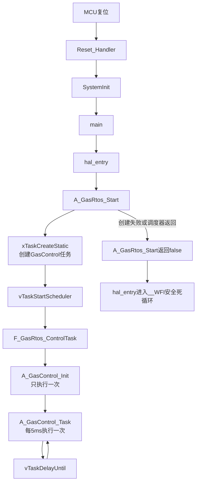

<p align="center" style="font-size: 2em; font-weight: bold; margin: 0.67em 0;">气源控制系统代码执行流程（函数执行轨迹）</p>

> 适用版本：V1.14（2026-09-04）
>
> 本文按照“谁调用当前函数 → 当前函数配置什么 → 当前函数继续调用谁 → 如何处理调用结果 → 当前函数返回到哪里 → 调用者下一步执行什么”的顺序说明程序执行过程。
>
> 气瓶七状态、自动换瓶条件、串口屏控件、日志格式和通信地址等业务定义，请配合 [程序运行流程说明_V1.14.md](程序运行流程说明_V1.14.md) 阅读；关键字段的数据来源与最终用途见[参数映射表](../PARAMETER_MAP.md)。

# 阅读标记和展开范围

本文使用以下标记区分不同动作：

- **[调用]**：进入另一个函数执行。
- **[配置]**：直接修改上下文、系统状态、硬件寄存器或外设配置。
- **[判断]**：根据参数、返回值、状态机或时间条件选择分支。
- **[返回]**：当前函数结束，回到调用它的函数。
- **[下一步]**：调用者在当前函数返回后执行的下一个函数或动作。

调用链展开到三层：

1. 系统入口和应用层主函数。
2. A/F/H 模块之间的调用。
3. 影响硬件、状态机、存储、通信和安全结果的重要内部步骤。

`memcpy()`、CRC逐字节计算、字符串逐字符拼接等纯算法细节不逐行展开，只说明最终输入、输出和失败条件。

# 系统总调用链



正常运行时，`A_GasRtos_Start()`、`F_GasRtos_ControlTask()`和 `hal_entry()`都不会返回。只有任务创建失败或调度器异常退出时，程序才进入安全等待分支。

# 从复位到控制任务启动

## `Reset_Handler()` → `SystemInit()` → `main()`

调用者：MCU复位硬件。

执行频率：每次上电或复位一次。

1. **[调用]** `Reset_Handler()`执行启动代码。
2. **[调用]** `SystemInit()`完成BSP时钟和基础系统配置。
3. **[返回]** `SystemInit()`返回启动代码。
4. **[调用]** 启动代码进入FSP生成的 `main()`。
5. **[调用]** `main()`调用用户入口 `hal_entry()`。

## `hal_entry()`

调用者：FSP生成的 `main()`。

所在文件：`src/hal_entry.c`。

1. **[配置]** 在非安全工程中分别创建静态 `A_Gas_Rtos_Context gas_rtos_context`和 `A_Gas_Control_Context gas_control_context`；前者保存任务资源，后者保存气源业务状态。
2. **[调用]** `A_GasRtos_Start(&gas_rtos_context, &gas_control_context)`。
3. **[判断]** `A_GasRtos_Start()`是否返回 `false`：
   - 正常情况：FreeRTOS调度器持续运行，不会返回。
   - 失败情况：进入无限循环并执行 `__WFI()`，保持上电安全状态，不再进入业务控制。

## `A_GasRtos_Start()`

调用者：`hal_entry()`。

所在文件：`MyUnitFile/A_Gas_Rtos.c`。

1. **[判断]** 检查 `context`和 `gas_control`：
   - 任一为 `NULL`：返回 `false`给 `hal_entry()`。
   - 有效：继续执行。
2. **[配置]** 清空RTOS任务资源上下文，并保存 `gas_control`业务实例指针。
3. **[调用]** `xTaskCreateStatic()`：
   - 任务入口：`F_GasRtos_ControlTask()`。
   - 任务名称：`GasControl`。
   - 参数：当前RTOS上下文。
   - 栈和任务控制块：使用上下文中的静态内存；任务栈为1024个`StackType_t`，即4096字节。
4. **[判断]** 任务句柄是否为空：
   - 为空：任务创建失败，返回 `false`给 `hal_entry()`。
   - 非空：继续启动调度器。
5. **[调用]** `vTaskStartScheduler()`启动调度器。
6. 正常情况下函数停留在调度器内，不再返回。
7. 如果调度器异常返回：直接返回 `false`给 `hal_entry()`。V1.14已移除没有任何读取者的`scheduler_started`字段，任务句柄和函数返回路径已足以表达创建/调度结果。

FSP工程配置的主栈是`0x400`字节（1024字节），主要用于调度器启动前的调用和中断现场；它与上述4096字节`GasControl`任务栈是两块独立内存。

## `F_GasRtos_ControlTask()`

调用者：FreeRTOS调度器。

执行频率：任务创建后进入一次，此后函数内部永久循环。

1. **[配置]** 将 `argument`转换为 `A_Gas_Rtos_Context *context`。
2. **[判断]** `context`或其 `gas_control`指针是否为空：
   - 任一为空：调用 `vTaskDelete(NULL)`删除当前任务，然后返回调度器。
   - 有效：继续执行。
3. **[调用]** `A_GasControl_Init(context->gas_control)`，完成整套气源系统初始化。
4. **[返回]** `A_GasControl_Init()`返回当前任务。
5. **[调用]** `xTaskGetTickCount()`，把当前系统节拍保存到 `last_wake_tick`。
6. **[配置]** 进入永久循环：
   1. **[调用]** `A_GasControl_Task()`执行一个完整5ms业务周期。
   2. **[返回]** 业务周期结束后返回当前任务。
   3. **[调用]** `vTaskDelayUntil()`等待下一个绝对周期，减少执行时间波动造成的累计漂移。
   4. 延时结束后再次调用 `A_GasControl_Task()`。

# `A_GasControl_Init()`完整初始化执行轨迹

调用者：`F_GasRtos_ControlTask()`。

执行频率：系统启动后只执行一次。

所在文件：`MyUnitFile/A_Gas_Control.c`。

完成结果：建立安全软件初态，初始化硬件、传感器、EEPROM、日志、外部通信和串口屏。

## 建立软件安全初态

1. **[判断]** 检查 `context`：为空时直接返回 `F_GasRtos_ControlTask()`。
2. **[配置]** 清空气源控制上下文，所有命令位、计时器、队列和状态从0开始。
3. **[调用]** `A_GasConfig_LoadDefaults()`：
   - 写入默认压力阈值。
   - 写入阀门吸合、关阀等待、开阀等待和人工阀门时长。
   - 测试阀最长开启时间默认设为10分钟。
4. **[返回]** 默认参数加载结束，回到 `A_GasControl_Init()`。
5. **[配置]** 外部通信模式先设为编译期默认模式。
6. **[配置]** 设置系统初态：
   - `mode = GAS_MODE_AUTO`。
   - 当前工作瓶、旧瓶和新瓶索引均设为无效索引。
   - 六瓶状态设为 `GAS_CYL_INIT`。
   - 六瓶测试合格标志全部清除。

## 初始化运行时硬件平台

1. **[调用]** `H_GasPlatform_Init(&context->platform)`，气源总控直接持有唯一硬件平台实例。
2. `H_GasPlatform_Init()`内部：
   1. **[配置]** 清空硬件上下文。
   2. **[调用]** `H_GasPlatform_ConfigureValvePins()`，把阀门和强吸合引脚配置为GPIO输出安全电平。
   3. **[调用]** `H_GasPlatform_AllValvesOff()`，尝试关闭十八路分瓶阀、总测试阀和强吸合输出；只有25路GPIO全部写入成功才清除硬件镜像。
   4. **[调用]** `H_GasPlatform_SensorDirectionReceive()`，将内部RS485切换为接收方向。
   5. **[调用]** `R_SCI_UART_BaudCalculate()`计算SCI1的9600波特率参数。
   6. **[调用]** `R_SCI_UART_Open()`打开压力传感器SCI1。
   7. **[调用]** `R_SCI_UART_BaudSet()`应用波特率。
   8. **[调用]** `R_SCI_UART_CallbackSet()`注册 `rs485_sensor_callback()`并绑定当前硬件上下文。
   9. **[配置]** 启用DWT周期计数器，建立不占用SysTick的单调毫秒时基。
   10. **[返回]** UART、DWT时基、RS485方向、阀门引脚和阀门总使能全部成功时返回 `true`。
3. **[返回]** `H_GasPlatform_Init()`直接把初始化结果返回 `A_GasControl_Init()`。
4. **[配置]** 将结果写入 `system.platform_ready`。
5. **[调用]** `H_GasPlatform_Millis()`读取DWT累计毫秒，保存到 `now_ms`和 `switch_enter_ms`。
6. **[判断]** 平台未就绪时设置 `GAS_ALARM_PLATFORM_NOT_READY`。

## 初始化阀门服务并再次确认全关

1. **[调用]** `F_ValveControl_Init()`。
2. **[调用]** `F_ValveControl_AllOff()`。
3. `F_ValveControl_AllOff()`内部：
   1. **[调用]** `H_GasPlatform_AllValvesOff()`尝试关闭全部硬件输出。
   2. **[判断]** 任一路GPIO写入失败：立即返回`false`，保留阀门命令和硬件镜像，不执行后续清零。
   3. **[配置]** 全部成功时才清除六瓶的`supply_cmd`、`exhaust_cmd`、`test_cmd`和两个截止时间。
   4. **[配置]** 全部成功时清除`total_test_cmd`并返回`true`。
4. **[判断]** `F_ValveControl_Init()`返回`false`时：
   - 设置`emergency_close_pending = true`。
   - 设置`platform_ready = false`。
   - 设置`GAS_ALARM_PLATFORM_NOT_READY`。
   - 后续每个5 ms控制周期先重试`A_GasControl_ForceAllValvesOff()`。
5. **[返回]** 阀门服务初始化步骤结束，回到`A_GasControl_Init()`。
6. **[下一步]** 初始化内部压力传感器轮询。

## 初始化1～7号压力传感器轮询

1. **[调用]** `A_ModbusPoll_Init()`。
2. `A_ModbusPoll_Init()`内部：
   1. **[判断]** 检查轮询上下文、硬件平台和系统对象。
   2. **[配置]** 清空轮询上下文。
   3. **[配置]** 将轮询索引0～5映射到1～6号气瓶传感器地址，索引6映射到总压力地址7。
   4. **[配置]** 六瓶和总压力质量设为无效，通信失败次数清零。
   5. **[调用]** `F_ModbusPoll_Init()`。
   6. `F_ModbusPoll_Init()`直接保存气源硬件平台指针，后续通过 `H_GasPlatform_Sensor*()`接口使用已打开的SCI1。
   7. **[返回]** 将主站绑定结果写入 `sensor_poll.ready`并返回 `A_GasControl_Init()`。
3. **[判断]** 传感器主站初始化失败时：
   - `platform_ready = false`。
   - 设置传感器通信报警和平台未就绪报警。
4. **[下一步]** 初始化EEPROM。

## 初始化EEPROM并恢复持久化数据

1. **[调用]** `A_Storage_Init()`初始化AT24C256存储服务。
2. `A_Storage_Init()`内部通过 `F_At24c256_Init()`和软件IIC检查器件地址、总线和应答：
   1. `H_SoftIic_Init()`配置SCL/SDA开漏GPIO，必要时输出最多9个恢复时钟，并检查STOP及总线空闲电平。
   2. `F_At24c256_SetWriteProtect(..., true)`将WP恢复到保护电平；GPIO配置或写入失败返回总线错误。
   3. `F_At24c256_ProbeReady()`发送器件地址后必须成功产生STOP；`H_SoftIic_WriteByte()`用返回值报告总线执行结果、用输出参数报告ACK，F层因此能区分`BUS`和`NACK`。
3. **[判断]** EEPROM初始化结果：
   - 失败：设置 `GAS_ALARM_STORAGE`，跳过通信模式、参数和日志恢复。
   - 成功：继续下面的数据恢复步骤。
4. **[调用]** `A_GasControl_LoadCommMode()`：
   - 优先读取新的通信模式地址。
   - 记录无效时兼容读取旧地址。
   - 校验标识、模式值和CRC。
   - 返回结果保存到 `comm_record_valid`。
5. **[调用]** `A_GasConfig_Load()`读取运行参数：
   - 校验记录标识、版本、CRC、单项范围和参数关系。
   - 支持旧版本参数迁移。
6. **[判断]** 参数读取结果：
   - 成功：用EEPROM参数覆盖编译期默认参数。
   - 失败：调用 `A_GasConfig_Save()`尝试把默认参数写入EEPROM。
   - 默认参数保存仍失败：设置 `GAS_ALARM_STORAGE`。
7. **[调用]** `A_GasLog_Init()`：
   - 读取两份冗余日志管理头。
   - 校验版本、代数、索引和CRC。
   - 选择较新的有效管理头；均无效时创建空日志区。
   - 建立六瓶状态快照，用于后续识别状态变化事件。
8. **[判断]** 日志初始化失败时设置 `GAS_ALARM_STORAGE`。
9. **[返回]** 存储恢复步骤结束，回到 `A_GasControl_Init()`。
10. **[下一步]** 初始化当前外部通信接口。

运行中读取时，`H_SoftIic_ReadByte()`只在8个数据位、第9个ACK/NACK时钟及SDA释放全部成功后才写出字节；
任一GPIO操作或最终STOP失败都使`F_At24c256_Read()`返回`AT24C256_RESULT_BUS`并执行一次有界总线恢复；
时序完整但器件单次未应答返回`AT24C256_RESULT_NACK`，写完成轮询在限定次数内始终未就绪返回`AT24C256_RESULT_TIMEOUT`。写入时的页内数据、STOP、写完成轮询和WP重新保护
也都检查结果；WP失败另由`write_protect_fault`锁存。自检图样根据原数据异或生成，进入测试写后统一尝试恢复原两个字节并再次读回确认。上层参数和日志函数因此能拒绝不完整操作并设置存储报警。

## 初始化CAN或外部Modbus

1. **[调用]** `A_GasControl_InitExternalComm(context, external_comm_mode)`。
2. **[判断]** 当前模式：
   - CAN：调用 `A_Can_Init()`，然后调用 `A_Can_UpdateLogInfo()`写入日志数量和容量。
   - RS485：调用 `A_Modbus_Init()`；`H_Modbus_Init()`先检查SCI0接收方向和匹配电阻GPIO，再打开SCI0并注册回调，最后由`A_Modbus_UpdateLogInfo()`写入日志数量和容量。
   - `R_SCI_UART_CallbackSet()`失败时，`H_Modbus_Init()`尝试关闭已打开的SCI0，不把部分初始化的接口报告为就绪。
3. **[判断]** 接口初始化失败：设置对应的CAN或外部Modbus报警并返回 `false`。
4. **[返回]** 初始化成功时清除对应通信报警并返回 `A_GasControl_Init()`。
5. **[判断]** 同时满足以下条件时调用 `A_GasControl_SaveCommMode()`：
   - 外部接口初始化成功。
   - EEPROM存储服务已经就绪。
   - EEPROM中没有有效通信模式记录。
6. **[判断]** 通信模式补写失败时设置存储报警。

## 初始化串口屏及其业务模块

1. **[调用]** `A_Hmi_Init()`：
   - 清空HMI应用上下文。
   - 调用 `F_Hmi_Init()`。
   - `F_Hmi_Init()`调用 `H_Hmi_Init()`打开SCI9并注册回调。
   - 结果写入 `hmi.ready`。
2. **[判断]** HMI初始化失败时设置 `GAS_ALARM_HMI_COMM`。
3. **[调用]** `A_HmiConfig_Init()`：
   - 绑定HMI上下文。
   - 初始化参数编辑、确认和日志清除页面状态。
4. **[判断]** 参数页模块初始化失败时设置HMI通信报警。
5. **[调用]** `A_HmiLog_Init()`：
   - 绑定HMI、日志服务和系统状态。
   - 默认查询类型设为事件日志。
   - 建立默认时间、气瓶和状态筛选条件。
6. **[判断]** 日志查询模块初始化失败时设置HMI通信报警。
7. **[返回]** `A_GasControl_Init()`结束，返回 `F_GasRtos_ControlTask()`。
8. **[下一步]** `F_GasRtos_ControlTask()`调用 `xTaskGetTickCount()`，随后进入5ms周期循环。

# `A_GasControl_Task()`每5ms执行轨迹

调用者：`F_GasRtos_ControlTask()`。

执行频率：每5ms一次。

执行原则：先采集输入，再处理人员和外部请求，然后推进控制状态机，最后执行安全检查、日志和界面刷新。

## 一个完整周期的固定顺序

| 顺序 | 当前函数中的动作 | 返回后下一步 |
|---:|---|---|
| 1 | `H_GasPlatform_Millis()`读取本周期 `now_ms` | 压力传感器轮询 |
| 2 | `A_ModbusPoll_Task()`推进1～7号传感器事务并更新压力 | 阀门吸合保持任务 |
| 3 | `F_ValveControl_Task()`推进12 V吸合转5 V保持并检查`valve_io_error` | 失败则锁定平台并全关；否则检查已有全关重试 |
| 4 | 保持切换失败或`emergency_close_pending`有效时调用 `A_GasControl_ForceAllValvesOff()` | 仍失败则立即返回RTOS任务；成功才进入HMI检查 |
| 5 | 先调用`A_GasControl_HandleHmiFault()`；正常时才由`A_Hmi_Task()`解析按键、文本和RTC，解析后再次检查SCI9 | 错误时RTC置无效并清硬件缓存、残帧和输入队列；无错误才进入文本FIFO |
| 6 | `A_GasControl_ProcessHmiTextInputs()`循环调用日志/参数消费者；丢弃并计数未知队首文本，完成后复查SCI9 | 无错误才进入HMI按键FIFO处理 |
| 7 | 循环调用`A_GasControl_ProcessHmiButton()`；每条后检查SCI9与`valve_io_error`，首个故障立即停止本批后续事件 | 全关失败立即返回；否则进入HMI参数保存请求 |
| 8 | `A_GasControl_ProcessHmiConfig()`校验、保存并应用参数 | 日志清除请求 |
| 9 | `A_GasControl_ProcessHmiLogClear()`推进日志物理清除 | 人工阀门超时处理 |
| 10 | `A_GasControl_ManualValveTask()`关闭到时阀门和停用瓶阀门；关阀失败保留截止时间，返回后立即处理阀门IO故障 | 全关失败立即返回；否则更新六瓶状态 |
| 11 | `A_GasControl_UpdateCylinderStates()`维护七种气瓶状态；异常关阀后再次检查IO故障 | 全关失败立即返回；否则进入自动切瓶 |
| 12 | `A_GasControl_SwitchTask()`推进初始选瓶或自动换瓶；活动瓶关阀失败不再继续选新瓶，返回后再检查 | 全关失败立即返回；否则进入总测试联动 |
| 13 | `A_GasControl_TotalTestTask()`推进总阀预开和分路延时开启；单路GPIO失败立即退出并全关 | 全关失败立即返回；否则检查安全不变量 |
| 14 | `A_GasControl_CheckOutputInvariant()`检查十九路阀门安全关系；随后保留一次`valve_io_error`兜底检查 | 全关失败立即返回；否则记录日志 |
| 15 | 条件调用 `A_GasLog_Task()`写事件或常规日志 | 参数页刷新 |
| 16 | `A_HmiConfig_Task()`分时发送一项参数页内容 | 日志查询任务 |
| 17 | `A_HmiLog_Task()`推进索引、翻页和逐行发送，显式接收RTC有效标志 | 当前外部通信分支 |
| 18A | CAN模式：更新日志信息，调用 `A_Can_Task()`并显式传入当前参数，再检查CAN故障 | CAN控制请求 |
| 18B | RS485模式：更新日志信息、刷新寄存器，调用 `A_Modbus_Task()`并显式传入当前参数，再检查硬件故障 | CAN控制函数快速返回 |
| 19 | `A_GasControl_ProcessCanControl()`；随后立即检查阀门IO，失败时先全关并跳过本周期同步EEPROM请求 | 无阀门故障时进入外部参数请求 |
| 20 | `A_GasControl_ProcessExternalConfig()` | 外部日志读取请求 |
| 21 | `A_GasControl_ProcessExternalLogRead()` | 外部控制后阀门IO兜底复查 |
| 22 | `A_GasControl_HandleValveIoFault()`统一锁定`platform_ready`、置报警并调用紧急全关 | 全关失败立即返回；否则进入HMI监控刷新判断 |
| 23 | 日志查询不忙时调用 `A_Hmi_Refresh()` | 返回RTOS任务 |
| 24 | `A_GasControl_Task()`返回 `F_GasRtos_ControlTask()` | `vTaskDelayUntil()`等待下一周期 |

## 日志记录条件

执行完安全不变量检查后：

1. **[判断]** 日志是否正在物理清除：正在清除时跳过正常日志写入。
2. **[判断]** 日志模块是否就绪：未就绪时不调用记录函数。
3. **[调用]** 条件满足时调用 `A_GasLog_Task()`。
4. **[判断]** 返回 `false`时设置 `GAS_ALARM_STORAGE`。
5. **[下一步]** 无论本周期是否写日志，都继续执行 `A_HmiConfig_Task()`。

## 外部通信分支结束后的共同路径

CAN或RS485分支执行完毕后统一进入：

```text
A_GasControl_ProcessCanControl
    ↓
立即调用A_GasControl_HandleValveIoFault
    ├─ 错误：锁定platform_ready并紧急全关，跳过本周期EEPROM请求
    └─ 正常：A_GasControl_ProcessExternalConfig
                    ↓
              A_GasControl_ProcessExternalLogRead
                    ↓
              阀门IO兜底复查
    ↓
判断A_HmiLog_IsBusy
    ├─ 忙：跳过A_Hmi_Refresh
    └─ 空闲：调用A_Hmi_Refresh
    ↓
返回F_GasRtos_ControlTask
```

# 压力传感器轮询执行链

入口：`A_GasControl_Task()`调用 `A_ModbusPoll_Task()`。

1. **[判断]** 检查轮询上下文、系统、参数和 `ready`状态；异常时设置平台未就绪报警并返回主周期。
2. **[调用]** `F_ModbusPoll_Task()`推进当前异步事务：
   - 首先调用`H_GasPlatform_SensorHasError()`检查SCI1错误锁存。
   - 等待发送完成；接收缓冲已在发送前挂接，发送完成后只把状态切到`RX`。
   - 等待固定长度响应。
   - 检查地址、功能码、字节数和CRC。
   - 超时或异常时调用`F_ModbusPoll_FinishTransaction()`中止事务并恢复RS485接收方向。
   - 中止前已有SCI1错误，或中止/恢复方向失败时，最终结果强制为`MODBUS_POLL_RESULT_IO`。
3. **[返回]** 回到 `A_ModbusPoll_Task()`。
4. **[调用]** `F_ModbusPoll_TakeResult()`检查是否有完整事务结果。
5. **[判断]** 有成功结果时调用 `A_ModbusPoll_DecodePressure()`：
   - 解析AB CD顺序的IEEE-754浮点压力。
   - 超过配置上限时保存为超量程质量，而不是当作有效控制压力。
6. **[配置]** 根据 `pending_index`更新：
   - 0～5：对应气瓶压力、质量、时间戳和失败计数。
   - 6：更新总压力；总压力只用于显示和诊断，不参与自动切瓶。
7. **[判断]** 事务失败或数据解析失败时调用 `A_ModbusPoll_RecordFailure()`累计通信失败并更新质量与报警。
8. **[配置]** 无论成功失败都轮转到下一个传感器，避免离线设备长期占用总线。
9. **[判断]** 检查六瓶和总压力时间戳，超过新鲜时间后把质量改为 `GAS_PRESSURE_STALE`。
10. **[判断]** 主站空闲、没有待取结果并且轮询时间到达时调用 `F_ModbusPoll_StartRead()`：
    1. 构造下一地址的功能码04请求并保存预期响应长度。
    2. **[调用]** `H_GasPlatform_SensorRxStart()`先挂接定长接收；失败则完成为IO错误并返回`false`。
    3. **[调用]** `H_GasPlatform_SensorTxStart()`再切到发送方向并启动请求；失败同样完成为IO错误。
    4. 只有两步均成功才返回`true`，从站紧跟请求末尾的响应因此不会等到下一个5 ms周期才开始接收。
11. **[返回]** `A_ModbusPoll_Task()`返回 `A_GasControl_Task()`。
12. **[下一步]** 主周期调用 `F_ValveControl_Task()`。

# HMI输入和按钮处理执行链

## `A_Hmi_Task()`解析串口数据

1. **[判断]** 主周期先调用`A_GasControl_HandleHmiFault()`；SCI9已故障时不进入解析，立即使RTC无效并清空硬件/协议待处理输入。
2. **[调用]** SCI9正常时，`F_Hmi_Task()`从环形缓冲区取字节并解析按键、菜单、文本和RTC帧：
   - 严格14字节的B1 11按键和合法B1 14菜单按到达顺序写入8项`button_queue`，超长残帧不生成按钮事件。
   - 合法B1 11文本写入8项`text_queue`。
   - 对应队列已满时丢弃新事件并使`button_event_drop_count`或`text_event_drop_count`饱和累加。
3. **[判断]** `F_Hmi_Task()`返回后立即检查SCI9；解析期间锁存错误时直接返回，不取RTC，也不发送下一次RTC请求。
4. **[调用]** 无错误时`F_Hmi_TakeRtcTime()`尝试取出有效RTC时间。
5. **[判断]** 有新RTC时更新 `system.date_time`和来源时间戳，并设 `valid = true`。
6. **[判断]** RTC超过规定时间没有更新时设 `valid = false`，日志暂停写入带时间记录。
7. **[判断]** 到达每秒读取时间且发送队列可用时调用 `F_Hmi_SendReadRtc()`。
8. **[返回]** 回到主周期再次调用`A_GasControl_HandleHmiFault()`；若解析或发送期间出现错误，则使RTC无效并丢弃硬件缓存、协议残帧、RTC待取值及待执行输入。
9. **[下一步]** 无错误时执行HMI文本FIFO处理；故障锁存仅由重新初始化清除，自动控制继续运行。

## 文本先处理、按钮后处理

主周期严格执行以下顺序：

```text
A_GasControl_HandleHmiFault解析前拦截
    ├─ 已故障：RTC无效并清空本批，跳过全部HMI派生请求
    └─ 正常：A_Hmi_Task解析上传帧，解析后再次检查
    ↓
A_GasControl_ProcessHmiTextInputs循环处理文本FIFO
    ├─ A_HmiLog_InputTask尝试提交日期/时间文本
    ├─ A_HmiConfig_InputTask尝试提交参数文本
    └─ 都未消费：F_Hmi_DiscardTextEvent丢弃并计数
    ↓
while (A_GasControl_ProcessHmiButton)按到达顺序处理按键FIFO
    ├─ 每条后检查SCI9错误：RTC无效，清缓存、残帧和队列并停止本批
    ├─ 每条后检查阀门IO错误：锁定平台、紧急全关并停止本批
    ├─ 无故障：继续下一条
    └─ 整批正常：才执行HMI参数保存和日志清除请求
```

因此，同一周期内先上传文本再点击按钮时，按钮建立的日志筛选快照或参数候选值会使用最后一次合法输入。
未知文本不会占住队首，同一批次的连续按键/菜单也不再被单事件槽覆盖。

## `A_GasControl_ProcessHmiButton()`

1. **[调用]** `A_Hmi_TakeButtonEvent()`从8项FIFO队首取出一条按键或下拉菜单事件；没有事件时返回`false`。
2. **[判断]** 根据控件ID依次分发：
   - 排气按钮：调用 `A_GasControl_StartExhaust()`，再调用 `A_Hmi_RequestExhaustSync()`回写MCU实际状态。
   - 测试阀按钮：调用 `A_GasControl_SetTestValve()`，再请求测试按钮同步。
   - 停用按钮：调用 `A_GasControl_SetCylinderDisabled()`，再请求停用状态同步。
   - 测试合格按钮：调用 `A_GasControl_SetQualificationPassed()`，再请求测试结论同步。
   - 日志筛选页控件：调用 `A_HmiLog_HandleFilterButton()`。
   - 事件或常规日志刷新：调用 `A_HmiLog_Request()`。
   - 最新页、上一页、下一页：调用 `A_HmiLog_RequestPage()`。
   - 参数菜单：调用 `A_HmiConfig_Open()`。
   - 日志清除入口：调用 `A_HmiConfig_OpenLogClear()`。
   - 日志清除确认按钮：调用 `A_HmiConfig_HandleLogClearButton()`。
   - 参数确认按钮：调用 `A_HmiConfig_HandleButton()`。
3. **[判断]** 业务请求被状态或互锁拒绝时设置 `GAS_ALARM_MANUAL_VALVE_ABORTED`。
4. **[返回]** 处理一条后返回`true`；主周期先检查SCI9和阀门IO。任一故障会失效剩余输入或保留到下一周期，并禁止继续开阀；无故障才取下一条。
5. **[下一步]** 本批处理结束后，主周期调用 `A_GasControl_ProcessHmiConfig()`处理已经建立的保存请求。

`F_Hmi_SendText()`和`F_Hmi_SendRecordAdd()`在执行“载荷长度+11字节帧开销”前，先检查
`length <= F_HMI_TX_MAX_SIZE - 11U`。因此超大`size_t`输入会在加法和`memcpy()`前被拒绝，不能通过整数回绕绕过帧缓冲边界。

# 参数修改、确认、保存和生效流程

入口：串口屏参数文本和确认按钮。

1. `A_HmiConfig_InputTask()`读取一个参数文本：
   - 解析整数或三位小数。
   - 检查单项范围。
   - 合法值写入 `edit_config`。
   - 非法值保留原配置并安排错误提示刷新。
2. `A_GasControl_ProcessHmiButton()`调用 `A_HmiConfig_HandleButton()`：
   - 第一次确认只建立候选参数和确认画面。
   - 人员再次确认后设置 `save_pending`。
3. **[返回]** 按钮处理结束，主周期立即调用 `A_GasControl_ProcessHmiConfig()`。
4. `A_GasControl_ProcessHmiConfig()`内部：
   1. **[调用]** `A_HmiConfig_TakeSaveRequest()`取出完整候选参数。
   2. **[调用]** `A_GasConfig_Validate()`检查全部范围和阈值关系。
   3. **[判断]** 校验失败：调用 `A_HmiConfig_ReportResult()`显示范围或关系错误，保留当前运行参数并返回主周期。
   4. **[调用]** 校验成功后调用 `A_GasConfig_Save()`写EEPROM并读回校验。
   5. **[判断]** 保存失败：设置存储报警，向HMI报告存储失败，保留旧参数并返回。
   6. **[配置]** 保存成功后一次性用候选值替换 `context->config`。
   7. **[调用]** `A_GasControl_ReclassifyPressureQuality()`按新的压力上限重新判断现有样本质量。
   8. **[判断]** 如果尚处于低压确认或无备用瓶阶段，则复位到 `GAS_SWITCH_IDLE`，使用新阈值重新判断；已经进入机械切瓶阶段时不中断当前动作。
   9. **[调用]** `A_GasControl_UpdateExternalConfig()`同步CAN镜像或Modbus保持寄存器。
   10. **[调用]** `A_HmiConfig_ReportResult()`报告成功并刷新当前参数。
5. **[返回]** 回到主周期。
6. **[下一步]** 调用 `A_GasControl_ProcessHmiLogClear()`。

# 日志记录、查询和物理清除流程

## `A_GasLog_Task()`记录日志

1. **[判断]** 日志上下文未就绪时返回失败。
2. **[判断]** 正在物理清除时不写日志，返回成功让主周期继续。
3. **[判断]** RTC时间无效时暂停写日志，保留状态快照并返回。
4. **[循环]** 比较六瓶当前状态与 `previous_state`：
   - 找到第一条状态变化时编码一条事件日志。
   - 调用 `A_GasLog_Append()`写入EEPROM并更新管理头。
   - 每个5ms周期最多写一条；`A_GasLog_Append()`内部的EEPROM记录写入、读回校验和管理头提交都是同步调用，完成后才返回主周期。
5. **[判断]** 没有状态事件时计算当前半小时常规记录键值。
6. 键值变化时编码六瓶压力、总压力、六瓶状态和有效位图，并追加一条常规日志。
7. **[返回]** 返回主周期；失败时由主周期设置存储报警。

## 日志条件输入和查询请求

1. `A_HmiLog_InputTask()`只处理Screen6的四个文本框：开始日期、开始时间、结束日期和结束时间。
2. 日期按 `YYYYMMDD`解析，时间按 `HHMMSS`解析。
3. **[判断]** 输入合法：
   - 更新 `edit_filter`。
   - 自动启用限定时间筛选。
   - 安排全部时间开关和提示文本回写。
4. **[判断]** 输入非法：
   - 不修改筛选值。
   - 只回写当前输入框的旧值并显示错误提示。
5. 气瓶菜单149号上传0～6，状态菜单150号上传0～7；触发按钮132和134只负责弹出菜单，不修改筛选值。
6. 人员点击查询后，`A_HmiLog_Request()`把 `edit_filter`复制到 `active_filter`，固定本次查询快照，并设置 `request_pending`。
7. **[返回]** 请求函数返回按钮处理函数，再返回主周期。
8. **[下一步]** 本周期后半段调用 `A_HmiLog_Task()`开始分步查询。

## `A_HmiLog_Task()`分步查询状态机

每次调用最多完成一次同步EEPROM读取或发送一行，状态按以下顺序推进：

```text
request_pending
    ↓ A_HmiLog_StartRequest
CLEAR 清空记录控件
    ↓
SCAN 反向扫描日志并建立RAM索引
    ↓ 达到请求页或扫描完成
PAGE_CLEAR 清空目标页控件
    ↓
PAGE_READ 读取一条EEPROM日志
    ↓
PAGE_ROWS 格式化并发送一行/两行
    └─ 未到页尾：返回PAGE_READ
    ↓ 页尾
PAGE_INFO 发送页码和总条数
    ↓
STATUS 发送完成、错误或快照变化提示
    ↓
IDLE
```

关键分支：

1. 查询开始时保存日志 `next_sequence`，作为快照版本。
2. 扫描和显示期间产生新日志时：停止使用旧索引，保留已经显示的页面并提示“日志已更新”。
3. 读取EEPROM失败、CRC错误或记录类型不匹配时调用 `A_HmiLog_FailAndClear()`。
4. 常规日志一条记录分压力行和状态行两次发送；事件日志一条记录只发送一行。
5. 查询未结束时 `A_HmiLog_IsBusy()`返回 `true`，主周期暂停普通监控画面刷新，把SCI9带宽留给日志。
6. 状态进入 `IDLE`后返回主周期，下一周期可继续实时画面刷新。

分步状态机限制的是每个周期的存储操作数量，不是单次操作的执行时间。
`A_Storage → F_At24c256 → H_SoftIic`的读写、STOP和写完成轮询均在当前`GasControl`任务内同步执行到返回。
100 kHz下64字节页写的总线传输时间本身就可能超过5 ms，还需叠加写完成轮询和软件开销。
这是V1.14未改变的实时性技术债，发布前应在实机测量日志追加、分页读取和物理清除的WCET，后续再根据结果评估独立低优先级存储任务或可中断的存储状态机。

## 日志物理清除

1. 人员进入日志清除画面并二次确认。
2. `A_HmiConfig_TakeLogClearRequest()`返回清除请求。
3. `A_GasControl_ProcessHmiLogClear()`调用 `A_GasLog_RequestClear()`。
4. **[判断]** 请求拒绝：设置存储报警，向HMI报告失败并返回主周期。
5. **[调用]** 请求接受后调用 `A_HmiLog_InvalidateCache()`，立即废弃RAM分页索引。
6. **[调用]** 每个主周期调用一次 `A_GasLog_ClearTask()`：
   - 先提交掉电安全空管理头。
   - 再逐页写入 `0xFF`。
   - 每页执行读回校验。
   - 最后更新结果和进度。
   - 每次只调度一次同步存储访问，但当前访问返回前不会执行后续业务。
7. **[调用]** `A_GasLog_GetClearResult()`读取当前状态。
8. **[判断]** 结果：
   - `BUSY`：向HMI刷新当前进度。
   - `SUCCESS`：清除存储报警，显示100%和当前日志数量。
   - `FAILED`：设置存储报警并显示失败进度。
9. **[返回]** 返回主周期，下一周期继续清除状态机或后续业务。

# 阀门操作和总测试阀执行链

## 分瓶阀通用调用层级

应用层不直接操作GPIO，调用关系为：

```text
A_GasControl_xxx
    ↓ 业务状态、时间和索引判断
F_ValveControl_SetSupply / SetExhaust / SetTest
    ↓ 状态和阀门互锁判断
H_GasPlatform_WriteSupplyValve / WriteExhaustValve / WriteTestValve
    ↓ GPIO输出和12V强吸合计时
返回F层同步软件命令
    ↓
返回A层更新状态、截止时间、报警和HMI同步请求
```

任何供气阀开启前都检查最多一路供气；同一气瓶供气与排气/测试互斥；停用瓶禁止开阀。

## 人工排气阀

1. HMI或CAN请求进入应用层。
2. **[调用]** `A_GasControl_StartExhaust()`检查索引、停用状态和供气互锁。
3. **[调用]** `F_ValveControl_SetExhaust()`打开排气阀。
4. **[配置]** 成功后设置 `exhaust_deadline_ms`。
5. 每周期 `A_GasControl_ManualValveTask()`检查截止时间。
6. 到时后调用 `F_ValveControl_SetExhaust(..., false)`关闭排气阀：
   - 成功：清除`exhaust_deadline_ms`。
   - 失败：保留原截止时间和`exhaust_cmd`，设置人工阀异常报警，使后续周期仍具备重试依据。
7. **[返回]** 回到主周期继续六瓶状态更新；本次GPIO失败已锁存`valve_io_error`，状态机后的安全复查会锁定平台并紧急全关。

## 测试阀和总测试阀

1. 测试阀开启请求调用 `A_GasControl_SetTestValve()`。
2. 应用层把对应气瓶加入 `pending_open_mask`。
3. 每周期 `A_GasControl_TotalTestTask()`检查等待位图。
4. **[判断]** 有等待请求且总测试阀未开：调用 `F_ValveControl_SetTotalTest(..., true)`先打开总测试阀。
5. **[配置]** 为每个等待分路设置不早于当前时间加500ms的开启时刻。
6. 时间到达后调用 `F_ValveControl_SetTest(..., true)`打开对应测试阀。
7. **[配置]** 成功后设置测试阀截止时间，最长范围5～60分钟，默认10分钟。
8. `A_GasControl_ManualValveTask()`到时调用 `A_GasControl_SetTestValve(..., false)`关闭分路。
9. 最后一路测试阀关闭且没有等待请求时，`A_GasControl_TotalTestTask()`关闭总测试阀。
10. **[返回]** 回到主周期并进入安全不变量检查。

## 12 V转5 V保持失败

1. 主周期调用`F_ValveControl_Task()`。
2. `H_GasPlatform_ValveTask()`遍历六组到期`VAL_Px`，只有GPIO成功关闭时才清除对应吸合镜像和截止时间。
3. **[判断]** 任一GPIO失败或`valve_io_error`已锁存：`F_ValveControl_Task()`置位`GAS_ALARM_PLATFORM_NOT_READY`并返回`false`。
4. **[配置]** `A_GasControl_Task()`将`platform_ready`置`false`，调用`A_GasControl_ForceAllValvesOff()`。
5. **[判断]** 全25路GPIO关闭成功：清除命令/硬件镜像、`valve_io_error`和`emergency_close_pending`，但不自动把`platform_ready`恢复为`true`。
6. **[判断]** 全关仍失败：保留镜像和`emergency_close_pending`，主周期立即返回，跳过同步EEPROM等非关键业务，下一个5 ms周期优先重试。

# 六瓶状态更新和自动换瓶执行链

## `A_GasControl_UpdateCylinderStates()`

对1～6号瓶依次执行：

1. 停用状态优先级最高；存在任何阀门命令时调用 `A_GasControl_CloseCylinderValves()`。
2. 当前工作瓶且供气阀开启：
   - 压力新鲜且不低于警告值：`GAS_CYL_ACTIVE`。
   - 压力低于警告值或压力失效：`GAS_CYL_LOW_WARNING`。
3. 非工作瓶出现供气命令：立即关阀并设置互锁报警。
4. 非工作瓶压力新鲜：
   - 低于待用最低压力：调用 `F_GasControl_EnterLowReplace()`进入低压待换并清除测试结论。
   - 从低压恢复且连续三个独立样本合格：进入待测试。
   - 压力合格且测试通过：进入待用。
   - 压力合格但未测试通过：进入待测试。
5. 压力不新鲜：进入初始化状态。
6. 六瓶全部处理后返回主周期。

## `A_GasControl_SwitchTask()`

前置条件：自动模式且平台就绪。

1. **[判断]** 当前没有工作瓶：
   - 调用 `A_GasControl_SelectInitialBottle()`。
   - `A_GasControl_FindNextReady()`按1→2→…→6循环查找压力新鲜、压力合格、测试通过且三阀关闭的待用瓶。
   - 找到后先关闭目标瓶其他阀门，再调用 `F_ValveControl_SetSupply()`开供气阀。
   - 阀门实际开启成功后才提交 `active_index`。
   - 返回主周期。
2. 当前有工作瓶时按状态机推进：

| 状态 | 本周期执行内容 | 下一状态 |
|---|---|---|
| `GAS_SWITCH_IDLE` | 监测工作瓶；首次低于切换压力时保存第一个样本和起始时间 | `LOW_CONFIRM` |
| `GAS_SWITCH_LOW_CONFIRM` | 使用独立压力时间戳累计样本；恢复到回差值时取消切换 | `FIND_NEXT`或`IDLE` |
| `GAS_SWITCH_FIND_NEXT` | 调用 `A_GasControl_FindNextReady()`查找备用瓶 | `CLOSE_OLD`或`NO_BACKUP` |
| `GAS_SWITCH_CLOSE_OLD` | 调用 `F_ValveControl_SetSupply()`关闭旧瓶 | `DEAD_TIME` |
| `GAS_SWITCH_DEAD_TIME` | 等待旧阀机械释放时间 | `OPEN_NEW` |
| `GAS_SWITCH_OPEN_NEW` | 关闭目标瓶其他阀门，再打开新供气阀 | `VERIFY_NEW` |
| `GAS_SWITCH_VERIFY_NEW` | 等待新阀稳定，旧瓶转低压待换，新瓶提交为工作瓶 | `IDLE` |
| `GAS_SWITCH_NO_BACKUP` | 不主动切断旧瓶，保留低压供气并设置无备用瓶报警 | `IDLE` |

3. **[判断]** 新瓶无法安全打开：
   - 调用 `A_GasControl_ForceAllValvesOff()`。
   - 清除工作瓶索引。
   - 系统进入停止模式。
   - 设置平台未就绪报警。
   - 全关只有在25路GPIO全部写入成功后才清除命令和硬件镜像；失败时保留`emergency_close_pending`并每5 ms重试。
4. **[返回]** 状态机本周期步骤结束，返回主周期。
5. **[下一步]** 主周期调用 `A_GasControl_TotalTestTask()`，然后执行安全不变量检查。

# CAN和外部Modbus处理链

## CAN模式

1. 主周期调用 `A_Can_UpdateLogInfo()`刷新日志数量和容量。
2. **[调用]** `A_Can_Task()`：
   1. 调用 `F_CanProtocol_Task()`收取硬件帧、校验地址和CRC并推进发送队列。
   2. 优先重试尚未入队的延迟写响应。
   3. 继续发送跨周期的连续读响应。
   4. 调用 `F_CanProtocol_TakeRequest()`取一条完整请求。
   5. 读请求：分周期生成读响应。
   6. 写请求：校验地址和值；立即操作直接回包，需要EEPROM或业务层处理的请求保存到上下文。
3. **[返回]** 回到主周期。
4. **[调用]** `A_Can_HasFault()`；根据结果设置或清除CAN报警。
5. **[调用]** `A_GasControl_ProcessCanControl()`：
   - 取出排气、测试、停用或测试结论请求。
   - 检查平台就绪和机械切瓶忙状态。
   - 调用统一气源业务接口执行，不能绕过互锁直接操作GPIO。
   - 请求HMI同步实际状态。
   - 调用 `A_Can_CompleteControlRequest()`保存成功或详细失败原因。
6. **[返回]** 回到主周期，继续外部参数和日志请求。

## 外部Modbus模式

1. 调用 `A_Modbus_UpdateLogInfo()`刷新日志数量和容量。
2. 调用 `A_Modbus_Refresh()`把压力、状态、阀门位图、报警和运行模式写入输入寄存器。
3. **[调用]** `A_Modbus_Task()`：
   1. 调用 `F_Modbus_Task()`解析SCI0请求并发送Modbus响应。
   2. 调用 `F_Modbus_TakeWriteEvent()`取得主站写寄存器范围。
   3. 写范围包含命令寄存器时调用 `A_Modbus_ProcessCommandWrite()`。
   4. 包含参数提交寄存器时调用 `A_Modbus_ProcessConfigCommit()`。
   5. 包含恢复默认寄存器时调用 `A_Modbus_ProcessConfigDefault()`。
   6. 包含日志命令寄存器时调用 `A_Modbus_ProcessLogCommandWrite()`。
   7. 恢复固定的配置版本寄存器。
4. **[返回]** 回到主周期。
5. **[调用]** `A_Modbus_HasFault()`；根据结果设置或清除外部Modbus报警。
6. `A_GasControl_ProcessCanControl()`因当前不是CAN模式而立即返回。
7. **[下一步]** 统一进入外部参数和日志请求处理。

`F_Modbus_Task()`在组帧后通过`H_Modbus_Send()`启动异步响应。V1.14的底层失败路径为：

1. **[调用]** `H_Modbus_SetTransmitMode()`把`SCI0_EN`切到发送；写GPIO失败时锁存`uart_error`并拒绝启动UART。
2. **[调用]** `R_SCI_UART_Write()`；失败时清除发送忙、锁存错误并尝试恢复接收方向。
3. **[回调]** `UART_EVENT_TX_COMPLETE`到达后再把`SCI0_EN`切回接收，避免截断最后一个停止位；方向GPIO失败同样锁存`uart_error`。
4. **[判断]** `H_Modbus_HasFault()`将“SCI0未打开或`uart_error=true`”报给应用层，主周期置位`GAS_ALARM_EXTERNAL_MODBUS`。

## 外部通讯模式切换与回滚

`A_GasControl_SetExternalCommMode()`只在六瓶全部停用且十九路阀门命令均关闭时运行：

1. **[调用]** `A_GasControl_DeinitExternalComm(previous_mode)`关闭原接口；失败时保留原模式并设置原接口报警。
2. **[调用]** `A_GasControl_InitExternalComm(mode)`启动目标接口。
3. **[判断]** 目标初始化失败：先检查目标接口回滚关闭`target_closed`；仅在关闭成功后恢复原接口并还原内存模式，关闭失败时保留目标模式以反映可能仍打开的故障接口；任一步失败都设置对应通讯报警。
4. **[调用]** 目标接口就绪后调用`A_GasControl_SaveCommMode()`写EEPROM并读回校验。
5. **[判断]** 保存失败：检查目标接口关闭、原模式记录回写`previous_mode_saved`和原接口恢复；原接口恢复同样以目标接口确认关闭为前提。设置存储报警，回滚各步失败另外设置对应通讯报警。
6. **[返回]** 只有目标接口就绪且新模式记录读回成功时返回`true`；回滚失败不再被忽略。

## 外部参数请求

1. `A_GasControl_ProcessExternalConfig()`调用当前通信模块的 `TakeConfigRequest()`。
2. 没有请求时立即返回主周期。
3. RS485整组参数提交要求六瓶全部停用且十九路阀门命令全部关闭；不满足时用当前生效参数恢复Modbus保持寄存器并返回系统忙。
4. 调用 `A_GasConfig_Save()`写EEPROM并读回校验。
5. 保存失败：设置存储报警，CAN继续直接读取原生效参数，Modbus恢复对应保持寄存器，然后返回存储失败。
6. 保存成功：提交新参数、重新判断压力质量、必要时复位尚未进入机械阶段的低压确认。
7. CAN后续读请求直接使用新的生效参数；Modbus刷新保持寄存器，然后返回成功结果。
8. **[返回]** 回到主周期，下一步处理外部日志读取。

## 外部日志读取请求

1. `A_GasControl_ProcessExternalLogRead()`从当前通信模块取得逻辑日志索引。
2. 日志正在物理清除：返回忙。
3. 日志模块未就绪：设置存储报警并返回读取失败。
4. 索引大于等于有效数量：返回索引无效。
5. 调用 `A_GasLog_ReadRecord()`把逻辑索引转换为环形物理地址，读取32字节并校验版本、类型和CRC。
6. 调用当前通信模块的 `SetLogRecord()`写入数据窗口。
7. 任一步失败：设置存储报警并返回读取失败。
8. 全部成功：返回日志读取成功。
9. **[返回]** 回到主周期，下一步判断是否允许刷新HMI实时监控页面。

# 安全不变量和错误后的执行去向

## `A_GasControl_CheckOutputInvariant()`

在状态判断和所有阀门状态机之后、日志记录之前执行：

1. 统计开启的供气阀数量。
2. 检查同瓶供气与排气/测试冲突。
3. 检查停用瓶是否存在任何开阀命令。
4. 检查总测试阀与分路测试阀、等待开启位图是否一致。
5. **[判断]** 发现多路供气或任何冲突：
   - 调用 `A_GasControl_ForceAllValvesOff()`。
   - 清除工作瓶索引。
   - 系统进入停止模式。
   - 切瓶状态复位为空闲。
   - 设置阀门互锁报警；多路供气时额外设置多供气报警。
6. **[返回]** 返回主周期。
7. **[下一步]** 主周期只记录经过安全检查后的最终状态。

## 主要故障后的处理结果

| 故障 | 当前层处理 | 后续运行 |
|---|---|---|
| 平台初始化失败 | 设置平台未就绪报警 | 禁止自动开阀 |
| 压力通信失败 | 累计失败次数，质量转警告/故障/陈旧 | 保留最后数值用于诊断，不作为有效控制压力 |
| 阀门GPIO或12 V转5 V保持失败 | 锁存`valve_io_error`，置位`GAS_ALARM_PLATFORM_NOT_READY`，锁定`platform_ready=false`并紧急全关 | 全关失败时保留镜像、立即结束周期并每5 ms重试；全关成功也不自动解锁平台 |
| 人工排气到期关阀失败 | 保留`exhaust_deadline_ms`和命令镜像，设置人工阀异常报警 | 同时进入阀门IO错误的平台锁定/紧急全关路径，不误报关闭 |
| EEPROM参数读取失败 | 使用编译期默认参数并尝试保存 | 保存失败则保持默认参数并设置存储报警 |
| EEPROM软件IIC的GPIO、STOP实际释放、读字节或WP恢复失败 | 失败逐层返回业务层并设置存储报警；WP失败另行锁存 | 单次NACK、写完成TIMEOUT和BUS可区分，参数/日志操作不依赖假成功 |
| 日志读写失败 | 设置存储报警 | 控制任务在当次同步访问返回后继续，日志功能降级 |
| HMI通信失败 | 锁存SCI9错误、设置报警、使RTC无效并丢弃硬件缓存、协议残帧、RTC待取值和待执行输入 | 自动控制继续；HMI控制输入禁用到重新初始化，避免故障批次形成伪命令或错误日志时间 |
| HMI按键/文本FIFO满或未知文本 | 丢弃当前事件并饱和累加对应计数 | 队头继续向后处理，未知文本不再阻塞有效输入 |
| 外部Modbus方向/匹配电阻GPIO或SCI0故障 | 锁存`uart_error`并设置外部Modbus报警；初始化中途失败时回滚SCI0 | 气源本地控制继续，外部RS485功能降级 |
| 外部通讯模式切换失败 | 分别检查目标关闭、原记录回写和原接口恢复结果 | 保留对应CAN、Modbus或存储报警，不把不完整回滚当成成功 |
| CAN故障 | 设置外部CAN报警 | 气源本地控制继续 |
| 新供气阀打开失败 | 发起紧急全关、停止模式、清除工作瓶 | 全关失败时保留镜像并每5 ms重试；等待维护处理 |
| 安全不变量冲突 | 发起紧急全关并停止 | 全关失败时保持平台未就绪，不再继续自动切瓶 |
| 日志查询期间出现新日志 | 停止使用旧RAM索引并提示刷新 | 保留已经显示的页面 |

# 主要模块入口和返回关系速查

| 模块 | 初始化入口 | 周期入口 | 周期入口返回后 |
|---|---|---|---|
| RTOS | `A_GasRtos_Start` | `F_GasRtos_ControlTask`内部循环 | `vTaskDelayUntil` |
| 气源总控 | `A_GasControl_Init` | `A_GasControl_Task` | 返回控制任务延时 |
| 硬件平台 | `H_GasPlatform_Init` | `H_GasPlatform_Millis`及各硬件操作接口 | 压力轮询或对应功能状态机 |
| 阀门控制 | `F_ValveControl_Init` | `F_ValveControl_Task` | HMI解析 |
| 内部传感器 | `A_ModbusPoll_Init` | `A_ModbusPoll_Task` | 阀门吸合保持 |
| EEPROM | `A_Storage_Init` | 由参数、日志按需同步调用 | 读写及写完成轮询结束后返回对应业务函数 |
| 参数 | `A_GasConfig_LoadDefaults` / `A_GasConfig_Load` | 按保存请求调用 | 报告结果后回主周期 |
| 日志记录 | `A_GasLog_Init` | `A_GasLog_Task` | HMI参数页刷新 |
| HMI协议 | `A_Hmi_Init` | `A_Hmi_Task` / `A_Hmi_Refresh` | 文本处理或周期空闲 |
| HMI参数页 | `A_HmiConfig_Init` | `A_HmiConfig_InputTask` / `A_HmiConfig_Task` | 按钮处理或日志任务 |
| HMI日志查询 | `A_HmiLog_Init` | `A_HmiLog_InputTask` / `A_HmiLog_Task` | 按钮处理或外部通信 |
| CAN | `A_Can_Init` | `A_Can_Task` | CAN控制请求 |
| 外部Modbus | `A_Modbus_Init` | `A_Modbus_Refresh` / `A_Modbus_Task` | 外部请求处理 |

# 一个5ms周期结束后的去向

`A_GasControl_Task()`可能在正常路径完成HMI刷新判断后返回，也可能在任一安全检查点发现紧急全关仍失败时提前返回。两种路径随后都执行：

1. **[返回]** `A_GasControl_Task()`返回 `F_GasRtos_ControlTask()`。
2. **[调用]** `F_GasRtos_ControlTask()`调用 `vTaskDelayUntil()`。
3. FreeRTOS在等待期间运行其他就绪任务或空闲任务。
4. 空闲任务调用 `vApplicationIdleHook()`执行 `__WFI()`等待中断。
5. 下一个5ms绝对节拍到达后，FreeRTOS再次调度 `F_GasRtos_ControlTask()`。
6. **[调用]** 再次进入 `A_GasControl_Task()`，开始下一周期。

# 建议断点和Watch变量

下表用于第一次接触工程时快速回答“数据从哪里来、为什么进入当前分支、下一步会影响哪个硬件”。
更完整的字段级路径见[参数映射表](../PARAMETER_MAP.md)。

| 调试目标 | 建议断点 | 建议Watch |
|---|---|---|
| 初始化结果 | `A_GasControl_Init()`末尾 | `context->system.platform_ready`、`context->system.alarm_bits`、`context->emergency_close_pending` |
| 5 ms主周期 | `A_GasControl_Task()`入口和返回前 | `now_ms`、`system->mode`、`system->switch_state`、`system->active_index` |
| 压力帧解析 | `F_ModbusPoll_StartRead()`、`F_ModbusPoll_FinishTransaction()`、`A_ModbusPoll_Task()`取得事务结果后 | `sensor_uart_error`、`result`、`pending_index`、`poll_index`、`next_poll_ms`、目标`pressure_mpa/quality/timestamp` |
| 排气开关 | `A_GasControl_StartExhaust()`、`A_GasControl_StopExhaust()`、`A_GasControl_ManualValveTask()` | `platform_ready`、`valve_io_error`、目标气瓶`state/exhaust_cmd/exhaust_deadline_ms` |
| 测试阀联动 | `A_GasControl_SetTestValve()`、`A_GasControl_TotalTestTask()` | `total_test_pending_open_mask`、`test_open_not_before_ms[index]`、`total_test_cmd`、目标`test_cmd/test_deadline_ms` |
| 自动换瓶 | `A_GasControl_SwitchTask()`的状态`switch` | `switch_state`、`active_index`、`switch_old_index`、`switch_new_index`、`switch_low_sample_count`、`switch_enter_ms` |
| 安全全关 | `F_ValveControl_Task()`、`A_GasControl_ForceAllValvesOff()`、`H_GasPlatform_AllValvesOff()` | `valve_io_error`、`emergency_close_pending`、`platform_ready`、`GAS_ALARM_PLATFORM_NOT_READY`、三类命令镜像、四类硬件状态镜像 |
| 参数原子生效 | `A_GasControl_ProcessHmiConfig()`、`A_GasControl_ProcessExternalConfig()` | 局部`candidate`、`context->config`、参数结果码、存储报警位 |
| 日志时间筛选 | `A_HmiLog_InputTask()`、`A_HmiLog_Request()`、`A_HmiLog_RecordMatchesFilter()` | `edit_filter`、`active_filter`、`filter_error`、`scanned_count`、`matched_count` |
| HMI事件防丢与故障失效 | `F_Hmi_QueueButtonEvent()`、`F_Hmi_DiscardPendingInput()`、`A_GasControl_ProcessHmiTextInputs()`、`A_GasControl_HandleHmiFault()` | `button_queue_count`、`text_queue_count`、`button_event_drop_count`、`text_event_drop_count`、`hmi.hardware.uart_error`、`system.date_time.valid` |
| 外部Modbus/模式回滚 | `H_Modbus_Init()`、`H_Modbus_Send()`、`A_GasControl_SetExternalCommMode()` | `uart_open`、`uart_error`、`external_comm_mode`、`target_closed`、`previous_restored`、`previous_mode_saved`及通讯/存储报警位 |
| 同步存储WCET | `A_GasLog_Append()`、`A_HmiLog_Task()`、`A_GasLog_ClearTask()`前后翻转测量GPIO | 逻辑分析仪上的执行脉宽、任务周期超期情况；当前无专用WCET运行字段 |

# V1.14文档变更与验证边界

| 项目 | 说明 |
|---|---|
| 变更范围 | 同步V1.14生产代码的完整执行轨迹：内部Modbus发前预接收与IO分类；阀门GPIO/保持切换失败时的分阶段即时锁定、紧急全关、失败周期立即返回和重试；人工排气截止时间保留；HMI固定FIFO/严格帧长/RTC与控制输入错误批次失效；EEPROM软件IIC错误分类、自检恢复验证和WP故障锁存；外部Modbus与通讯模式回滚检查；移除无用`scheduler_started`。 |
| 影响模块 | `modbus_poll`、`H_Gas_Platform`、`F_Valve_Control`、`A_Gas_Control`、`HMI`、`AT24C256`、`modbus/H_Modbus`、`A_Gas_Rtos`及配套文档。FSP主栈实际为`0x400`字节（1024字节）；正常硬件时序、RTOS/FSP配置、CAN/Modbus字节协议、EEPROM参数/日志格式与V1.12大彩画面均未改。 |
| 实时性边界 | AT24C256软件IIC读写及写完成轮询仍同步执行；日志分步调度只限制每周期操作数量。100 kHz的64字节页写可能超过5 ms，是V1.14保留的实时性技术债。 |
| 验证方式 | 按caller→callee→返回值→后续分支逐项对照当前V1.14代码，并补充PC严格警告回归及`-fanalyzer`检查；Arm GCC 10.3.1全量重建和链接通过。实机GPIO/SCI/EEPROM故障注入与同步存储路径WCET仍待板卡验证。 |
