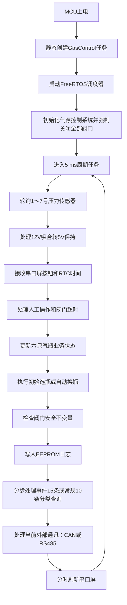
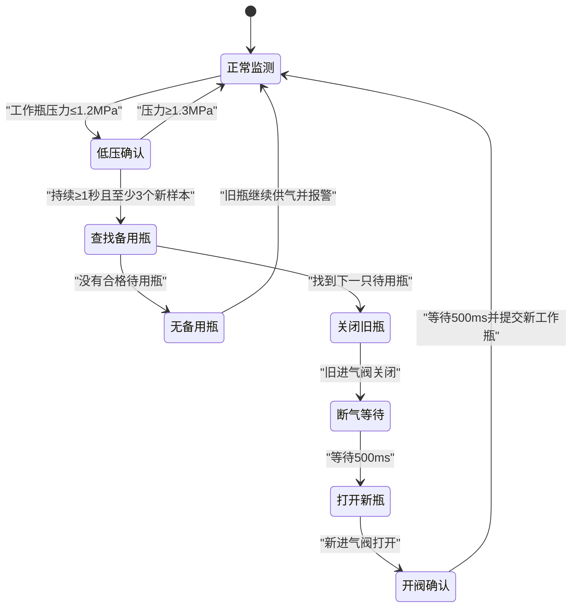

# 六瓶三阀气源控制程序运行流程说明

本文根据工程当前代码整理，说明系统从 MCU 上电开始，到压力采集、气瓶状态判断、自动换瓶、人工阀门操作、日志记录及外部通信的完整运行流程。

# 1. 程序总体结构

程序采用FreeRTOS静态任务结构，入口位于工程根目录下的`src/hal_entry.c`。

```c
void hal_entry(void)
{
    static A_Gas_Rtos_Context gas_rtos_context;

    (void) A_GasRtos_Start(&gas_rtos_context);
}
```

`A_GasRtos_Start()`使用静态TCB和静态栈创建`GasControl`任务并启动调度器。任务先执行一次
`A_GasControl_Init()`，随后以5 ms固定周期调用`A_GasControl_Task()`。自动换瓶、阀门延时、
传感器通信、串口屏通信和日志查询均采用非阻塞状态机，不使用长时间阻塞延时。

FreeRTOS应用上下文包含控制业务实例、静态任务控制块和4096字节控制任务栈，整体使用函数内静态存储。
FSP主栈配置为`0x1000`，用于调度器启动前的函数调用和中断现场；任务启动后使用独立任务栈。



# 2. 上电初始化流程

初始化函数为 `A_GasControl_Init()`，主要按以下顺序执行。

## 2.1 建立软件安全初态

程序先清空整个控制上下文，加载编译期默认参数，然后设置：

- 系统模式为自动模式；
- 当前工作瓶为无效索引；
- 原工作瓶和目标工作瓶均为无效索引；
- 六只气瓶全部进入初始化状态；
- 六只气瓶的测试合格标志全部为未通过；
- 全部阀门软件命令为关闭。

此时即使压力满足要求，也不会直接投入供气。气瓶必须取得有效压力，并由工作人员设置测试合格，才能进入待用状态。

## 2.2 初始化硬件平台和阀门

硬件平台初始化包括：

- 把全部进气阀、排气阀、分路测试阀和`VAL_CAL`总测试阀写为关闭；
- 把 `VAL_P1～VAL_P6` 强吸合控制写为关闭；
- 将内部压力传感器 RS485 设置为接收方向；
- 初始化 SCI1 为 9600、8N1；
- 初始化 DWT 单调毫秒时基；
- 清空硬件阀门状态镜像。

阀门初始化早于通信、EEPROM和串口屏初始化，因此后续模块即使初始化失败，阀门也已经处于关闭状态。

## 2.3 初始化压力传感器轮询

内部 Modbus 主站轮询七个地址：

| 地址 | 数据用途 |
|---:|---|
| 1 | 1号气瓶压力 |
| 2 | 2号气瓶压力 |
| 3 | 3号气瓶压力 |
| 4 | 4号气瓶压力 |
| 5 | 5号气瓶压力 |
| 6 | 6号气瓶压力 |
| 7 | 总压力 |

读取协议为：

- 功能码：`0x04`；
- 起始寄存器：`0x0000`；
- 寄存器数量：2；
- 数据类型：IEEE-754 32位浮点数；
- 字节顺序：AB CD；
- 压力单位：MPa。

刚上电时全部压力质量为无效。收到正确响应并通过CRC、地址、功能码和长度校验后，0～99.999 MPa
范围内的有限非负浮点数会被保存；不高于配置上限时质量为有效，高于配置上限时质量为超量程。

## 2.4 初始化AT24C256

EEPROM初始化成功后执行：

1. 读取运行参数记录；
2. 校验记录标识、版本、长度和CRC；
3. 校验参数范围和阈值关系；
4. 有效时使用EEPROM参数覆盖默认参数；
5. 无有效记录时使用默认参数并尝试写入EEPROM；
6. 读取`0x0020～0x0027`外部通讯模式记录，无效时选择默认CAN；
7. 读取A/B日志管理头，恢复日志数量和环形写入位置。

EEPROM异常不会使控制任务停止，但会设置存储报警。

## 2.5 初始化外部通信和串口屏

外部通讯默认使用CAN0，参数为250 kbit/s、29位扩展数据帧、本机类型0和地址1。EEPROM保存模式1
时改为启用SCI0/RS485 Modbus。两套源码均保留但任一时刻只运行一套，当前没有串口屏通讯选择控件。
程序接口只允许在停止状态且全部阀门关闭时切换；目标接口初始化或EEPROM保存失败会恢复原接口。

SCI9 串口屏用于人工排气、测试阀控制、气瓶停用、测试合格确认、运行数据显示和RTC时间读取。
串口屏初始化时先将 `DISP_POWER` 拉高并等待100ms，再将 `DISP_EN` 拉高并等待500ms，最后打开SCI9，避免屏幕尚未完成上电启动时接收通信数据。

# 3. 控制任务的固定执行顺序

每次调用 `A_GasControl_Task()` 时，依次执行以下任务：

1. 读取并解析内部压力传感器结果，必要时启动下一地址轮询；
2. 检查12V吸合截止时间，到期后切换到约5V保持；
3. 解析串口屏按钮帧和RTC响应；
4. 执行一条串口屏按钮业务操作；
5. 关闭达到截止时间的排气阀或分路测试阀，并在最后一路测试结束后关闭总测试阀；
6. 根据压力和测试合格标志更新六瓶状态；
7. 执行初始选瓶或低压自动换瓶；
8. 推进总测试阀预开启和分路延时放行，再检查多路供气、进气阀与人工阀互锁及总测试阀联动不变量；
9. 写入常规日志或状态变化事件日志；
10. 分步处理串口屏分类日志查询，每周期最多扫描、读取或发送一行；
11. 更新并处理当前外部CAN或RS485 Modbus；
12. 执行外部启停、参数保存或日志读取请求；
13. 日志查询空闲时分时刷新实时监控画面；
14. 使用`vTaskDelayUntil()`等待下一个5 ms周期。

先采集输入、再执行控制、最后检查安全不变量和记录日志，保证日志与对外状态反映的是本周期安全检查后的最终结果。

# 4. 压力传感器轮询和异常处理

正常轮询顺序为：

```text
地址1 → 地址2 → 地址3 → 地址4 → 地址5 → 地址6 → 地址7 → 地址1……
```

相邻请求默认间隔100ms，单次响应超时200ms。一个地址成功或失败后都会轮转到下一地址，防止离线设备长期占用总线。

压力成功后：

- 保存压力值；
- 不高于配置上限时质量设置为有效，高于配置上限时设置为超量程；
- 保存样本时间戳；
- 连续失败计数清零。

配置合法上限`pressure_max_mpa`默认为25MPa。超过该值的实际压力仍保存并在串口屏上以红色显示，
但不参与初始化、选瓶、低压判断或自动切换；负数、NaN、无穷大及高于99.999MPa的异常数据仍按解析失败处理。

异常处理规则：

- 连续失败3次：设置传感器通信报警；
- 连续失败10次：压力质量设置为无效；
- 工作瓶压力失效：进入低压警告并设置工作瓶传感器报警，但不会依靠无效压力直接换瓶；
- 非工作瓶压力失效：退回初始化状态；
- 有效或超量程压力超过默认2500ms没有更新：标记为过期并显示`--`，不再参与自动选瓶和切换判断。

地址7的总压力仅用于显示、日志和通信诊断，不参与六瓶状态机和自动换瓶。

# 5. 七种气瓶状态

| 状态值 | 状态 | 主要含义 |
|---:|---|---|
| 1 | 初始化 | 等待有效压力，随后进入低压待换、待测试或待用 |
| 2 | 待用 | 压力和测试均合格，可以被自动选择 |
| 3 | 使用 | 当前工作瓶，进气阀打开 |
| 4 | 低压待换 | 压力不足或刚被切换下来的旧瓶；进入时自动撤销测试通过结论 |
| 5 | 低压警告 | 工作瓶压力偏低或压力数据异常 |
| 6 | 停用 | 维护停用，三个阀门全部关闭 |
| 7 | 待测试 | 压力已经恢复合格，等待工作人员重新确认测试通过 |

## 5.1 初始化状态

初始化取得有效压力后执行以下判断：

```text
压力数据有效
且压力 ≥ 1.5MPa
且工作人员确认测试通过
```

压力低于1.5MPa时进入低压待换；压力足够但测试未通过时进入待测试；只有保留了有效测试结论时才进入待用。

## 5.2 待用状态

待用瓶满足压力、测试结果和阀门条件，可以按照气瓶编号顺序投入供气。待用状态允许人工排气、人工测试和停用操作。

## 5.3 使用状态

进气阀成功打开并提交为当前工作瓶后进入使用状态。全系统最多允许一个气瓶处于供气命令开启状态。

## 5.4 低压警告状态

工作瓶压力低于2.0MPa时进入低压警告，但仍继续供气。2.0MPa只用于状态提示，真正启动自动换瓶确认的压力是1.2MPa。

## 5.5 低压待换状态

非工作瓶压力低于1.5MPa，或者自动换瓶后的原工作瓶，进入低压待换。该状态不会参与自动选瓶。

进入低压待换时，程序把测试通过标志清零并主动回写串口屏对应开关。更换气瓶后，连续3个时间戳不同的有效压力样本不低于1.5MPa时进入待测试；尚未完成测试时不能进入待用。

## 5.6 停用状态

除初始化状态外，其余业务状态可以进入停用。进入停用时立即关闭本瓶三个阀门、撤销测试通过结论并退出自动选择。再次解除停用后进入初始化，重新进行压力和测试判断。

如果停用当前工作瓶，程序关闭该瓶并清除工作瓶索引，然后重新选择下一只合格待用瓶。

## 5.7 待测试状态

待测试表示气瓶压力已经合格，但尚未获得本轮人工测试结论。该状态允许排气阀和测试阀人工操作，进气阀始终关闭。工作人员在压力仍然有效且不低于1.5MPa时点击测试通过，气瓶才进入待用；压力再次不足时返回低压待换并继续保持未通过。

# 6. 首次自动选瓶

上电时没有工作瓶。气瓶状态更新后，程序从1号瓶开始按以下顺序查找：

```text
1 → 2 → 3 → 4 → 5 → 6 → 1
```

候选气瓶必须满足：

- 状态为待用；
- 测试合格；
- 压力有效且未过期；
- 压力不低于1.5MPa；
- 进气、排气和测试阀均关闭。

找到后先再次关闭目标瓶三个阀门，再打开进气阀。只有硬件层接受开阀命令后，程序才提交当前工作瓶索引并把该瓶设置为使用状态。

如果没有合格待用瓶，不打开任何进气阀，并设置无备用瓶报警，后续循环继续查找。

# 7. 自动换瓶流程



## 7.1 低压确认

工作瓶压力小于2.0MPa时先显示低压警告。压力达到或低于1.2MPa时进入低压确认，同时保存开始时间和第一个低压样本。

换瓶必须同时满足：

- 低压持续至少1000ms；
- 累计至少3个独立新样本；
- 新样本压力不高于1.2MPa。

控制任务重复读取同一个样本不会增加计数。压力恢复到1.3MPa或以上时退出低压确认，继续使用原瓶。1.2/1.3MPa回差用于防止临界点附近反复切换。

## 7.2 查找下一只待用瓶

从当前工作瓶的下一编号开始环形查找。例如当前是3号瓶，查找顺序为4、5、6、1、2。

找到后记录原工作瓶和目标瓶索引，然后进入先关后开的阀门切换过程。

## 7.3 先关闭旧瓶

程序先关闭旧工作瓶进气阀，再等待默认500ms。等待期间所有进气阀关闭，系统允许短暂断气，但不允许两瓶同时供气。

## 7.4 打开并确认新瓶

开新瓶前再次关闭目标瓶三个阀门，确保进气阀开启前排气阀和测试阀均已关闭，然后打开新瓶进气阀。排气阀与测试阀之间允许在人工操作状态下同时开启。

如果新瓶不能安全打开：

- 全部阀门关闭；
- 当前工作瓶清空；
- 系统进入停止模式；
- 设置硬件平台报警。

新瓶打开后等待默认500ms，然后一次性提交：

- 原工作瓶进入低压待换；
- 新工作瓶进入使用；
- 当前工作瓶索引改为新瓶；
- 清除本次切换索引和低压样本计数。

## 7.5 没有备用瓶

没有合格备用瓶时不主动关闭旧工作瓶。旧瓶继续低压供气，保持低压警告并设置无备用瓶报警，系统后续继续检查是否出现新的合格备用瓶。

# 8. 串口屏人工控制

| 控件ID | 功能 |
|---|---|
| 1～6 | 六瓶排气按钮 |
| 7～12 | 六瓶测试阀开关 |
| 13～18 | 六瓶停用/使用开关 |
| 19～24 | 六瓶正常压力显示，青色；无效或陈旧显示`--` |
| 25～30 | 六瓶状态中文显示：初始化、待用、使用、低压待换、低压警告、停用、待测试 |
| 31～36 | 六瓶进气阀中文状态显示：开启或关闭 |
| 37～42 | 六瓶排气阀中文状态显示：开启或关闭 |
| 43～48 | 六瓶测试阀中文状态显示：开启或关闭 |
| 49 | 正常总压力显示，青色；无效或陈旧显示`--` |
| 50 | RTC时间显示和编辑控件 |
| 51～56 | 六瓶测试合格开关 |
| 57～60 | 主菜单和监控画面内部导航按钮 |
| 61 | 按当前条件刷新事件日志并返回第1页 |
| 62 | 事件日志四列数据记录控件 |
| 63 | 事件日志查询结果文本 |
| 64 | 事件日志画面返回日志条件页 |
| 65 | 按当前时间条件刷新常规日志并返回第1页 |
| 66 | 常规日志右侧内容控件，20行对应10组压力和状态双行记录 |
| 67 | 常规日志查询结果文本 |
| 68 | 常规日志画面返回日志条件页 |
| 69～70 | 事件与常规结果页切换，并按当前条件重新查询对应类型 |
| 71 | 保留编号，当前不创建控件；时间已合并到控件66 |
| 78 | 主菜单进入密码参数页，固定密码`243579` |
| 80～90 | 11项可见运行参数输入 |
| 93 | 参数输入、逐项确认和保存结果文本 |
| 97～98 | 参数页恢复默认和返回按钮 |
| 101～106 | 六瓶超量程实际压力显示，红色，与19～24逐路重叠 |
| 107 | 超量程总压力显示，红色，与49重叠 |
| 108～109 | 画面5确认并应用和返回修改按钮 |
| 110～113 | 画面5参数名、当前值、候选值和校验说明文本 |
| 127～130 | 画面6开始日期/时间和结束日期/时间输入 |
| 131 | 全部时间开关；关闭后才应用起止时间 |
| 132～135 | 事件日志气瓶及目标状态循环选择按钮和条件文本 |
| 136～137 | 按当前条件查询事件日志或常规日志 |
| 138～141 | 重置条件、状态提示、返回主菜单和日志查询标题 |
| 142 | 参数页进入日志清除确认画面 |
| 143～145 | 画面7日志清除标题、当前条数和不可恢复警告 |
| 146～147 | 画面7确认清除和返回参数按钮 |
| 148 | 画面7清除状态及百分比进度 |

压力显示采用两个同位置文本控件。固件先清空非目标颜色控件，再写入目标颜色控件：质量为有效时使用
青色层，质量为超量程时使用红色层；质量为无效或陈旧时在青色层显示`--`。超量程值仅用于人员诊断，
不会因为画面仍显示实际数值而被状态机接受。

控件25～30需要在 VisualTFT 中选用支持中文的 GBK 文本控件，并确保字库包含程序使用的状态文字和异常备用文字“未知”。
控件31～48为`Valve_State.icon`双帧ARGB图标，帧0是原浅色“关闭”，帧1是绿色“开启”；MCU通过`B1 23`指定帧索引，不再向阀位控件发送GBK文本。

## 8.1 排气阀

排气只允许在初始化、待测试、待用、低压待换状态执行。按下按钮后，排气阀按当前
`manual_exhaust_time_ms`自动关闭，默认5000 ms；密码参数页允许设置3.000～65.535秒，内部直接保存为
3000～65535 ms。按钮松开事件不会提前结束排气。

## 8.2 测试阀

测试阀只允许在初始化、待测试、待用、低压待换状态打开。开启请求先进入内部等待队列：程序等待1号阀组共享的`VALP1+`强吸合电源可用，打开`VAL_CAL`总测试阀，再等待500 ms后打开对应分路测试阀。最长开启时间从分路实际打开时开始计算，达到60秒后MCU强制关闭。多路分路测试阀可以共用总阀；最后一路关闭或超时后总阀自动关闭。总阀没有独立串口屏按钮、CAN地址或Modbus地址。MCU仍以分路最终`test_cmd`为既有界面反馈依据。

## 8.3 停用开关

控件13～18用于停用对应气瓶。停用时三个阀门全部关闭；解除停用后进入初始化状态。初始化状态下的停用请求按照当前代码会被拒绝。MCU以气瓶是否真正处于停用状态为显示依据，CAN或串口屏请求完成后都会优先回写对应开关。

## 8.4 测试合格开关

控件51～56用于设置 `qualification_passed`：

- 1表示测试通过；
- 0表示测试不通过。

该标志只决定气瓶是否有资格进入待用，不直接打开任何阀门。只有待测试状态允许确认通过；进入低压待换或停用时自动清零。MCU在标志变化后优先回写对应按钮，并在68槽普通刷新中周期校正，因此按钮显示最终与程序状态一致。

## 8.5 菜单和分类日志查询

串口屏启动进入画面0主菜单；画面1为实时监控；画面6为日志条件页；画面2和画面3分别显示事件与常规查询结果。画面6初始值与MCU默认条件一致；人员修改条件后，MCU每次最多回写一个动态控件，避免集中发送长帧阻塞SCI9。用户可以选择全部时间，或用`YYYYMMDD`和`HHMMSS`输入包含边界的开始、结束时刻。事件查询还可选择全部/1～6号气瓶以及全部/七种目标状态；目标状态指状态变化后的新状态。常规记录同时包含六瓶信息，因此只应用时间条件。

按控件136或137后，MCU复制当前条件形成查询快照并进入对应结果页。开始时间晚于结束时间时立即提示错误，不扫描EEPROM。合法查询执行：

1. 保存当前日志总数和下一流水号快照；
2. 发送`B1 53`清空本次查询对应的数据记录控件62或66；
3. 从最新记录开始反向扫描，只把满足当前查询快照的记录加入RAM索引，找到指定类型的15条或10条后立即显示第1页；
4. 事件记录转换成时间、气瓶、状态变化、压力四列GBK文本；
5. 常规记录向控件66依次发送“时间＋压力”和“空时间＋状态”两行；
6. 发送`B1 52`逐行添加到对应数据记录控件；
7. 全部完成后在控件63或67显示已加载逻辑记录数和当前类型日志总数。

两个表格按当前页索引从新到旧发送，使最新记录位于顶部。常规日志只使用控件66，列宽为22%时间和
78%内容；每条逻辑记录固定以压力行在上、状态行在下显示，20个物理行对应10条常规记录。控件71仅
保留编号，当前画面不创建该控件，避免双表格滚动或刷新不同步。

查询期间如果日志流水号变化，说明产生了新的半小时记录或状态事件，程序停止使用旧索引并提示“日志已更新”；人员按结果页刷新按钮后，沿用当前查询快照重新执行上述流程。
普通监控文本刷新在查询期间暂缓，但压力采集、阀门控制和自动换瓶继续运行。

事件日志的触发条件是气瓶业务状态发生变化。排气阀、测试阀、刷新查询和参数修改本身不产生状态事件；
串口屏RTC连续5秒无有效响应时日志暂停写入，时间恢复后再记录能够检测到的最终状态变化。
刷新时RTC无效不会阻止读取既有日志，但查询状态控件会显示`EVT NO RTC`或`REG NO RTC`。

## 8.6 密码参数设置

主菜单控件78使用密码`243579`进入参数页。页面显示11项可见参数：切瓶压力、待用最低压力、低压警告
压力、压力合法上限、12V强吸合时间、低压确认时间、低压确认样本数、关阀等待、开阀等待、手动排气
时间和测试阀最长开启时间。回差释放压力不提供输入框，保存时自动取“切瓶压力+0.100 MPa”；压力
数据新鲜度不提供输入框，固定为2500 ms。业务层补齐这2项后仍按完整13项关系校验并写入EEPROM。

每次修改控件80～90中的一个字段，程序都从当前生效参数重新建立单字段候选值，补齐隐藏值并校验
完整13项关系；`main.lua`同时打开画面5确认子画面。控件108确认后才写入EEPROM，读回成功后一次性
替换当前运行参数；控件109返回时恢复当前值，不修改EEPROM和运行参数。控件97恢复默认会建立整组
默认候选值并进入同一确认阶段。画面4不再设置保存、确认和取消按钮，本地保存流程不要求系统停止。

压力文本解析允许整数和最多三位小数，并清理首尾空白，因此`20`、`20.0`和`20.00`均作为
`20.000 MPa`候选值。格式、单项范围或完整参数关系错误时不生成保存请求，画面5显示原因并在返回后
恢复当前生效值。当前正式版不提供整机人工停止/恢复控件，参数页继续采用逐项确认后运行中原子保存。

运行中应用新参数时，尚未完成的低压确认会清零并按新阈值重新开始；已经进入关旧阀、开新阀等机械
切瓶步骤不会被打断。已开启排气阀或测试阀的本次截止时间不追溯修改，新时长从下一次开启开始生效。
手动排气时间可输入三位小数秒，允许范围为3.000～65.535秒；其余参数范围和关系见根目录`README.md`。
严重阀门冲突、平台异常或切瓶开阀失败时，程序仍会进入内部故障锁定并关闭18路分瓶阀和VAL_CAL总测试阀；该保护不是操作人员可切换的运行模式。

## 8.7 清除全部日志

参数页受密码`243579`保护。人员点击控件142后进入独立画面7，页面显示当前日志条数以及“永久删除、
无法恢复”警告。控件147只返回参数页；只有点击控件146“确认清除”才建立一次日志清除任务。
CAN和外部Modbus均不提供清除入口，防止远程误操作。

清除流程为：

1. 停止新增常规和事件日志，并使本地及外部日志读取返回忙；
2. 向当前非活动管理头写入代数更新、数量为0的空日志索引，并读回校验；
3. 空索引可靠提交后，把旧管理头所在64字节页写为`0xFF`并读回校验；
4. 从`0x00C0`开始把全部509个日志数据页逐页写为`0xFF`，每页写后再读回确认；
5. 完成510页清除后恢复日志写入和查询，控件148显示100%及成功结果。

清除任务由5 ms控制任务分步执行，每次最多进行一次64字节写入或一次读回校验，典型耗时约10～20秒。
画面7返回参数页不会取消已经开始的任务。压力轮询、状态机、阀门控制和普通外部通讯在清除期间继续运行；
`0x0000～0x003F`参数及通讯配置不在清除范围。若清除期间掉电，重新上电会使用已提交的空管理头，
不会重新把部分清除的旧数据作为有效日志。清除完成后不立即补写当前半小时常规记录，后续真实状态变化
或进入下一半小时时段时恢复正常记录。

# 9. 阀门12V吸合和5V保持

打开任意阀门时：

1. 对应 `VAL_Px` 置为有效，选择12V强吸合；
2. 对应 `VALx` 阀门输出开启；
3. 保持默认200ms；
4. `VAL_Px`关闭，线圈转入约5～5.5V保持；
5. 对应 `VALx` 继续保持开启。

重复的开阀命令不会重新触发12V吸合脉冲。关闭阀门后，如果该瓶三个阀门均已关闭，程序同时确保对应 `VAL_Px` 关闭。

# 10. 阀门安全互锁

功能层和应用层共同保证：

- 同一气瓶进气阀开启时，排气阀和测试阀必须关闭；在二者都有人工开启权限时，排气阀和测试阀可以同时开启；任一分路测试阀实际开启时总测试阀必须开启；
- 全系统六路进气阀最多打开一路；
- 停用瓶三个阀门必须全部关闭；
- 关阀命令不受业务状态限制，紧急关断始终允许；
- 工作瓶供气时禁止人工排气和测试；
- 新工作瓶开阀失败时执行全关和停机。

每轮业务逻辑结束后还会执行一次总安全检查。发现多路供气、同瓶阀门冲突或停用瓶开阀时，立即全部关阀、清除工作瓶并停止自动模式。

# 11. RTC和日志流程

程序每秒向串口屏读取一次全局RTC时间，并检查BCD、年月日、时分秒和闰年日期。连续5秒没有收到有效时间后，时间标记为无效。

只有RTC有效时才写日志：

- 常规记录：每个半小时时段记录一条，包含时间、六瓶压力、总压力和六瓶状态；
- 事件记录：任意气瓶状态发生变化时记录一条。

每个控制任务周期最多写一条事件记录，避免连续EEPROM页写长期阻塞通信。

日志采用32字节定长记录和环形存储，写满后覆盖最旧记录。A/B双管理头用于恢复写入位置并降低掉电时元数据损坏风险。外部读取使用逻辑序号，逻辑序号0代表当前保存的最旧记录。

本地串口屏按画面6的条件扫描循环区：画面2每页显示15条匹配事件，画面3每页显示10条匹配常规记录。常规记录每条
使用压力行和状态行两个显示行。控件62、66和71都使用串口屏SDRAM临时显示，AT24C256仍是唯一日志持久化来源。

V1.09增加参数页本地物理清除。它先以双管理头机制提交空日志索引，再逐页擦除并校验旧管理头和
`0x00C0～0x7FFF`日志区。清除中日志数量视为0、日志写入和读取暂停；其他气源控制流程不暂停。

# 12. 外部CAN与RS485处理

当前启用的外部通讯在本周期状态机和安全检查完成后刷新数据，可执行：

- 读取当前状态和压力；
- 修改并保存运行参数；
- 恢复默认运行参数；
- 按逻辑序号读取EEPROM日志。

外部CAN使用单参数原子保存；外部RS485整组提交只允许在六瓶全部停用且十八路分瓶阀和总测试阀全部关闭后执行。新参数先经过范围和
关系校验，再写入EEPROM，读写成功后才替换当前运行参数。该门槛只针对外部通讯；密码串口屏采用
人员逐项确认后运行中原子应用的流程。

CAN使用固定8字节经典帧：29位ID携带功能码、目标类型/地址和源类型/地址，数据区携带16位数据地址、
校验字节、连续数量和32位小端数据。读响应最多按连续地址返回8帧；32字节日志由8个连续32位地址
完整输出。RS485继续支持Modbus功能码03、04、06和10。两种通讯使用相同的业务结果码、参数校验、
安全业务门槛和EEPROM日志数据，不会形成两套不同的控制状态。当前正式版保留旧启停地址作为废弃兼容位，对其写入不会改变系统状态。日志清除只允许通过密码串口屏执行，不增加CAN或Modbus删除命令。

# 13. 当前工程的阀门输出总使能

当前 `gas_common.h` 中定义为：

```c
#define GAS_BOARD_VALVE_OUTPUTS_ENABLED (1U)
```

因此当前构建已允许实机阀门输出。开阀请求仍必须通过平台就绪、气瓶状态、同瓶进气互锁和全局单路供气检查；任何安全条件不成立时仍会拒绝开阀。

该宏是整个工程能否真正输出电磁阀控制信号的板级安全总开关。如需在无负载或未完成气路核对的板卡上调试，可以临时改为0，此时仅允许执行关阀命令。
